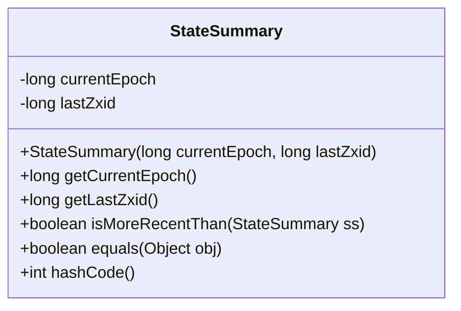
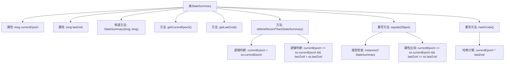

# 基础信息

|      |      |
|------|------|
| 名称 | StateSummary |
| 编码语言 | .java |
| 代码路径 | zookeeper/zookeeper-server/src/main/java/org/apache/zookeeper/server/quorum/StateSummary.java |
| 包名 | org.apache.zookeeper.server.quorum |
| 依赖项 | [] |
| 概述说明 | StateSummary类记录当前周期和最后事务ID，提供比较、相等判断和哈希计算功能。 |

# 说明

StateSummary类是一个用于记录状态摘要的Java类，包含当前周期数currentEpoch和最后事务ID lastZxid两个私有属性。通过构造函数初始化这两个属性，并提供对应的getter方法获取属性值。类中实现了isMoreRecentThan方法，用于比较两个StateSummary对象的新旧程度，判断依据是先比较currentEpoch，若相同再比较lastZxid。重写了equals方法，确保两个对象在currentEpoch和lastZxid都相等时才视为相等。同时重写了hashCode方法，采用currentEpoch和lastZxid的异或值作为哈希码。

# 类列表 Class Summary

| 名称   | 类型  | 说明 |
|-------|------|-------------|
| StateSummary | class | StateSummary类记录当前周期和最后Zxid，提供比较、相等判断和哈希计算功能。 |

## 类 StateSummary

|      |      |
|------|------|
| 访问范围 | public |
| 类型 | class |
| 名称 | StateSummary |
| 说明 | StateSummary类记录当前周期和最后Zxid，提供比较、相等判断和哈希计算功能。 |

### UML类图

这段代码定义了一个`StateSummary`类，用于封装当前纪元(`currentEpoch`)和最后事务ID(`lastZxid`)两个状态值。类提供了构造方法、getter方法、比较方法(`isMoreRecentThan`)、以及重写了`equals`和`hashCode`方法。`isMoreRecentThan`方法通过比较纪元值和事务ID来判断状态的新旧程度，而`equals`和`hashCode`方法则用于对象比较和哈希计算。这个类通常用于分布式系统中维护和比较节点状态信息。

### 内部方法调用关系图

这段代码定义了一个StateSummary类，用于存储和比较状态摘要信息。类中包含两个核心属性currentEpoch和lastZxid，通过构造方法初始化。提供了获取属性的方法getCurrentEpoch()和getLastZxid()，以及比较方法isMoreRecentThan()用于判断当前状态是否比另一个状态更新。重写了equals()方法进行对象相等性判断，以及hashCode()方法生成哈希值。整个类设计用于高效地比较和存储状态信息，适用于需要版本比较的场景。

### 字段列表 Field List

| 名称  | 类型  | 说明 |
|-------|-------|------|
| lastZxid | long | 存储最后处理的ZooKeeper事务ID。 |
| currentEpoch | long | 私有长整型变量currentEpoch，用于存储当前纪元时间。 |

### 方法列表 Method List

| 名称  | 类型  | 说明 |
|-------|-------|------|
| getLastZxid | long | 获取最后事务ID的方法，返回长整型值lastZxid。 |
| getCurrentEpoch | long | 获取当前周期值的方法，返回长整型变量currentEpoch。 |
| isMoreRecentThan | boolean | 方法isMoreRecentThan比较当前状态与输入StateSummary的新旧程度，若当前epoch更大，或epoch相同但zxid更大，则返回true。 |
| equals | boolean | 重写equals方法，检查对象是否为StateSummary实例，比较currentEpoch和lastZxid是否相等。 |
| hashCode | int | 重写hashCode方法，返回currentEpoch与lastZxid异或结果的整数值。 |

