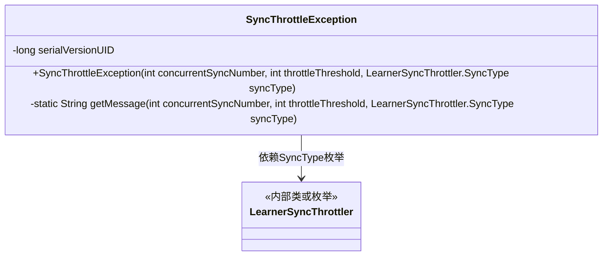
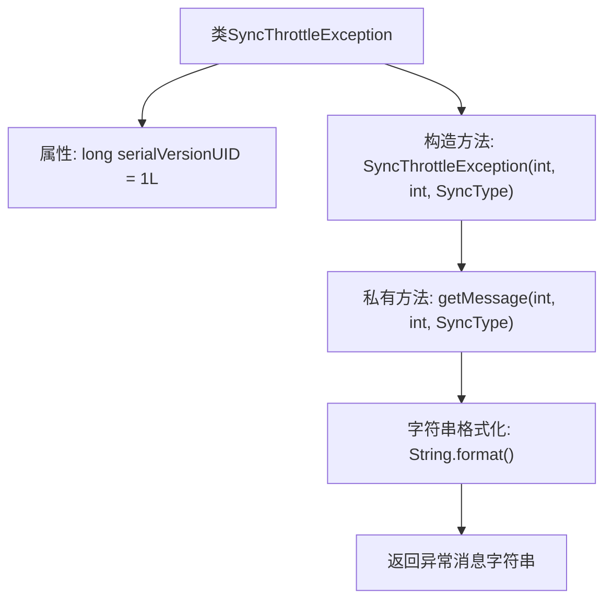

# 基础信息

|      |      |
|------|------|
| 名称 | SyncThrottleException |
| 编码语言 | .java |
| 代码路径 | zookeeper/zookeeper-server/src/main/java/org/apache/zookeeper/server/quorum/SyncThrottleException.java |
| 包名 | org.apache.zookeeper.server.quorum |
| 依赖项 | [] |
| 概述说明 | SyncThrottleException是异常类，当并发同步数超过阈值时抛出，包含当前同步数、阈值和同步类型信息。 |

# 说明

SyncThrottleException是一个自定义异常类，用于处理同步操作被节流的情况。它继承自Exception类，包含一个序列化版本UID。异常构造函数接收三个参数：当前并发同步数量、节流阈值和同步类型，并通过getMessage方法生成错误信息。错误信息会指出新同步请求将导致当前并发数超过设定的最大阈值，具体信息包含同步类型、当前并发数和最大允许值。

# 类列表 Class Summary

| 名称   | 类型  | 说明 |
|-------|------|-------------|
| SyncThrottleException | class | SyncThrottleException是异常类，当并发同步数超过阈值时抛出，包含当前同步数、阈值和同步类型信息。 |

## 类 SyncThrottleException

|      |      |
|------|------|
| 访问范围 | public |
| 类型 | class |
| 名称 | SyncThrottleException |
| 说明 | SyncThrottleException是异常类，当并发同步数超过阈值时抛出，包含当前同步数、阈值和同步类型信息。 |

### UML类图

这段代码定义了一个SyncThrottleException异常类，用于在同步操作超过阈值时抛出。该类包含一个序列化ID和构造方法，构造方法通过私有静态方法getMessage生成异常信息。异常信息会显示当前同步类型、并发同步数和最大允许阈值。该类依赖于LearnerSyncThrottler的SyncType枚举来标识同步类型，体现了限流控制中的异常处理机制。

### 内部方法调用关系图

这段代码定义了一个SyncThrottleException异常类，用于在并发同步操作超过阈值时抛出。类中包含一个序列化ID字段和带参数的构造函数，构造函数通过私有静态方法getMessage生成格式化的异常信息。该信息会显示当前同步类型、并发数和允许的最大阈值，帮助开发者快速定位限流问题。整个流程展示了从异常构造到消息生成的完整处理链。

### 字段列表 Field List

| 名称  | 类型  | 说明 |
|-------|-------|------|
| serialVersionUID = 1L | long | 私有静态常量序列化ID，值为1L。 |

### 方法列表 Method List

| 名称  | 类型  | 说明 |
|-------|-------|------|
| getMessage | String | Java方法生成同步限制提示信息，显示当前并发同步数及上限阈值。 |

