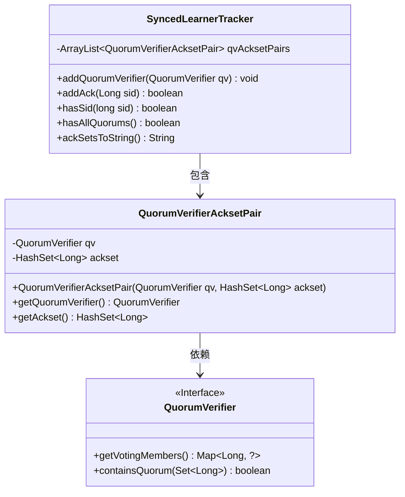
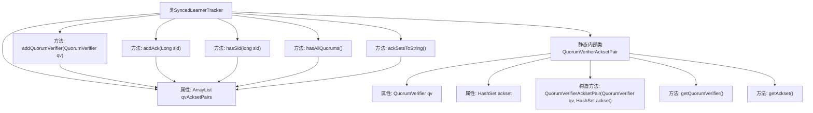

# 基础信息

|      |      |
|------|------|
| 名称 | SyncedLearnerTracker |
| 编码语言 | .java |
| 代码路径 | zookeeper/zookeeper-server/src/main/java/org/apache/zookeeper/server/quorum/SyncedLearnerTracker.java |
| 包名 | org.apache.zookeeper.server.quorum |
| 依赖项 | ['java.util.ArrayList', 'java.util.HashSet', 'org.apache.zookeeper.server.quorum.flexible.QuorumVerifier'] |
| 概述说明 | SyncedLearnerTracker类管理QuorumVerifierAcksetPair列表，提供添加验证器、记录确认、检查成员存在性、验证法定人数及输出确认集功能。 |

# 说明

SyncedLearnerTracker类用于跟踪同步学习者的状态，包含一个QuorumVerifierAcksetPair列表。主要功能包括添加QuorumVerifier、记录确认的sid、检查sid是否存在、验证是否满足所有法定人数要求以及生成确认集合的字符串表示。QuorumVerifierAcksetPair是内部类，包含QuorumVerifier和对应的确认集合。

# 类列表 Class Summary

| 名称   | 类型  | 说明 |
|-------|------|-------------|
| SyncedLearnerTracker | class | SyncedLearnerTracker类管理QuorumVerifierAcksetPair列表，提供添加验证器、确认成员、检查成员存在、验证法定人数及输出确认集的方法。内部类QuorumVerifierAcksetPair封装验证器和确认集。 |

## 类 SyncedLearnerTracker

|      |      |
|------|------|
| 访问范围 | public |
| 类型 | class |
| 名称 | SyncedLearnerTracker |
| 说明 | SyncedLearnerTracker类管理QuorumVerifierAcksetPair列表，提供添加验证器、确认成员、检查成员存在、验证法定人数及输出确认集的方法。内部类QuorumVerifierAcksetPair封装验证器和确认集。 |

### UML类图

该代码实现了一个同步学习者跟踪器，用于管理Quorum验证器与确认集合的配对关系。核心类SyncedLearnerTracker通过内部类QuorumVerifierAcksetPair维护验证器与对应ACK集合，提供添加验证器、记录ACK、检查成员存在性、验证法定人数等功能。QuorumVerifier作为接口定义了获取投票成员和验证法定人数的契约，体现了分布式系统中法定人数验证的核心逻辑。

### 内部方法调用关系图

这段代码定义了一个名为SyncedLearnerTracker的类，用于管理QuorumVerifierAcksetPair对象的集合。主要功能包括添加QuorumVerifier、处理ack确认、检查sid是否存在、验证是否满足所有quorum条件以及将ack集合转换为字符串。内部静态类QuorumVerifierAcksetPair封装了QuorumVerifier和对应的ack集合，提供了基本的访问方法。整个类设计用于在分布式系统中跟踪和管理quorum验证相关的状态信息。

### 字段列表 Field List

| 名称  | 类型  | 说明 |
|-------|-------|------|
| qvAcksetPairs = new ArrayList<>() | ArrayList<QuorumVerifierAcksetPair> | 声明一个受保护的ArrayList变量qvAcksetPairs，存储QuorumVerifierAcksetPair对象。 |

### 方法列表 Method List

| 名称  | 类型  | 说明 |
|-------|-------|------|
| hasAllQuorums | boolean | 检查所有法定人数验证器是否满足法定数量要求，若全部满足则返回真，否则返回假。 |
| hasSid | boolean | 检查给定sid是否存在于所有QuorumVerifier的投票成员中，存在返回true，否则false。 |
| addAck | boolean | 该方法检查给定ID是否存在于投票成员中，若存在则将其加入确认集并返回变更状态。 |
| addQuorumVerifier | void | 方法`addQuorumVerifier`接收一个`QuorumVerifier`参数，将其与新建的空`HashSet`封装为`QuorumVerifierAcksetPair`对象，并添加到`qvAcksetPairs`集合中。 |
| ackSetsToString | String | 该方法将多个QuorumVerifierAcksetPair对象的Ackset转换为字符串，用逗号分隔，最后去掉末尾逗号后返回。 |

