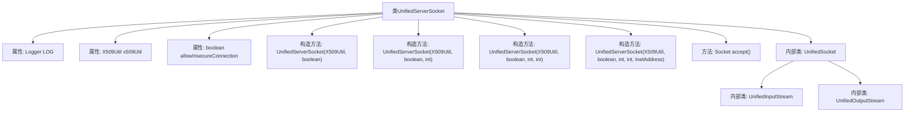
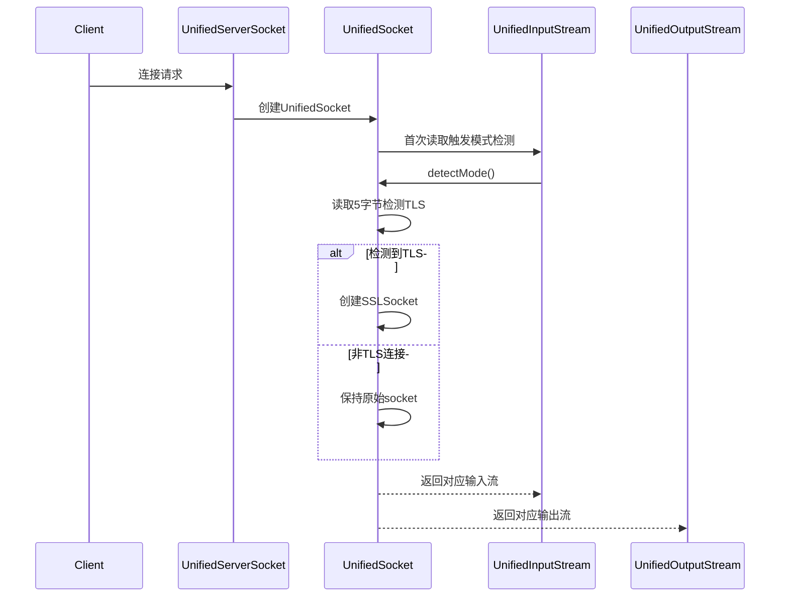

# 基础信息

|      |      |
|------|------|
| 名称 | UnifiedServerSocket |
| 编码语言 | .java |
| 代码路径 | zookeeper/zookeeper-server/src/main/java/org/apache/zookeeper/server/quorum/UnifiedServerSocket.java |
| 包名 | org.apache.zookeeper.server.quorum |
| 依赖项 | ['io.netty.buffer.Unpooled', 'io.netty.handler.ssl.SslHandler', 'java.io.IOException', 'java.io.InputStream', 'java.io.OutputStream', 'java.net.InetAddress', 'java.net.ServerSocket', 'java.net.Socket', 'java.net.SocketAddress', 'java.net.SocketException', 'java.net.SocketTimeoutException', 'java.nio.channels.SocketChannel', 'javax.net.ssl.SSLSocket', 'org.apache.zookeeper.common.X509Exception', 'org.apache.zookeeper.common.X509Util', 'org.slf4j.Logger', 'org.slf4j.LoggerFactory'] |
| 概述说明 | UnifiedServerSocket支持TLS和明文连接，根据allowInsecureConnection参数决定是否接受明文连接。UnifiedSocket在首次读写时检测连接模式，自动升级TLS或保持明文，避免在accept线程阻塞。 |

# 说明

UnifiedServerSocket是一个扩展自ServerSocket的类，支持同时处理TLS和明文连接。它通过检测ClientHello消息自动升级安全连接，并根据allowInsecureConnection参数决定是否接受明文连接。其内部类UnifiedSocket在首次读写操作时触发模式检测，通过读取前5字节判断是否为TLS握手。若检测到TLS则创建SSLSocket，否则根据配置决定是否保留明文连接。该设计需注意避免在accept线程执行阻塞式检测，防止拒绝服务攻击。类提供完整Socket API封装，非读写操作（如设置参数）不会触发模式检测，并包含UnifiedInputStream/UnifiedOutputStream来延迟初始化真实流。

# 类列表 Class Summary

| 名称   | 类型  | 说明 |
|-------|------|-------------|
| UnifiedServerSocket | class | UnifiedServerSocket支持同时处理TLS和明文连接，通过检测ClientHello自动升级TLS，允许配置是否接受明文连接。UnifiedSocket在首次读写时检测连接模式，避免阻塞accept线程。 |


## 类 UnifiedServerSocket

|      |      |
|------|------|
| 访问范围 | public |
| 类型 | class |
| 名称 | UnifiedServerSocket |
| 说明 | UnifiedServerSocket支持同时处理TLS和明文连接，通过检测ClientHello自动升级TLS，允许配置是否接受明文连接。UnifiedSocket在首次读写时检测连接模式，避免阻塞accept线程。 |


### UML类图

```mermaid
classDiagram
    class ServerSocket {
        <<Interface>>
        +ServerSocket()
        +ServerSocket(int port)
        +ServerSocket(int port, int backlog)
        +ServerSocket(int port, int backlog, InetAddress bindAddr)
        +Socket accept()
    }

    class UnifiedServerSocket {
        -Logger LOG
        -X509Util x509Util
        -boolean allowInsecureConnection
        +UnifiedServerSocket(X509Util, boolean) throws IOException
        +UnifiedServerSocket(X509Util, boolean, int) throws IOException
        +UnifiedServerSocket(X509Util, boolean, int, int) throws IOException
        +UnifiedServerSocket(X509Util, boolean, int, int, InetAddress) throws IOException
        +Socket accept() throws IOException
    }

    class UnifiedSocket {
        -enum Mode { UNKNOWN, PLAINTEXT, TLS }
        -X509Util x509Util
        -boolean allowInsecureConnection
        -PrependableSocket prependableSocket
        -SSLSocket sslSocket
        -Mode mode
        -UnifiedSocket(X509Util, boolean, PrependableSocket)
        +boolean isSecureSocket()
        +boolean isPlaintextSocket()
        +boolean isModeKnown()
        -void detectMode() throws IOException
        -Socket getSocketAllowUnknownMode()
        -Socket getSocket() throws IOException
        +SSLSocket getSslSocket() throws IOException
        // Overridden Socket methods...
    }

    class PrependableSocket {
        // Implementation details not shown
    }

    class SSLSocket {
        <<Interface>>
        // SSL-specific methods
    }

    class X509Util {
        +SSLSocket createSSLSocket(PrependableSocket, byte[]) throws X509Exception
        +int getSslHandshakeTimeoutMillis()
    }

    class UnifiedInputStream {
        -UnifiedSocket unifiedSocket
        -InputStream realInputStream
        +UnifiedInputStream(UnifiedSocket)
        // Overridden InputStream methods...
    }

    class UnifiedOutputStream {
        -UnifiedSocket unifiedSocket
        -OutputStream realOutputStream
        +UnifiedOutputStream(UnifiedSocket)
        // Overridden OutputStream methods...
    }

    ServerSocket <|-- UnifiedServerSocket : 继承
    UnifiedServerSocket --> X509Util : 依赖
    UnifiedServerSocket --> UnifiedSocket : 创建
    UnifiedSocket --> PrependableSocket : 包含
    UnifiedSocket --> SSLSocket : 升级为
    UnifiedSocket --> X509Util : 依赖
    UnifiedSocket --> UnifiedInputStream : 创建
    UnifiedSocket --> UnifiedOutputStream : 创建
    UnifiedInputStream --> InputStream : 继承
    UnifiedOutputStream --> OutputStream : 继承
```

这段代码实现了一个支持混合模式（明文/TLS）的服务器套接字UnifiedServerSocket，它通过检测客户端初始数据自动升级安全连接。核心类UnifiedSocket使用状态模式处理连接类型检测，通过X509Util管理SSL上下文，其输入/输出流首次操作会触发模式检测。该设计避免了在accept线程执行阻塞操作，同时保持了对标准Socket API的兼容性。类图展示了从ServerSocket继承的主类结构、内部类关系及关键依赖。


### 内部方法调用关系图





该流程图展示了UnifiedServerSocket类的结构和主要方法调用关系，包含4个构造方法和核心accept()方法，以及3个内部类的继承关系。时序图则详细描述了客户端连接时的处理流程，特别是首次I/O操作时触发的TLS/明文模式自动检测机制，这种设计允许单个端口同时处理安全和非安全连接，通过读取前5字节智能判断连接类型并自动升级为SSL连接或保持明文通信。

### 字段列表 Field List

| 名称  | 类型  | 说明 |
|-------|-------|------|
| LOG = LoggerFactory.getLogger(UnifiedServerSocket.class) | Logger | 定义私有静态日志对象LOG，用于UnifiedServerSocket类的日志记录。 |
| x509Util | X509Util | 私有X509工具类实例。 |
| allowInsecureConnection | boolean | 私有布尔变量，控制是否允许不安全连接。 |

### 方法列表 Method List

| 名称  | 类型  | 说明 |
|-------|-------|------|
| accept | Socket | 重写accept方法，检查socket状态后创建并返回新socket。 |


