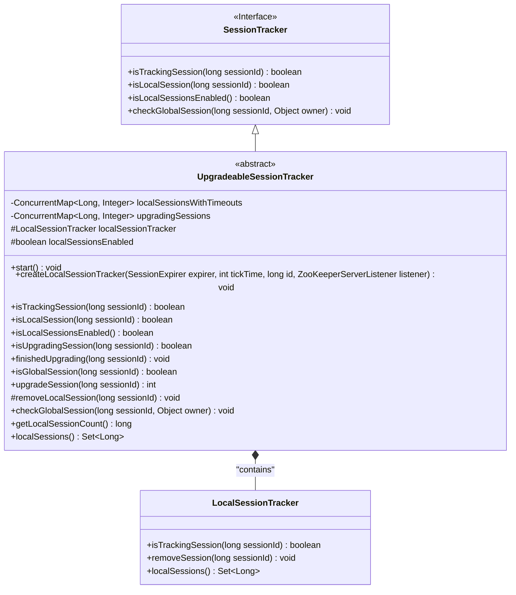

# 基础信息

|      |      |
|------|------|
| 名称 | UpgradeableSessionTracker |
| 编码语言 | .java |
| 代码路径 | zookeeper/zookeeper-server/src/main/java/org/apache/zookeeper/server/quorum/UpgradeableSessionTracker.java |
| 包名 | org.apache.zookeeper.server.quorum |
| 依赖项 | ['java.util.Collections', 'java.util.Set', 'java.util.concurrent.ConcurrentHashMap', 'java.util.concurrent.ConcurrentMap', 'org.apache.zookeeper.KeeperException', 'org.apache.zookeeper.server.SessionTracker', 'org.apache.zookeeper.server.ZooKeeperServerListener', 'org.slf4j.Logger', 'org.slf4j.LoggerFactory'] |
| 概述说明 | 可升级会话跟踪器，管理本地和全局会话，支持会话升级、超时处理和状态检查，使用并发映射存储会话数据。 |

# 说明

该抽象类用于管理可升级的会话跟踪，包含本地会话和升级中会话的并发映射。核心功能包括创建本地会话跟踪器、检查会话状态、升级会话为全局会话以及移除本地会话。本地会话通过LocalSessionTracker管理，升级时会从本地映射移除并加入升级映射。提供方法判断会话类型（本地/全局/升级中），支持查询会话数量和列表。异常处理和全局会话验证暂未实现。日志记录用于跟踪会话升级过程。

# 类列表 Class Summary

| 名称   | 类型  | 说明 |
|-------|------|-------------|
| UpgradeableSessionTracker | class | 抽象类UpgradeableSessionTracker管理会话升级，包含本地和升级会话跟踪功能，支持会话超时处理和状态检查。 |

## 类 UpgradeableSessionTracker

|      |      |
|------|------|
| 访问范围 | public abstract |
| 类型 | class |
| 名称 | UpgradeableSessionTracker |
| 说明 | 抽象类UpgradeableSessionTracker管理会话升级，包含本地和升级会话跟踪功能，支持会话超时处理和状态检查。 |

### UML类图

该类图展示了ZooKeeper中会话跟踪的核心结构。UpgradeableSessionTracker作为抽象类实现了SessionTracker接口，负责管理本地会话和全局会话的升级过程。它包含两个ConcurrentMap用于跟踪会话超时和升级中的会话，并聚合了LocalSessionTracker来管理本地会话。类图清晰地展示了接口实现、类继承和组合关系，体现了会话跟踪器在ZooKeeper服务器中的核心职责：会话生命周期管理和状态转换控制。

### 内部方法调用关系图

```mermaid
graph TD
    A["抽象类UpgradeableSessionTracker"]
    B["属性: ConcurrentMap<Long, Integer> localSessionsWithTimeouts"]
    C["属性: ConcurrentMap<Long, Integer> upgradingSessions"]
    D["属性: LocalSessionTracker localSessionTracker"]
    E["属性: boolean localSessionsEnabled"]
    F["方法: start()"]
    G["方法: createLocalSessionTracker(...)"]
    H["方法: isTrackingSession(long)"]
    I["方法: isLocalSession(long)"]
    J["方法: isLocalSessionsEnabled()"]
    K["方法: isUpgradingSession(long)"]
    L["方法: finishedUpgrading(long)"]
    M["抽象方法: isGlobalSession(long)"]
    N["方法: upgradeSession(long)"]
    O["方法: removeLocalSession(long)"]
    P["方法: checkGlobalSession(...)"]
    Q["方法: getLocalSessionCount()"]
    R["方法: localSessions()"]

    A --> B
    A --> C
    A --> D
    A --> E
    A --> F
    A --> G
    A --> H
    H --> I
    H --> M
    A --> I
    A --> J
    A --> K
    A --> L
    A --> M
    A --> N
    N --> B
    N --> C
    N --> D
    A --> O
    O --> D
    A --> P
    A --> Q
    Q --> B
    A --> R
    R --> D
```

这段代码定义了一个抽象类`UpgradeableSessionTracker`，主要用于管理可升级的会话。它包含两个并发映射表`localSessionsWithTimeouts`和`upgradingSessions`，以及一个本地会话跟踪器`localSessionTracker`。类中提供了创建本地会话跟踪器、检查会话状态、升级会话、移除本地会话等方法。其中`upgradeSession`方法负责将本地会话升级为全局会话，涉及从本地映射表中移除会话并添加到升级映射表中。抽象方法`isGlobalSession`需要子类实现，用于判断是否为全局会话。整体设计支持会话状态的动态管理和升级操作。

### 字段列表 Field List

| 名称  | 类型  | 说明 |
|-------|-------|------|
| localSessionsEnabled | boolean | protected布尔变量，控制本地会话是否启用。 |
| upgradingSessions | ConcurrentMap<Long, Integer> | 私有并发映射，键为长整型，值为整型，用于升级会话管理。 |
| LOG = LoggerFactory.getLogger(UpgradeableSessionTracker.class) | Logger | 私有静态日志常量LOG，用于UpgradeableSessionTracker类的日志记录。 |
| localSessionsWithTimeouts | ConcurrentMap<Long, Integer> | 私有并发映射，键为长整型，值为整型，用于存储带超时的本地会话。 |
| localSessionTracker | LocalSessionTracker | 局部会话跟踪器保护变量。 |

### 方法列表 Method List

| 名称  | 类型  | 说明 |
|-------|-------|------|
| isGlobalSession | boolean | 检查指定会话ID是否为全局会话，返回布尔值。 |
| finishedUpgrading | void | 方法finishedUpgrading移除指定sessionId的升级会话。 |
| isUpgradingSession | boolean | 检查会话ID是否在升级会话列表中。 |
| isLocalSessionsEnabled | boolean | 重写方法isLocalSessionsEnabled，返回本地会话启用状态布尔值localSessionsEnabled。 |
| start | void | 空方法start，无具体实现。 |
| isTrackingSession | boolean | 检查会话ID是否为本地或全局会话，返回布尔值。 |
| isLocalSession | boolean | 检查会话ID是否属于本地会话，条件是本地会话跟踪器存在且正在跟踪该会话。 |
| createLocalSessionTracker | void | 方法创建本地会话跟踪器，初始化会话超时映射和升级会话映射，使用给定参数构建LocalSessionTracker实例。 |
| localSessions | Set<Long> | 该方法返回本地会话ID集合，若跟踪器为空则返回空集。 |
| upgradeSession | int | 升级指定会话ID的会话状态，移除本地会话超时记录并跟踪全局会话。若会话存在则返回超时值，否则返回-1。 |
| removeLocalSession | void | 移除本地会话的方法，检查会话跟踪器存在后删除指定ID的会话。 |
| checkGlobalSession | void | 方法checkGlobalSession检查全局会话，若会话无效或转移则抛出异常，当前未实现具体逻辑。 |
| getLocalSessionCount | long | 获取本地会话数量：若localSessionsWithTimeouts为空返回0，否则返回其大小。 |

