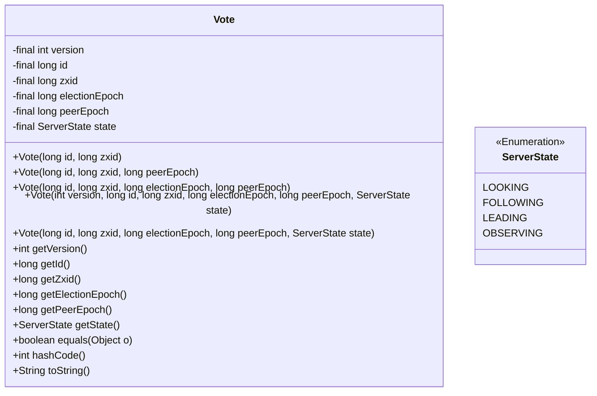

# 基础信息

|      |      |
|------|------|
| 名称 | Vote |
| 编码语言 | .java |
| 代码路径 | zookeeper/zookeeper-server/src/main/java/org/apache/zookeeper/server/quorum/Vote.java |
| 包名 | org.apache.zookeeper.server.quorum |
| 依赖项 | ['org.apache.zookeeper.server.quorum.QuorumPeer.ServerState'] |
| 概述说明 | Vote类表示选举投票，包含id、zxid、选举和peer纪元、状态等属性，提供构造方法和equals逻辑，支持不同版本比较。 |

# 说明

该内容描述了一个名为Vote的类，用于表示选举投票信息。类包含多个构造函数，初始化版本号、ID、zxid、选举周期、对等周期和服务器状态等属性。属性均为私有且提供对应的getter方法。equals方法根据服务器状态决定比较逻辑，LOOKING状态时比较所有关键字段，否则根据版本号决定是否比较peerEpoch。hashCode方法基于ID和zxid计算。toString方法返回格式化字符串。该类主要用于分布式系统中服务器状态的选举过程。

# 类列表 Class Summary

| 名称   | 类型  | 说明 |
|-------|------|-------------|
| Vote | class | Vote类用于选举投票，包含id、zxid、选举和peer纪元等属性，提供多个构造方法和equals逻辑，支持不同状态和版本的比较。 |

## 类 Vote

|      |      |
|------|------|
| 访问范围 | public |
| 类型 | class |
| 名称 | Vote |
| 说明 | Vote类用于选举投票，包含id、zxid、选举和peer纪元等属性，提供多个构造方法和equals逻辑，支持不同状态和版本的比较。 |

### UML类图

该代码实现了一个投票类Vote，用于分布式选举场景（如ZooKeeper选举）。类包含5个构造方法，分别初始化版本号(version)、节点ID(id)、事务ID(zxid)、选举周期(electionEpoch)、对等周期(peerEpoch)和状态(state)等核心字段。特别值得注意的是equals()方法的复杂逻辑：在LOOKING状态下严格比较所有字段，非LOOKING状态下根据版本号差异采用不同比较策略，这是为了解决分布式系统滚动升级时的兼容性问题。hashCode()使用id和zxid的位运算结果，toString()输出关键字段的十六进制表示。

### 内部方法调用关系图

```mermaid
graph TD
    A["类Vote"]
    B["属性: int version"]
    C["属性: long id"]
    D["属性: long zxid"]
    E["属性: long electionEpoch"]
    F["属性: long peerEpoch"]
    G["属性: ServerState state"]
    H["构造方法: Vote(id, zxid)"]
    I["构造方法: Vote(id, zxid, peerEpoch)"]
    J["构造方法: Vote(id, zxid, electionEpoch, peerEpoch)"]
    K["构造方法: Vote(version, id, zxid, electionEpoch, peerEpoch, state)"]
    L["构造方法: Vote(id, zxid, electionEpoch, peerEpoch, state)"]
    M["方法: getVersion()"]
    N["方法: getId()"]
    O["方法: getZxid()"]
    P["方法: getElectionEpoch()"]
    Q["方法: getPeerEpoch()"]
    R["方法: getState()"]
    S["重写方法: equals(Object o)"]
    T["重写方法: hashCode()"]
    U["重写方法: toString()"]

    A --> B
    A --> C
    A --> D
    A --> E
    A --> F
    A --> G
    A --> H
    A --> I
    A --> J
    A --> K
    A --> L
    A --> M
    A --> N
    A --> O
    A --> P
    A --> Q
    A --> R
    A --> S
    A --> T
    A --> U
```

这段代码定义了一个`Vote`类，主要用于选举场景中表示投票信息。类包含多个构造方法，允许以不同参数组合初始化投票对象，核心属性包括版本号、ID、zxid（ZooKeeper事务ID）、选举周期、对等周期和状态。类提供了属性访问方法，并重写了`equals`、`hashCode`和`toString`方法。`equals`方法实现了复杂的投票比较逻辑，考虑了选举状态和版本兼容性，特别处理了ZooKeeper集群滚动升级时的版本差异问题。流程图清晰展示了类结构与成员关系。

### 字段列表 Field List

| 名称  | 类型  | 说明 |
|-------|-------|------|
| peerEpoch | long | 私有长整型变量peerEpoch，用于存储纪元值。 |
| electionEpoch | long | 私有长整型变量electionEpoch，用于存储选举周期值。 |
| state | ServerState | 私有不可变服务器状态实例。 |
| version | int | 私有整型版本号变量。 |
| zxid | long | 私有长整型变量zxid。 |
| id | long | 私有长整型变量id |

### 方法列表 Method List

| 名称  | 类型  | 说明 |
|-------|-------|------|
| getId | long | 这是一个Java方法，返回长整型变量id的值。 |
| getState | ServerState | 获取当前服务器状态的方法，直接返回私有变量state的值。 |
| getVersion | int | 方法返回整型变量version的值。 |
| hashCode | int | 重写hashCode方法，返回id与zxid按位与的结果。 |
| equals | boolean | 重写equals方法，比较Vote对象。若状态为LOOKING，比较id、zxid、electionEpoch和peerEpoch；否则根据版本号决定是否比较peerEpoch，确保兼容性和一致性。 |
| getPeerEpoch | long | 获取peerEpoch值的公共方法，返回类型为long。 |
| getElectionEpoch | long | 获取选举周期值的方法，返回长整型变量electionEpoch。 |
| getZxid | long | 获取zxid值的方法，返回长整型数据。 |
| toString | String | Java方法：返回字符串格式为(id, 十六进制zxid, 十六进制peerEpoch)。 |

