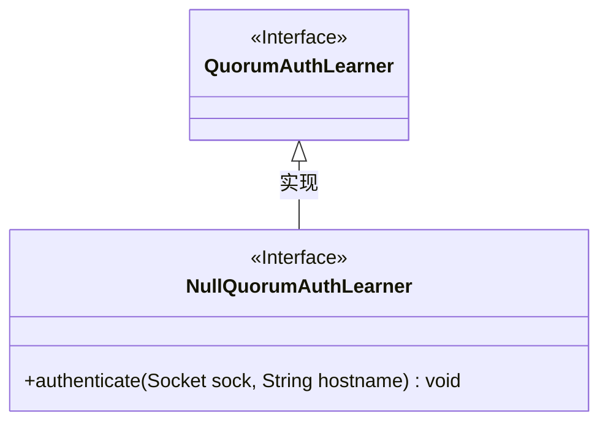
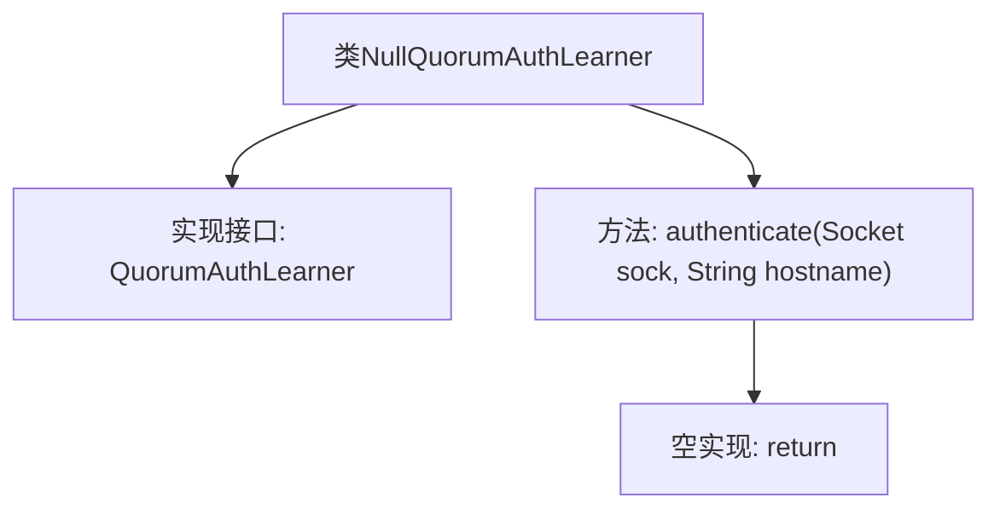

# 基础信息

|      |      |
|------|------|
| 名称 | NullQuorumAuthLearner |
| 编码语言 | .java |
| 代码路径 | zookeeper/zookeeper-server/src/main/java/org/apache/zookeeper/server/quorum/auth/NullQuorumAuthLearner.java |
| 包名 | org.apache.zookeeper.server.quorum.auth |
| 依赖项 | ['java.net.Socket'] |
| 概述说明 | 空授权学习者类，不要求认证，直接返回。 |

# 说明

该内容描述了一个名为NullQuorumAuthLearner的类，实现了QuorumAuthLearner接口。该类重写了authenticate方法，该方法接收Socket对象和主机名字符串作为参数，但方法体为空，直接返回，不执行任何认证操作。这表明该类的设计目的是跳过认证流程，无需进行任何验证。

# 类列表 Class Summary

| 名称   | 类型  | 说明 |
|-------|------|-------------|
| NullQuorumAuthLearner | class | 这是一个名为NullQuorumAuthLearner的类，实现了QuorumAuthLearner接口。其authenticate方法不执行任何认证操作，直接返回。 |

## 类 NullQuorumAuthLearner

|      |      |
|------|------|
| 访问范围 | public |
| 类型 | class |
| 名称 | NullQuorumAuthLearner |
| 说明 | 这是一个名为NullQuorumAuthLearner的类，实现了QuorumAuthLearner接口。其authenticate方法不执行任何认证操作，直接返回。 |

### UML类图

这段类图展示了NullQuorumAuthLearner类实现了QuorumAuthLearner接口的关系。NullQuorumAuthLearner是一个空实现的安全认证类，其authenticate方法直接返回而不执行任何认证逻辑，适用于不需要认证的场景。QuorumAuthLearner作为接口定义了认证规范，而NullQuorumAuthLearner作为其实现提供了无操作的默认实现方式。这种模式常见于需要提供可选安全层的系统架构中。

### 内部方法调用关系图

这段代码展示了一个名为NullQuorumAuthLearner的类，该类实现了QuorumAuthLearner接口。主要功能是提供了一个authenticate方法的空实现，该方法接收Socket和hostname参数但不执行任何认证逻辑直接返回。这种设计模式通常用于需要接口实现但不需要实际认证的场景，作为认证功能的"空对象"占位符。

### 字段列表 Field List

| 名称  | 类型  | 说明 |
|-------|-------|------|

### 方法列表 Method List

| 名称  | 类型  | 说明 |
|-------|-------|------|
| authenticate | void | 方法authenticate不执行认证，直接返回，无需验证。 |

