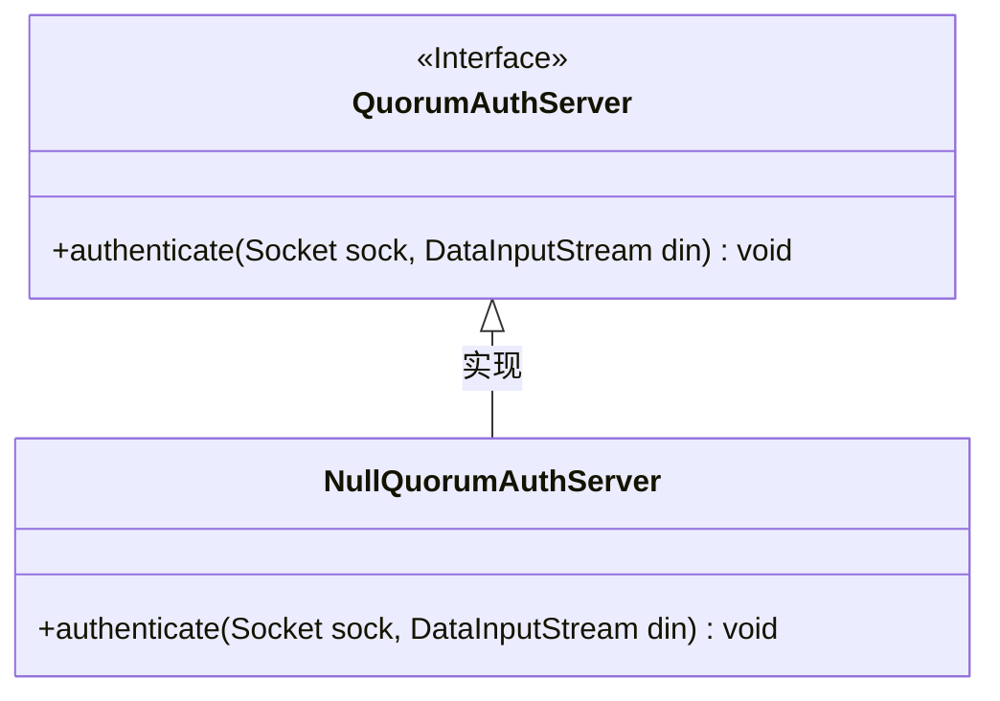
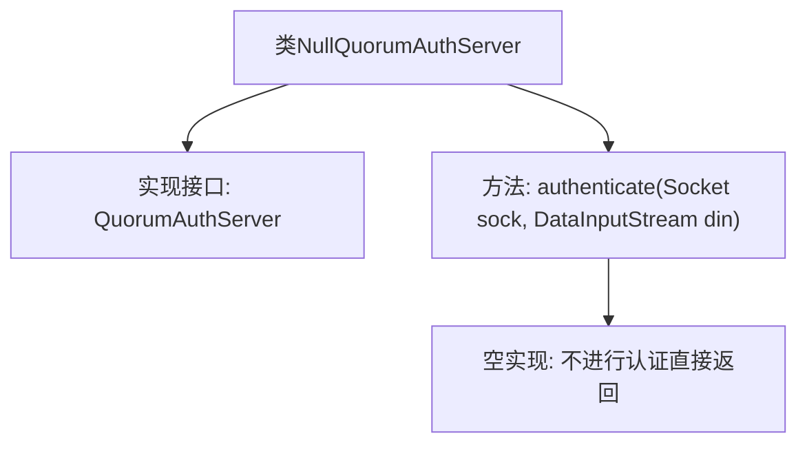

# 基础信息

|      |      |
|------|------|
| 名称 | NullQuorumAuthServer |
| 编码语言 | .java |
| 代码路径 | zookeeper/zookeeper-server/src/main/java/org/apache/zookeeper/server/quorum/auth/NullQuorumAuthServer.java |
| 包名 | org.apache.zookeeper.server.quorum.auth |
| 依赖项 | ['java.io.DataInputStream', 'java.net.Socket'] |
| 概述说明 | 空认证服务器类，不执行任何认证操作，直接返回。 |

# 说明

该代码定义了一个名为NullQuorumAuthServer的类，实现了QuorumAuthServer接口。该类重写了authenticate方法，该方法接收Socket和DataInputStream参数，但方法体为空，表示不进行任何认证操作。这相当于一个空实现，允许连接无需认证即可通过。

# 类列表 Class Summary

| 名称   | 类型  | 说明 |
|-------|------|-------------|
| NullQuorumAuthServer | class | 空授权服务器类，不执行认证直接返回。 |

## 类 NullQuorumAuthServer

|      |      |
|------|------|
| 访问范围 | public |
| 类型 | class |
| 名称 | NullQuorumAuthServer |
| 说明 | 空授权服务器类，不执行认证直接返回。 |

### UML类图

这段代码展示了一个名为NullQuorumAuthServer的类，它实现了QuorumAuthServer接口。QuorumAuthServer是一个接口，定义了一个authenticate方法，该方法接收Socket和DataInputStream作为参数。NullQuorumAuthServer作为该接口的实现类，提供了一个空实现的authenticate方法，表明不需要进行任何认证操作。这种模式常用于提供"空对象"实现，以避免空指针异常或作为默认行为。

### 内部方法调用关系图

这段流程图描述了NullQuorumAuthServer类的结构，该类实现了QuorumAuthServer接口并重写了authenticate方法。authenticate方法是一个空实现，表示不需要任何认证流程，直接返回。这种设计模式常用于提供"无操作"的默认实现，允许系统在不需要认证时跳过该步骤。类与接口之间的关系通过实线箭头表示，方法内部逻辑通过虚线箭头说明其行为特性。

### 字段列表 Field List

| 名称  | 类型  | 说明 |
|-------|-------|------|

### 方法列表 Method List

| 名称  | 类型  | 说明 |
|-------|-------|------|
| authenticate | void | 无需认证，直接返回。 |

