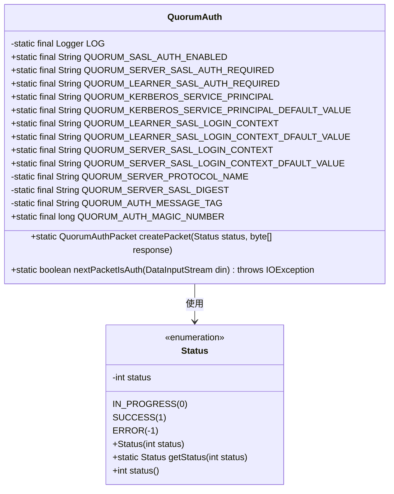
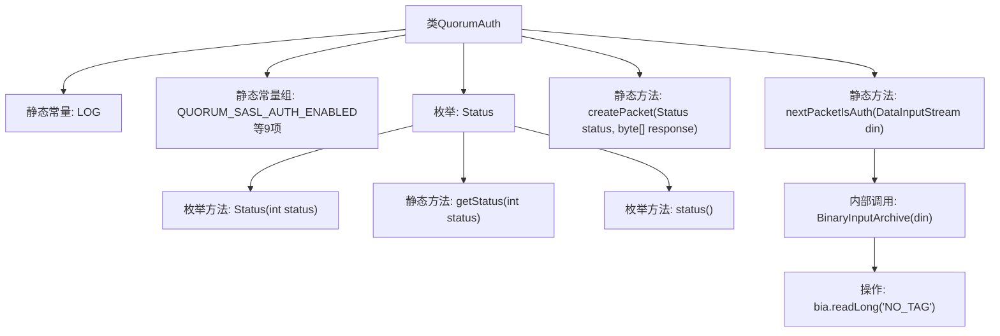

# 基础信息

|      |      |
|------|------|
| 名称 | QuorumAuth |
| 编码语言 | .java |
| 代码路径 | zookeeper/zookeeper-server/src/main/java/org/apache/zookeeper/server/quorum/auth/QuorumAuth.java |
| 包名 | org.apache.zookeeper.server.quorum.auth |
| 依赖项 | ['java.io.DataInputStream', 'java.io.IOException', 'org.apache.jute.BinaryInputArchive', 'org.apache.zookeeper.server.quorum.QuorumAuthPacket', 'org.slf4j.Logger', 'org.slf4j.LoggerFactory'] |
| 概述说明 | QuorumAuth类定义了ZooKeeper仲裁认证相关常量和方法，包括SASL认证配置、Kerberos服务主体、状态枚举及认证包处理功能。 |

# 说明

QuorumAuth类定义了与ZooKeeper仲裁认证相关的常量和方法。关键常量包括SASL认证开关、Kerberos服务主体名称、登录上下文配置及默认值。定义了三种认证状态枚举（进行中、成功、错误）及相关转换方法。提供了创建认证数据包和判断数据包是否为认证包的工具方法。核心功能围绕QUORUM_AUTH_MAGIC_NUMBER实现认证协议识别，使用二进制归档处理网络数据流。

# 类列表 Class Summary

| 名称   | 类型  | 说明 |
|-------|------|-------------|
| QuorumAuth | class | QuorumAuth类定义ZooKeeper仲裁认证相关常量和方法，包括SASL/Kerberos配置、状态枚举及认证包处理功能。 |

## 类 QuorumAuth

|      |      |
|------|------|
| 访问范围 | public |
| 类型 | class |
| 名称 | QuorumAuth |
| 说明 | QuorumAuth类定义ZooKeeper仲裁认证相关常量和方法，包括SASL/Kerberos配置、状态枚举及认证包处理功能。 |

### UML类图

类图描述：
QuorumAuth类是一个用于Zookeeper集群认证的工具类，包含多个静态常量和认证相关方法。它定义了SASL认证的配置参数、Kerberos服务主体名称、协议名称等常量，并提供了创建认证包和检测认证包的方法。Status枚举类表示认证状态，包含IN_PROGRESS、SUCCESS和ERROR三种状态，以及状态转换方法。该类主要处理Zookeeper集群节点间的安全认证流程，通过魔法数字验证和状态管理确保通信安全。

### 内部方法调用关系图

该流程图展示了QuorumAuth类的核心结构，包含静态常量定义、Status枚举及其方法，以及两个关键静态方法。其中nextPacketIsAuth方法通过BinaryInputArchive读取数据流并验证魔数，createPacket方法则用于生成认证数据包。枚举Status通过状态码管理认证过程的状态流转。

### 字段列表 Field List

| 名称  | 类型  | 说明 |
|-------|-------|------|
| QUORUM_SERVER_SASL_AUTH_REQUIRED = "quorum.auth.serverRequireSasl" | String | 该代码定义了一个静态常量字符串，表示ZooKeeper仲裁服务器要求SASL认证的配置键。 |
| QUORUM_SASL_AUTH_ENABLED = "quorum.auth.enableSasl" | String | 该代码定义了一个静态常量字符串，表示启用SASL认证的配置键，用于仲裁机制的身份验证设置。 |
| QUORUM_LEARNER_SASL_LOGIN_CONTEXT_DFAULT_VALUE = "QuorumLearner" | String | 静态常量QUORUM_LEARNER_SASL_LOGIN_CONTEXT_DFAULT_VALUE，默认值为"QuorumLearner"。 |
| LOG = LoggerFactory.getLogger(QuorumAuth.class) | Logger | QuorumAuth类中定义了一个私有静态日志记录器LOG。 |
| QUORUM_SERVER_SASL_LOGIN_CONTEXT_DFAULT_VALUE = "QuorumServer" | String | QuorumServer的SASL登录上下文默认值设为"QuorumServer"。 |
| QUORUM_LEARNER_SASL_LOGIN_CONTEXT = "quorum.auth.learner.saslLoginContext" | String | Quorum学习者SASL登录上下文配置键。 |
| QUORUM_AUTH_MESSAGE_TAG = "qpconnect" | String | 静态常量字符串QUORUM_AUTH_MESSAGE_TAG定义为"qpconnect"。 |
| QUORUM_KERBEROS_SERVICE_PRINCIPAL = "quorum.auth.kerberos.servicePrincipal" | String | 该代码定义了一个静态常量字符串，用于配置Kerberos认证的服务主体名称。 |
| QUORUM_KERBEROS_SERVICE_PRINCIPAL_DEFAULT_VALUE = "zkquorum/localhost" | String | 默认的Kerberos服务主体名称为zkquorum/localhost。 |
| QUORUM_AUTH_MAGIC_NUMBER = -0xa0dbcafecafe1234L | long | 这是一个Java静态常量，名为QUORUM_AUTH_MAGIC_NUMBER，类型为long，值为十六进制负数-0xa0dbcafecafe1234L。 |
| QUORUM_SERVER_PROTOCOL_NAME = "zookeeper-quorum" | String | 静态常量QUORUM_SERVER_PROTOCOL_NAME定义为"zookeeper-quorum"。 |
| QUORUM_SERVER_SASL_DIGEST = "zk-quorum-sasl-md5" | String | 静态字符串常量QUORUM_SERVER_SASL_DIGEST定义为zk-quorum-sasl-md5。 |
| QUORUM_SERVER_SASL_LOGIN_CONTEXT = "quorum.auth.server.saslLoginContext" | String | QUORUM_SERVER_SASL_LOGIN_CONTEXT是定义Quorum服务器SASL登录上下文的常量字符串。 |
| QUORUM_LEARNER_SASL_AUTH_REQUIRED = "quorum.auth.learnerRequireSasl" | String | ZooKeeper配置项，用于设置学习者节点是否需要SASL认证。 |

### 方法列表 Method List

| 名称  | 类型  | 说明 |
|-------|-------|------|
| createPacket | QuorumAuthPacket | 创建QuorumAuthPacket静态方法，接收状态和响应字节数组，返回包含魔数、状态值和响应的新包实例。 |
| nextPacketIsAuth | boolean | 检查数据流中下一个包是否为认证包，通过读取并比较魔数判断，完成后重置流位置。 |

