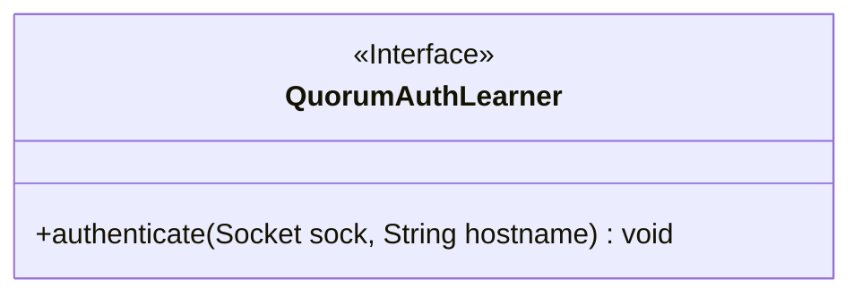
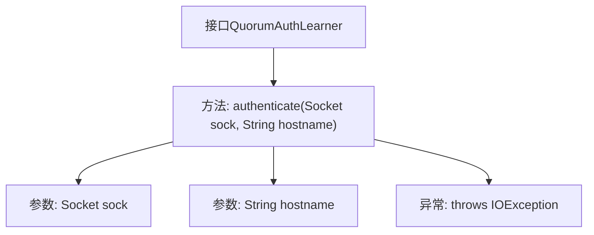

# 基础信息

|      |      |
|------|------|
| 名称 | QuorumAuthLearner |
| 编码语言 | .java |
| 代码路径 | zookeeper/zookeeper-server/src/main/java/org/apache/zookeeper/server/quorum/auth/QuorumAuthLearner.java |
| 包名 | org.apache.zookeeper.server.quorum.auth |
| 依赖项 | ['java.io.IOException', 'java.net.Socket'] |
| 概述说明 | QuorumAuthLearner接口定义认证方法authenticate，用于验证quorum peer服务器间的socket连接，参数为socket和主机名，失败时抛出IOException。 |

# 说明

QuorumAuthLearner是一个公开接口，定义了一个用于执行法定人数认证学习者操作的方法authenticate。该方法接收一个Socket连接和对方法定人数对等服务器的主机名作为参数，并在认证失败时抛出IOException异常。该接口主要用于处理与其他法定人数对等服务器之间的认证流程。

# 类列表 Class Summary

| 名称   | 类型  | 说明 |
|-------|------|-------------|
| QuorumAuthLearner | interface | QuorumAuthLearner接口定义认证方法authenticate，通过Socket和主机名验证对等节点，失败时抛出IOException。 |

## 类 QuorumAuthLearner

|      |      |
|------|------|
| 访问范围 | public |
| 类型 | interface |
| 名称 | QuorumAuthLearner |
| 说明 | QuorumAuthLearner接口定义认证方法authenticate，通过Socket和主机名验证对等节点，失败时抛出IOException。 |

### UML类图

这段代码定义了一个名为QuorumAuthLearner的接口，该接口包含一个authenticate方法，用于对给定的套接字连接和主机名进行认证操作。接口方法会抛出IOException异常，表示可能发生的认证失败情况。这个接口很可能用于分布式系统中quorum peer服务器之间的安全认证机制，确保通信双方的身份合法性。

### 内部方法调用关系图

该流程图展示了QuorumAuthLearner接口的结构，核心是authenticate方法定义，包含两个参数(Socket对象和主机名字符串)以及可能抛出的IOException异常。接口作为身份验证的抽象规范，明确了学习者节点与其他法定人数节点建立安全连接时需要实现的认证行为，强调网络通信异常处理的重要性。

### 字段列表 Field List

| 名称  | 类型  | 说明 |
|-------|-------|------|

### 方法列表 Method List

| 名称  | 类型  | 说明 |
|-------|-------|------|
| authenticate | void | 验证Socket连接并处理主机名，失败时抛出IO异常。 |

