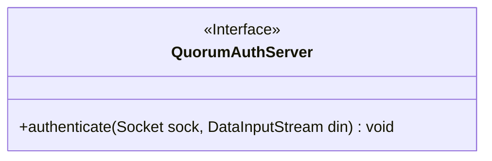
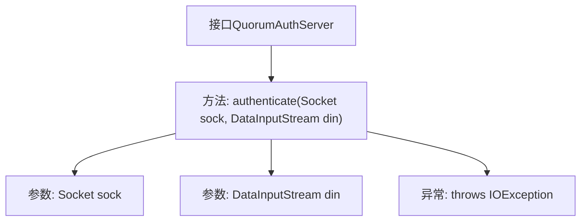

# 基础信息

|      |      |
|------|------|
| 名称 | QuorumAuthServer |
| 编码语言 | .java |
| 代码路径 | zookeeper/zookeeper-server/src/main/java/org/apache/zookeeper/server/quorum/auth/QuorumAuthServer.java |
| 包名 | org.apache.zookeeper.server.quorum.auth |
| 依赖项 | ['java.io.DataInputStream', 'java.io.IOException', 'java.net.Socket'] |
| 概述说明 | QuorumAuthServer接口定义认证方法authenticate，通过Socket和DataInputStream验证连接，失败时抛出IOException。 |

# 说明

QuorumAuthServer是一个公开接口，定义了一个认证方法authenticate，用于对给定的套接字连接进行认证步骤。该方法接收一个Socket对象和一个DataInputStream对象作为参数，后者用于读取来自Quorum学习者的认证数据。如果认证失败，该方法会抛出IOException异常。该接口主要用于处理Quorum节点间的安全认证流程。

# 类列表 Class Summary

| 名称   | 类型  | 说明 |
|-------|------|-------------|
| QuorumAuthServer | interface | QuorumAuthServer接口定义认证方法authenticate，通过Socket和DataInputStream验证连接，失败时抛出IOException。 |

## 类 QuorumAuthServer

|      |      |
|------|------|
| 访问范围 | public |
| 类型 | interface |
| 名称 | QuorumAuthServer |
| 说明 | QuorumAuthServer接口定义认证方法authenticate，通过Socket和DataInputStream验证连接，失败时抛出IOException。 |

### UML类图

这段代码定义了一个名为QuorumAuthServer的接口，该接口包含一个authenticate方法，用于对给定的socket连接执行认证步骤。接口方法接收Socket和DataInputStream参数，可能抛出IOException异常。该接口主要用于ZooKeeper等分布式系统中处理quorum peer之间的认证逻辑，强制实现类提供具体的认证机制实现。

### 内部方法调用关系图

这段流程图描述了QuorumAuthServer接口的结构，该接口定义了一个核心认证方法authenticate，接收Socket和DataInputStream参数，并可能抛出IOException异常。接口作为ZooKeeper集群中法定人数认证的抽象规范，明确了服务端对学习者节点进行身份验证的契约，强调输入输出流处理和网络连接异常场景的应对能力。

### 字段列表 Field List

| 名称  | 类型  | 说明 |
|-------|-------|------|

### 方法列表 Method List

| 名称  | 类型  | 说明 |
|-------|-------|------|
| authenticate | void | 方法authenticate通过Socket和DataInputStream进行身份验证，可能抛出IOException异常。 |

