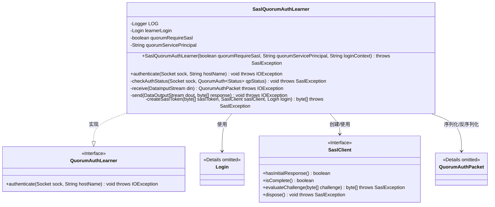

# 基础信息

|      |      |
|------|------|
| 名称 | SaslQuorumAuthLearner |
| 编码语言 | .java |
| 代码路径 | zookeeper/zookeeper-server/src/main/java/org/apache/zookeeper/server/quorum/auth/SaslQuorumAuthLearner.java |
| 包名 | org.apache.zookeeper.server.quorum.auth |
| 依赖项 | ['java.io.BufferedOutputStream', 'java.io.DataInputStream', 'java.io.DataOutputStream', 'java.io.IOException', 'java.net.Socket', 'java.security.PrivilegedActionException', 'java.security.PrivilegedExceptionAction', 'java.util.function.Supplier', 'javax.security.auth.Subject', 'javax.security.auth.callback.CallbackHandler', 'javax.security.auth.login.AppConfigurationEntry', 'javax.security.auth.login.Configuration', 'javax.security.auth.login.LoginException', 'javax.security.sasl.SaslClient', 'javax.security.sasl.SaslException', 'org.apache.jute.BinaryInputArchive', 'org.apache.jute.BinaryOutputArchive', 'org.apache.zookeeper.Login', 'org.apache.zookeeper.SaslClientCallbackHandler', 'org.apache.zookeeper.common.ZKConfig', 'org.apache.zookeeper.server.quorum.QuorumAuthPacket', 'org.apache.zookeeper.util.SecurityUtils', 'org.slf4j.Logger', 'org.slf4j.LoggerFactory'] |
| 概述说明 | SaslQuorumAuthLearner类实现QuorumAuthLearner接口，用于ZooKeeper仲裁学习者的SASL认证。包含初始化JAAS配置、SASL客户端创建及认证流程，支持认证状态检查与错误处理。 |

# 说明

SaslQuorumAuthLearner类实现了QuorumAuthLearner接口，用于处理ZooKeeper仲裁学习者的SASL认证。类包含三个主要字段：learnerLogin用于管理登录状态，quorumRequireSasl指示是否强制SASL认证，quorumServicePrincipal存储服务主体名称。构造函数初始化这些字段，并通过JAAS配置验证登录上下文有效性，失败时抛出SASL异常。authenticate方法根据quorumRequireSasl决定是否跳过认证，否则通过SaslClient与服务器进行握手，交换令牌并验证状态。认证过程涉及令牌创建、发送接收及状态检查，成功完成会记录日志，失败则抛出异常。createSaslToken方法在主体上下文中评估挑战令牌，处理可能的Kerberos配置错误。

# 类列表 Class Summary

| 名称   | 类型  | 说明 |
|-------|------|-------------|
| SaslQuorumAuthLearner | class | SaslQuorumAuthLearner类实现QuorumAuthLearner接口，负责SASL认证流程。初始化时配置JAAS登录上下文，根据quorumRequireSasl决定是否跳过认证。认证过程包括令牌交换、状态检查及错误处理，成功完成则建立安全连接。 |


## 类 SaslQuorumAuthLearner

|      |      |
|------|------|
| 访问范围 | public |
| 类型 | class |
| 名称 | SaslQuorumAuthLearner |
| 说明 | SaslQuorumAuthLearner类实现QuorumAuthLearner接口，负责SASL认证流程。初始化时配置JAAS登录上下文，根据quorumRequireSasl决定是否跳过认证。认证过程包括令牌交换、状态检查及错误处理，成功完成则建立安全连接。 |


### UML类图



该图展示了SaslQuorumAuthLearner类的结构及其与关键组件的关系。作为QuorumAuthLearner接口的实现，它通过Login类处理身份验证，使用SaslClient进行SASL协议交互，并依赖QuorumAuthPacket进行网络通信。私有方法处理认证状态检查、令牌创建和网络I/O操作，体现了完整的SASL认证流程。类中包含详细的错误处理和日志记录能力，确保分布式系统中安全通信的可靠性。


### 内部方法调用关系图

```mermaid
graph TD
    A["类SaslQuorumAuthLearner"]
    B["属性: Logger LOG"]
    C["属性: Login learnerLogin"]
    D["属性: boolean quorumRequireSasl"]
    E["属性: String quorumServicePrincipal"]
    F["构造方法: SaslQuorumAuthLearner(quorumRequireSasl, quorumServicePrincipal, loginContext)"]
    G["方法: authenticate(Socket sock, String hostName)"]
    H["方法: checkAuthStatus(Socket sock, QuorumAuth.Status qpStatus)"]
    I["方法: receive(DataInputStream din)"]
    J["方法: send(DataOutputStream dout, byte[] response)"]
    K["方法: createSaslToken(byte[] saslToken, SaslClient saslClient, Login login)"]

    A --> B
    A --> C
    A --> D
    A --> E
    A --> F
    A --> G
    A --> H
    A --> I
    A --> J
    A --> K

    F -->|初始化| C
    F -->|设置| D
    F -->|设置| E
    F -->|调用| 'Configuration.getConfiguration()'
    F -->|创建| 'SaslClientCallbackHandler'
    F -->|创建| 'Login实例'
    F -->|启动| 'learnerLogin.startThreadIfNeeded()'

    G -->|检查| D
    G -->|创建| 'DataOutputStream/DataInputStream'
    G -->|创建| 'SaslClient'
    G -->|循环处理| 'sc.isComplete()'
    G -->|调用| K
    G -->|调用| J
    G -->|调用| I
    G -->|调用| H
    G -->|清理| 'sc.dispose()'

    K -->|验证| 'saslToken'
    K -->|执行| 'Subject.doAs'
    K -->|处理异常| 'PrivilegedActionException'
```

该流程图展示了SaslQuorumAuthLearner类的结构和主要方法调用关系。类包含4个私有属性和5个核心方法，其中构造方法负责初始化SASL认证所需的配置和Login实例。authenticate方法是核心认证流程，通过Socket与服务器交互，使用SaslClient进行认证握手，涉及token创建、发送接收和状态检查。createSaslToken方法处理SASL token的生成与验证，包含详细的错误处理逻辑。整体流程展现了从初始化到认证完成的完整SASL握手过程，以及各方法间的调用层次关系。

### 字段列表 Field List

| 名称  | 类型  | 说明 |
|-------|-------|------|
| quorumRequireSasl | boolean | 私有布尔变量quorumRequireSasl，表示是否要求SASL认证。 |
| learnerLogin | Login | 私有终态登录对象learnerLogin。 |
| quorumServicePrincipal | String | 私有终态字符串变量quorumServicePrincipal。 |
| LOG = LoggerFactory.getLogger(SaslQuorumAuthLearner.class) | Logger | 类SaslQuorumAuthLearner定义私有静态日志常量LOG，通过LoggerFactory获取日志实例。 |

### 方法列表 Method List

| 名称  | 类型  | 说明 |
|-------|-------|------|
| checkAuthStatus | void | 检查认证状态：成功则记录日志，失败则抛出异常，包含服务器地址和状态信息。 |
| receive | QuorumAuthPacket | 接收数据流并反序列化为QuorumAuthPacket对象。 |
| send | void | 私有方法send通过DataOutputStream发送QuorumAuthPacket数据包，使用BinaryOutputArchive序列化并刷新缓冲输出流。 |
| createSaslToken | byte[] | 方法createSaslToken生成SASL令牌，验证Zookeeper成员身份。若令牌或主题为空抛出异常，同步处理主题操作，捕获异常时提供诊断建议。 |
| authenticate | void | 方法实现SASL认证流程，检查配置决定是否跳过认证，创建SASL客户端处理令牌交换，验证状态直至完成或失败，最后清理资源。 |


