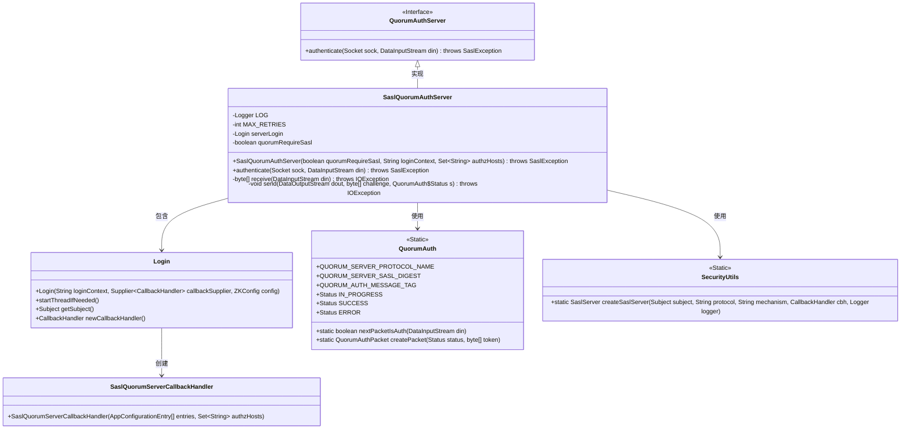
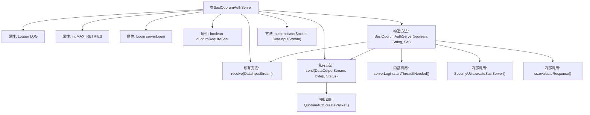
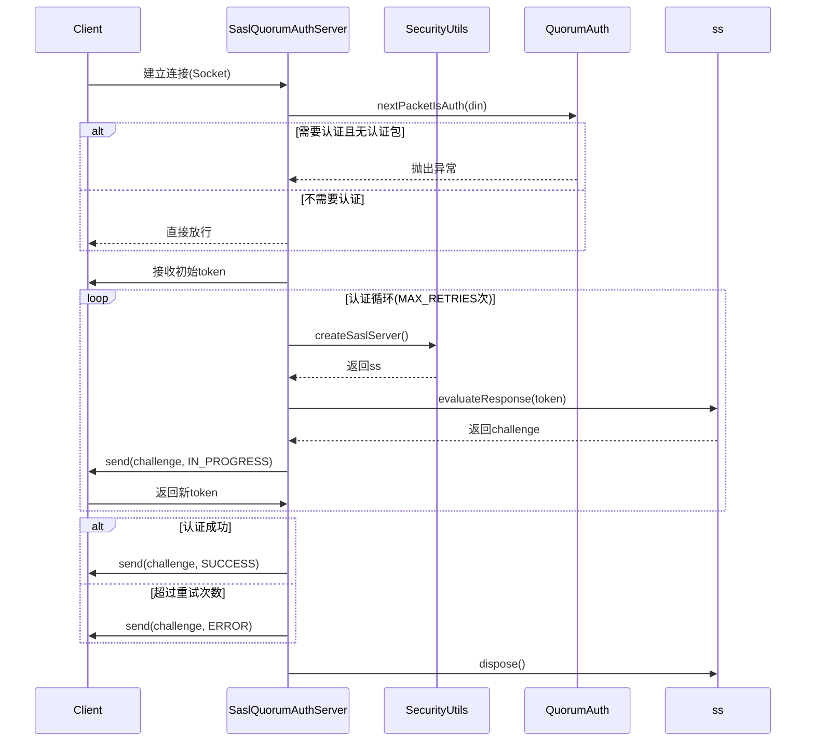

# 基础信息

|      |      |
|------|------|
| 名称 | SaslQuorumAuthServer |
| 编码语言 | .java |
| 代码路径 | zookeeper/zookeeper-server/src/main/java/org/apache/zookeeper/server/quorum/auth/SaslQuorumAuthServer.java |
| 包名 | org.apache.zookeeper.server.quorum.auth |
| 依赖项 | ['java.io.BufferedOutputStream', 'java.io.DataInputStream', 'java.io.DataOutputStream', 'java.io.IOException', 'java.net.Socket', 'java.util.Set', 'java.util.function.Supplier', 'javax.security.auth.callback.CallbackHandler', 'javax.security.auth.login.AppConfigurationEntry', 'javax.security.auth.login.Configuration', 'javax.security.auth.login.LoginException', 'javax.security.sasl.SaslException', 'javax.security.sasl.SaslServer', 'org.apache.jute.BinaryInputArchive', 'org.apache.jute.BinaryOutputArchive', 'org.apache.zookeeper.Login', 'org.apache.zookeeper.common.ZKConfig', 'org.apache.zookeeper.server.quorum.QuorumAuthPacket', 'org.apache.zookeeper.util.SecurityUtils', 'org.slf4j.Logger', 'org.slf4j.LoggerFactory'] |
| 概述说明 | SaslQuorumAuthServer实现QuorumAuthServer接口，提供基于SASL的认证服务。支持JAAS配置，最大重试5次，可配置是否强制认证。处理认证流程，包括令牌交换、挑战响应及状态管理。 |

# 说明

SaslQuorumAuthServer类实现了QuorumAuthServer接口，用于处理基于SASL的认证机制。该类包含一个构造函数，初始化JAAS配置和登录上下文，并设置最大重试次数为5。authenticate方法负责处理客户端认证流程，包括接收和发送认证令牌、验证响应、处理重试逻辑以及最终认证状态通知。若认证失败且SASL非必需，仍允许连接通过。类中还包含接收和发送认证数据包的辅助方法，确保通信过程的安全性和完整性。整个过程涉及SASL服务器创建、令牌交换和状态管理，并记录详细日志。

# 类列表 Class Summary

| 名称   | 类型  | 说明 |
|-------|------|-------------|
| SaslQuorumAuthServer | class | SaslQuorumAuthServer实现QuorumAuthServer接口，提供基于SASL的认证功能。支持JAAS配置，最大重试5次，可配置是否强制认证。认证过程包括令牌交换、挑战响应，成功或失败后发送状态。异常处理完善，支持非强制认证模式。 |

## 类 SaslQuorumAuthServer

|      |      |
|------|------|
| 访问范围 | public |
| 类型 | class |
| 名称 | SaslQuorumAuthServer |
| 说明 | SaslQuorumAuthServer实现QuorumAuthServer接口，提供基于SASL的认证功能。支持JAAS配置，最大重试5次，可配置是否强制认证。认证过程包括令牌交换、挑战响应，成功或失败后发送状态。异常处理完善，支持非强制认证模式。 |

### UML类图

该代码实现了一个基于SASL协议的Quorum认证服务器，主要功能包括初始化JAAS配置、处理客户端认证请求、管理认证状态和重试机制。SaslQuorumAuthServer类实现了QuorumAuthServer接口，通过Login类管理认证主体，使用SecurityUtils创建SASL服务器实例，并依赖QuorumAuth类处理协议状态和报文。认证过程包含令牌交换、挑战响应和状态管理，支持最大重试次数限制和可选强制认证模式。

### 内部方法调用关系图

该流程图展示了SaslQuorumAuthServer类的结构和主要方法调用关系，包含构造方法初始化JAAS配置、核心认证流程以及网络通信处理。时序图详细描述了SASL认证的交互过程，包括客户端与服务端的挑战-响应机制、错误处理逻辑和认证状态管理。认证过程支持最大重试次数控制，并根据配置决定是否强制要求SASL认证，最后会清理SaslServer资源。

### 字段列表 Field List

| 名称  | 类型  | 说明 |
|-------|-------|------|
| MAX_RETRIES = 5 | int | 私有静态常量MAX_RETRIES值为5，表示最大重试次数。 |
| quorumRequireSasl | boolean | 私有布尔变量quorumRequireSasl，表示是否要求SASL认证。 |
| LOG = LoggerFactory.getLogger(SaslQuorumAuthServer.class) | Logger | 私有静态日志常量LOG，用于SaslQuorumAuthServer类的日志记录。 |
| serverLogin | Login | 私有登录服务实例。 |

### 方法列表 Method List

| 名称  | 类型  | 说明 |
|-------|-------|------|
| receive | byte[] | 私有方法接收数据流，反序列化为认证包后返回令牌。 |
| authenticate | void | 方法authenticate处理SASL认证流程，检查是否需要认证，接收令牌并验证，支持重试机制，认证成功或失败发送状态，最后清理资源。若无需认证则跳过。 |
| send | void | 私有方法send通过DataOutputStream发送认证包，若挑战为空且状态非成功则发送处理中状态包，否则发送指定状态及挑战包，最后刷新输出流。 |

