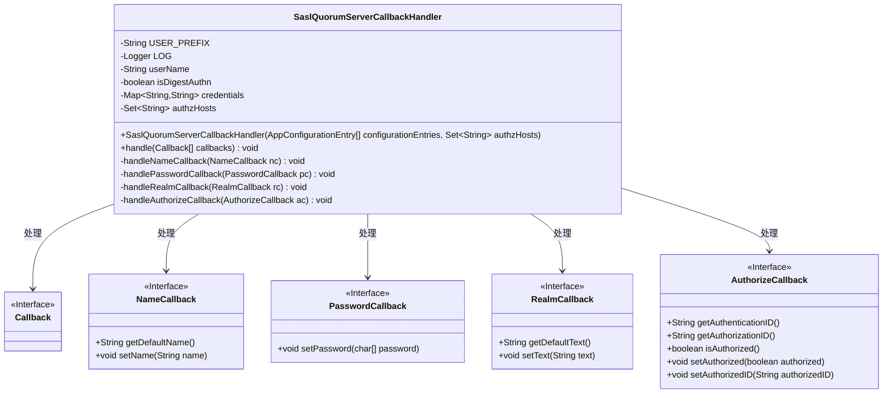
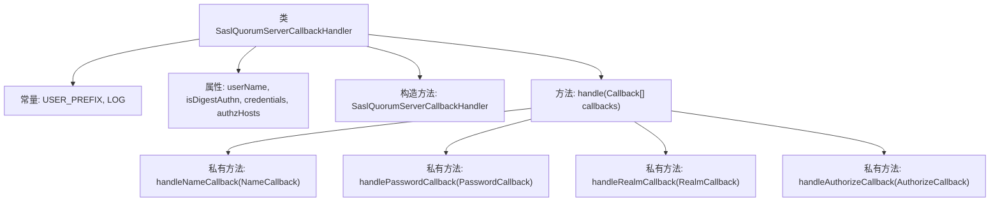
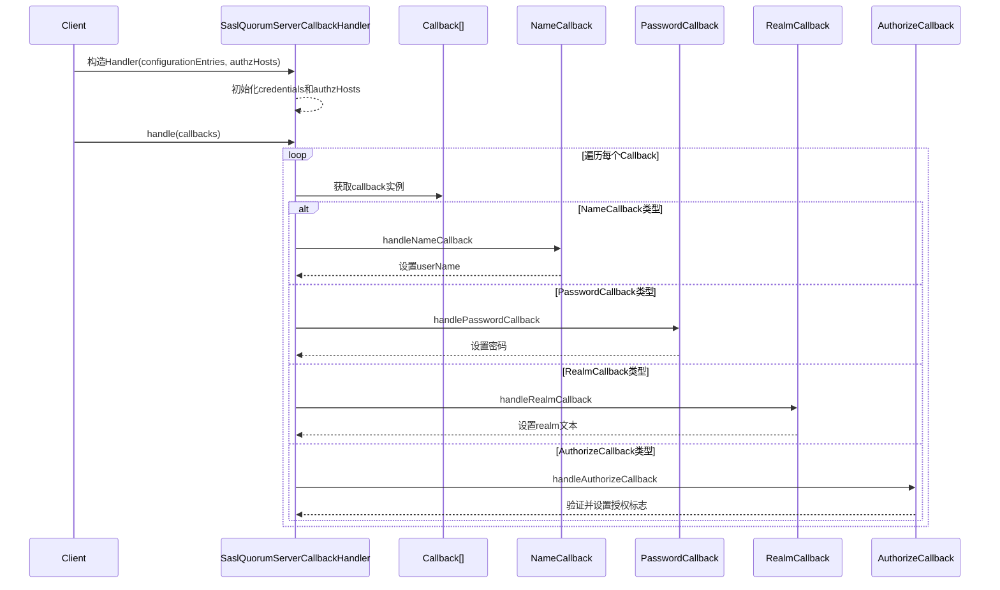

# 基础信息

|      |      |
|------|------|
| 名称 | SaslQuorumServerCallbackHandler |
| 编码语言 | .java |
| 代码路径 | zookeeper/zookeeper-server/src/main/java/org/apache/zookeeper/server/quorum/auth/SaslQuorumServerCallbackHandler.java |
| 包名 | org.apache.zookeeper.server.quorum.auth |
| 依赖项 | ['java.util.Collections', 'java.util.HashMap', 'java.util.Map', 'java.util.Set', 'javax.security.auth.callback.Callback', 'javax.security.auth.callback.CallbackHandler', 'javax.security.auth.callback.NameCallback', 'javax.security.auth.callback.PasswordCallback', 'javax.security.auth.callback.UnsupportedCallbackException', 'javax.security.auth.login.AppConfigurationEntry', 'javax.security.sasl.AuthorizeCallback', 'javax.security.sasl.RealmCallback', 'org.apache.zookeeper.server.auth.DigestLoginModule', 'org.slf4j.Logger', 'org.slf4j.LoggerFactory'] |
| 概述说明 | SaslQuorumServerCallbackHandler处理SASL认证回调，支持DIGEST-MD5验证，管理用户凭证和授权主机列表，验证身份与权限匹配。 |

# 说明

SaslQuorumServerCallbackHandler是一个实现了CallbackHandler接口的类，用于处理SASL认证和授权回调。它支持DIGEST-MD5认证方式，通过JAAS配置初始化用户凭证，并验证授权主机列表。主要功能包括处理NameCallback、PasswordCallback、RealmCallback和AuthorizeCallback，检查用户凭证和主机授权状态，记录认证结果日志。

# 类列表 Class Summary

| 名称   | 类型  | 说明 |
|-------|------|-------------|
| SaslQuorumServerCallbackHandler | class | SaslQuorumServerCallbackHandler处理SASL认证回调，支持DIGEST-MD5验证和主机授权检查。从JAAS配置加载用户凭证，验证用户名密码匹配及授权主机列表。 |

## 类 SaslQuorumServerCallbackHandler

|      |      |
|------|------|
| 访问范围 | public |
| 类型 | class |
| 名称 | SaslQuorumServerCallbackHandler |
| 说明 | SaslQuorumServerCallbackHandler处理SASL认证回调，支持DIGEST-MD5验证和主机授权检查。从JAAS配置加载用户凭证，验证用户名密码匹配及授权主机列表。 |

### UML类图

这段代码实现了一个SASL(简单认证和安全层)服务端回调处理器，主要用于ZooKeeper仲裁服务器的认证和授权。类结构包含一个主处理器类和四个回调接口，处理器通过构造函数初始化认证配置，并实现了处理不同类型回调的方法。主要功能包括：处理用户名/密码认证、域验证和主机授权检查，支持DIGEST-MD5认证方式，同时维护授权主机列表进行访问控制。

### 内部方法调用关系图

这段代码实现了一个SASL（简单认证和安全层）的服务器回调处理器，主要用于ZooKeeper仲裁服务器的认证和授权流程。流程图展示了类的结构和主要方法调用关系，时序图则详细描述了从客户端发起请求到处理各类回调（名称、密码、域、授权）的完整交互过程。该处理器支持DIGEST-MD5认证方式，并通过authzHosts集合进行主机级别的访问控制，在授权阶段会严格验证客户端身份和主机权限。

### 字段列表 Field List

| 名称  | 类型  | 说明 |
|-------|-------|------|
| USER_PREFIX = "user_" | String | 定义私有静态常量字符串USER_PREFIX，值为"user_"。 |
| authzHosts | Set<String> | 私有字符串集合，存储授权主机信息。 |
| LOG = LoggerFactory.getLogger(SaslQuorumServerCallbackHandler.class) | Logger | SaslQuorumServerCallbackHandler类定义了一个私有静态日志记录器LOG，用于记录日志信息。 |
| credentials | Map<String, String> | 私有成员变量credentials，类型为Map，键值对均为String。 |
| isDigestAuthn | boolean | 私有布尔变量，标识是否启用摘要认证。 |
| userName | String | 私有字符串变量userName。 |

### 方法列表 Method List

| 名称  | 类型  | 说明 |
|-------|-------|------|
| handle | void | 处理回调数组，根据不同类型调用对应处理方法：NameCallback、PasswordCallback、RealmCallback、AuthorizeCallback。 |
| handlePasswordCallback | void | 处理密码回调：检查用户名是否存在，存在则设置密码，不存在则记录警告。 |
| handleNameCallback | void | 方法处理名称回调，检查用户是否在凭据库中。若不存在则记录警告并返回，否则设置回调名称并存储用户名。 |
| handleRealmCallback | void | 处理RealmCallback，记录默认文本并设置相同值。 |
| handleAuthorizeCallback | void | 处理授权回调：验证认证ID与授权ID是否匹配，检查连接主机是否在授权列表中，设置授权标志并记录结果。 |

