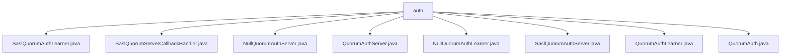

# 基础信息

|      |      |
|------|------|
| 名称 | auth |
| 编码语言 | .java |
| 代码路径 | zookeeper/zookeeper-server/src/main/java/org/apache/zookeeper/server/quorum/auth |
| 包名 | zookeeper.docs.zookeeper-server.src.main.java.org.apache.zookeeper.server.quorum.auth |
| 概述说明 | SaslQuorumAuthLearner处理ZooKeeper仲裁学习者的SASL认证，含登录状态、强制认证标志和服务主体字段。SaslQuorumServerCallbackHandler处理SASL回调，支持DIGEST-MD5。NullQuorumAuthServer和NullQuorumAuthLearner为空实现，跳过认证。QuorumAuthServer和QuorumAuthLearner为认证接口。SaslQuorumAuthServer处理SASL服务器认证流程。QuorumAuth定义认证常量和方法。 |

# 说明

## 概述  
1. 该模块是ZooKeeper仲裁节点的SASL认证框架，核心职责是实现Quorum节点间的安全认证机制，类似Kerberos的握手协议。  
2. 主要接口包括QuorumAuthServer和QuorumAuthLearner，通过Socket交换认证令牌，例如SaslQuorumAuthServer处理服务端认证流程。  
3. 关键数据结构包含认证状态枚举（进行中/成功/错误）和QUORUM_AUTH_MAGIC_NUMBER协议标识符，类似网络协议魔数校验机制。  
4. 依赖JAAS配置和SASL库，例如DIGEST-MD5和Kerberos实现，NullQuorumAuthServer提供免认证模式。  

## 主要业务场景  
1. 支持仲裁节点建立连接时的SASL握手流程，例如SaslQuorumAuthLearner处理客户端令牌交换。  
2. 采用同步令牌交互模式，通过DataInputStream读取认证数据包，类似HTTPS的证书验证过程。  
3. 功能完整性体现为支持强制认证（quorumRequireSasl）和免认证（NullQuorumAuth*）两种模式。  
4. 主要用于ZooKeeper集群内部通信安全，例如防止未授权节点加入仲裁组。  
5. 提供SPI式接口扩展能力，例如自定义CallbackHandler实现DIGEST-MD5认证。  
6. 可与Kerberos系统集成，例如通过quorumServicePrincipal配置Kerberos服务主体。

### 包内部结构视图

该流程图展示了Zookeeper项目中quorum认证模块的文件结构。根节点"auth"下包含8个Java实现文件，涉及SASL认证、空认证实现和基础认证接口等核心功能类，反映了Zookeeper集群认证机制的完整实现方案。所有文件均位于同一层级，没有进一步嵌套关系。

# 文件列表 File List

| 名称   | 类型  | 说明 |
|-------|------|-------------|
| [SaslQuorumServerCallbackHandler.java](SaslQuorumServerCallbackHandler.md) | file | SaslQuorumServerCallbackHandler处理SASL认证回调，支持DIGEST-MD5验证，管理用户凭证和授权主机列表，验证身份与权限匹配。 |
| [SaslQuorumAuthLearner.java](SaslQuorumAuthLearner.md) | file | SaslQuorumAuthLearner类实现QuorumAuthLearner接口，用于ZooKeeper仲裁学习者的SASL认证。包含初始化JAAS配置、SASL客户端创建及认证流程，支持认证状态检查与错误处理。 |
| [NullQuorumAuthLearner.java](NullQuorumAuthLearner.md) | file | 空授权学习者类，不要求认证，直接返回。 |
| [QuorumAuthServer.java](QuorumAuthServer.md) | file | QuorumAuthServer接口定义认证方法authenticate，通过Socket和DataInputStream验证连接，失败时抛出IOException。 |
| [NullQuorumAuthServer.java](NullQuorumAuthServer.md) | file | 空认证服务器类，不执行任何认证操作，直接返回。 |
| [QuorumAuth.java](QuorumAuth.md) | file | QuorumAuth类定义了ZooKeeper仲裁认证相关常量和方法，包括SASL认证配置、Kerberos服务主体、状态枚举及认证包处理功能。 |
| [QuorumAuthLearner.java](QuorumAuthLearner.md) | file | QuorumAuthLearner接口定义认证方法authenticate，用于验证quorum peer服务器间的socket连接，参数为socket和主机名，失败时抛出IOException。 |
| [SaslQuorumAuthServer.java](SaslQuorumAuthServer.md) | file | SaslQuorumAuthServer实现QuorumAuthServer接口，提供基于SASL的认证服务。支持JAAS配置，最大重试5次，可配置是否强制认证。处理认证流程，包括令牌交换、挑战响应及状态管理。 |

