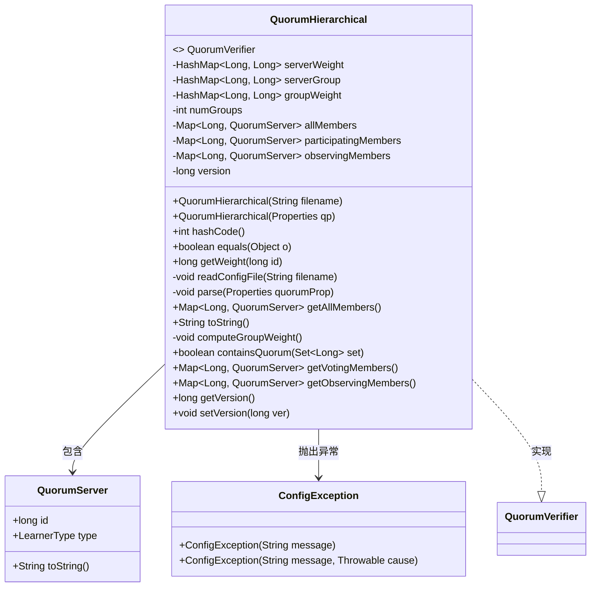

# 基础信息

|      |      |
|------|------|
| 名称 | QuorumHierarchical |
| 编码语言 | .java |
| 代码路径 | zookeeper/zookeeper-server/src/main/java/org/apache/zookeeper/server/quorum/flexible/QuorumHierarchical.java |
| 包名 | org.apache.zookeeper.server.quorum.flexible |
| 依赖项 | ['java.io.File', 'java.io.FileInputStream', 'java.io.IOException', 'java.io.StringWriter', 'java.util.HashMap', 'java.util.Map', 'java.util.Map.Entry', 'java.util.Properties', 'java.util.Set', 'org.apache.zookeeper.server.quorum.QuorumPeer.LearnerType', 'org.apache.zookeeper.server.quorum.QuorumPeer.QuorumServer', 'org.apache.zookeeper.server.quorum.QuorumPeerConfig.ConfigException', 'org.slf4j.Logger', 'org.slf4j.LoggerFactory'] |
| 概述说明 | QuorumHierarchical类实现QuorumVerifier接口，管理服务器权重、分组及权重计算，支持配置文件解析，提供法定人数验证功能。 |

# 说明

QuorumHierarchical类实现QuorumVerifier接口，用于管理分层法定人数验证。核心功能包括：通过配置文件或属性初始化服务器权重、分组信息；计算组权重；验证给定集合是否满足法定人数条件。类包含多个HashMap存储服务器权重、分组及组权重，维护所有成员、参与成员和观察成员映射。提供equals方法比较对象，toString生成配置字符串。关键方法containsQuorum通过检查各组权重是否过半判定法定人数。支持版本控制，提供获取投票成员和观察成员的接口。日志记录详细调试信息。

# 类列表 Class Summary

| 名称   | 类型  | 说明 |
|-------|------|-------------|
| QuorumHierarchical | class | QuorumHierarchical类实现QuorumVerifier接口，管理服务器权重、分组及多数投票验证，支持配置文件和属性初始化。 |


## 类 QuorumHierarchical

|      |      |
|------|------|
| 访问范围 | public |
| 类型 | class |
| 名称 | QuorumHierarchical |
| 说明 | QuorumHierarchical类实现QuorumVerifier接口，管理服务器权重、分组及多数投票验证，支持配置文件和属性初始化。 |


### UML类图



类图描述：
QuorumHierarchical类实现了QuorumVerifier接口，用于管理分布式系统中的法定人数(quorum)验证逻辑。它通过三个核心HashMap(serverWeight/serverGroup/groupWeight)维护服务器权重和分组信息，包含allMembers/participatingMembers/observingMembers三个成员集合。主要功能包括解析配置文件、计算组权重、验证法定人数集合，其中包含与QuorumServer的关联关系，并在异常时抛出ConfigException。该类采用分层权重机制进行quorum验证，适用于ZooKeeper等分布式协调服务场景。


### 内部方法调用关系图

```mermaid
graph TD
    A["类QuorumHierarchical"]
    B["属性: HashMap<Long,Long> serverWeight"]
    C["属性: HashMap<Long,Long> serverGroup"]
    D["属性: HashMap<Long,Long> groupWeight"]
    E["属性: int numGroups"]
    F["属性: Map<Long,QuorumServer> allMembers"]
    G["属性: Map<Long,QuorumServer> participatingMembers"]
    H["属性: Map<Long,QuorumServer> observingMembers"]
    I["属性: long version"]
    J["构造方法: QuorumHierarchical(String filename)"]
    K["构造方法: QuorumHierarchical(Properties qp)"]
    L["方法: long getWeight(long id)"]
    M["方法: void readConfigFile(String filename)"]
    N["方法: void parse(Properties quorumProp)"]
    O["方法: Map<Long,QuorumServer> getAllMembers()"]
    P["方法: String toString()"]
    Q["方法: void computeGroupWeight()"]
    R["方法: boolean containsQuorum(Set<Long> set)"]
    S["方法: Map<Long,QuorumServer> getVotingMembers()"]
    T["方法: Map<Long,QuorumServer> getObservingMembers()"]
    U["方法: long getVersion()"]
    V["方法: void setVersion(long ver)"]
    W["方法: int hashCode()"]
    X["方法: boolean equals(Object o)"]

    A --> B
    A --> C
    A --> D
    A --> E
    A --> F
    A --> G
    A --> H
    A --> I
    A --> J
    A --> K
    A --> L
    A --> M
    A --> N
    A --> O
    A --> P
    A --> Q
    A --> R
    A --> S
    A --> T
    A --> U
    A --> V
    A --> W
    A --> X
    J --> M
    K --> N
    M --> N
    N --> Q
    R --> Q
```



```mermaid
sequenceDiagram
    participant Client
    participant QuorumHierarchical
    participant Properties
    participant File

    Client ->> QuorumHierarchical: new QuorumHierarchical(filename)
    QuorumHierarchical ->> File: new File(filename)
    File -->> QuorumHierarchical: configFile
    QuorumHierarchical ->> File: exists()
    alt 文件存在
        QuorumHierarchical ->> Properties: new Properties()
        QuorumHierarchical ->> FileInputStream: new FileInputStream(configFile)
        QuorumHierarchical ->> Properties: load(in)
        QuorumHierarchical ->> QuorumHierarchical: parse(cfg)
    else 文件不存在
        QuorumHierarchical ->> IllegalArgumentException: throw
    end
    QuorumHierarchical -->> Client: 初始化完成
```

这段代码实现了一个分层的法定人数验证器QuorumHierarchical，主要用于分布式系统中法定人数的计算和验证。类中包含多个HashMap用于存储服务器权重、分组信息以及组权重，提供了从配置文件或属性初始化、权重计算、法定人数验证等功能。核心方法parse()负责解析配置，computeGroupWeight()预计算组权重，containsQuorum()验证给定集合是否构成法定人数。代码通过日志记录关键操作，并实现了equals和hashCode方法用于对象比较。

### 字段列表 Field List

| 名称  | 类型  | 说明 |
|-------|-------|------|
| LOG = LoggerFactory.getLogger(QuorumHierarchical.class) | Logger | QuorumHierarchical类中定义了一个私有静态日志记录器LOG。 |
| participatingMembers = new HashMap<>() | Map<Long, QuorumServer> | 定义了一个私有成员变量participatingMembers，类型为Map，键为Long，值为QuorumServer，初始化为HashMap实例。 |
| serverGroup = new HashMap<>() | HashMap<Long, Long> | 定义私有HashMap变量serverGroup，键值对均为Long类型。 |
| allMembers = new HashMap<>() | Map<Long, QuorumServer> | 定义一个私有Map变量allMembers，键为Long类型，值为QuorumServer对象，初始化为HashMap实例。 |
| version = 0 | long | 私有长整型变量version初始化为0。 |
| serverWeight = new HashMap<>() | HashMap<Long, Long> | 定义私有HashMap变量serverWeight，键值对均为Long类型，用于存储服务器权重信息。 |
| observingMembers = new HashMap<>() | Map<Long, QuorumServer> | 定义一个私有Map变量observingMembers，键为Long类型，值为QuorumServer对象。 |
| numGroups = 0 | int | 私有整型变量numGroups初始化为0。 |
| groupWeight = new HashMap<>() | HashMap<Long, Long> | 定义私有HashMap变量groupWeight，键值对为Long类型。 |

### 方法列表 Method List

| 名称  | 类型  | 说明 |
|-------|-------|------|
| readConfigFile | void | 读取配置文件，检查存在性后加载属性，处理异常并抛出配置错误。 |
| getObservingMembers | Map<Long, QuorumServer> | 获取观察成员映射表，返回键为长整型、值为QuorumServer的Map。 |
| containsQuorum | boolean | 检查集合是否满足多数权重条件：统计各组权重，若过半数组的权重超过组内半数则返回真，否则返回假。 |
| getVersion | long | 获取版本号的方法，返回长整型变量version的值。 |
| setVersion | void | 设置版本号的方法，将输入参数ver赋值给变量version。 |
| equals | boolean | equals方法检查对象是否为QuorumHierarchical实例，比较版本、成员数量及各映射表内容是否一致，全部匹配返回true，否则false。 |
| hashCode | int | 该方法重写hashCode但未实际实现，直接返回固定值42并断言提示未设计哈希逻辑。 |
| getVotingMembers | Map<Long, QuorumServer> | 获取投票成员映射表，返回参与成员的键值对集合。 |
| computeGroupWeight | void | 计算服务器组权重：遍历服务器组，累加各服务器权重到对应组；忽略权重为零的组，并减少组计数。 |
| toString | String | 将成员、组和权重信息格式化为字符串，包含server.id=value、group.gid=sid列表、weight.sid=value及版本号。 |
| parse | void | 解析配置属性，处理服务器、组、权重和版本信息，验证参与者服务器分组和权重，计算组权重。 |
| getWeight | long | 获取指定ID的权重值。 |
| getAllMembers | Map<Long, QuorumServer> | 该方法返回一个包含所有成员的长整型键和QuorumServer对象的映射。 |


