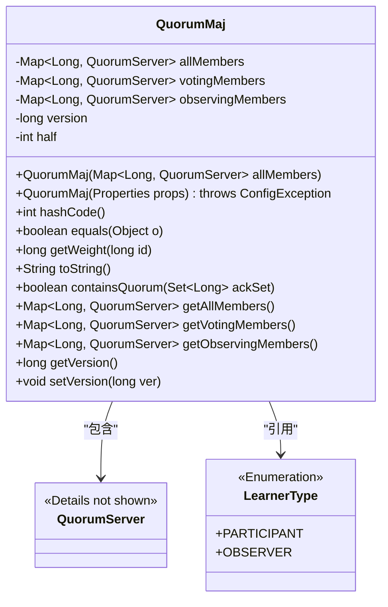

# 基础信息

|      |      |
|------|------|
| 名称 | QuorumMaj |
| 编码语言 | .java |
| 代码路径 | zookeeper/zookeeper-server/src/main/java/org/apache/zookeeper/server/quorum/flexible/QuorumMaj.java |
| 包名 | org.apache.zookeeper.server.quorum.flexible |
| 依赖项 | ['java.util.HashMap', 'java.util.Map', 'java.util.Map.Entry', 'java.util.Properties', 'java.util.Set', 'org.apache.zookeeper.server.quorum.QuorumPeer.LearnerType', 'org.apache.zookeeper.server.quorum.QuorumPeer.QuorumServer', 'org.apache.zookeeper.server.quorum.QuorumPeerConfig.ConfigException', 'org.slf4j.Logger', 'org.slf4j.LoggerFactory'] |
| 概述说明 | QuorumMaj类实现QuorumVerifier接口，管理投票成员和观察成员，通过半数以上投票判断法定人数，提供成员管理、版本控制和权重计算功能。 |

# 说明

QuorumMaj类实现了QuorumVerifier接口，用于管理多数投票机制。它维护三个成员映射：allMembers、votingMembers和observingMembers，分别存储所有成员、投票成员和观察成员。类中包含两个构造函数，一个接收成员映射，另一个从配置属性初始化成员。主要功能包括计算多数阈值（half）、验证投票集合是否构成多数（containsQuorum）、以及基本的成员管理方法。类还实现了equals和toString方法，用于比较和字符串表示。版本号用于跟踪配置变更，权重默认为1。

# 类列表 Class Summary

| 名称   | 类型  | 说明 |
|-------|------|-------------|
| QuorumMaj | class | QuorumMaj类实现多数投票验证，管理投票成员和观察成员，提供版本控制和权重计算，验证集合是否满足多数条件。 |

## 类 QuorumMaj

|      |      |
|------|------|
| 访问范围 | public |
| 类型 | class |
| 名称 | QuorumMaj |
| 说明 | QuorumMaj类实现多数投票验证，管理投票成员和观察成员，提供版本控制和权重计算，验证集合是否满足多数条件。 |

### UML类图

类图描述：
QuorumMaj类实现了多数仲裁验证逻辑，通过维护三个成员映射表(allMembers/votingMembers/observingMembers)来区分参与者和观察者节点。核心功能包含构造器初始化成员列表、计算半数值(half)、验证投票集合是否构成多数(containsQuorum)以及版本控制。该类与QuorumServer存在组合关系，并引用LearnerType枚举来区分节点类型。特别注意其equals方法通过比较版本号和成员列表来实现对象相等性验证，而hashCode被设计为固定值42以强制使用equals比较。

### 内部方法调用关系图

```mermaid
graph TD
    A["类QuorumMaj"]
    B["属性: Map<Long, QuorumServer> allMembers"]
    C["属性: Map<Long, QuorumServer> votingMembers"]
    D["属性: Map<Long, QuorumServer> observingMembers"]
    E["属性: long version"]
    F["属性: int half"]
    G["方法: hashCode()"]
    H["方法: equals(Object o)"]
    I["构造方法: QuorumMaj(Map<Long, QuorumServer>)"]
    J["构造方法: QuorumMaj(Properties)"]
    K["方法: getWeight(long id)"]
    L["方法: toString()"]
    M["方法: containsQuorum(Set<Long>)"]
    N["方法: getAllMembers()"]
    O["方法: getVotingMembers()"]
    P["方法: getObservingMembers()"]
    Q["方法: getVersion()"]
    R["方法: setVersion(long)"]

    A --> B
    A --> C
    A --> D
    A --> E
    A --> F
    A --> G
    A --> H
    A --> I
    A --> J
    A --> K
    A --> L
    A --> M
    A --> N
    A --> O
    A --> P
    A --> Q
    A --> R
```

该流程图展示了QuorumMaj类的完整结构，包含4个核心属性（allMembers/votingMembers/observingMembers集合、version版本号和half半数阈值）和11个关键方法。其中构造方法负责初始化成员集合并计算半数阈值，equals()方法通过比较版本号和成员列表实现对象等价性判断，containsQuorum()是核心功能方法用于验证投票集是否达到多数决条件。所有方法均围绕分布式一致性投票机制设计，通过成员分类（参与节点/观察节点）和权重计算实现法定人数验证功能。

### 字段列表 Field List

| 名称  | 类型  | 说明 |
|-------|-------|------|
| half | int | 声明一个受保护的整型变量half。 |
| votingMembers = new HashMap<>() | Map<Long, QuorumServer> | 定义了一个私有Map变量votingMembers，键为Long类型，值为QuorumServer对象，初始化为HashMap实例。 |
| allMembers = new HashMap<>() | Map<Long, QuorumServer> | 私有成员变量allMembers，类型为HashMap，键为Long，值为QuorumServer。 |
| LOG = LoggerFactory.getLogger(QuorumMaj.class) | Logger | 定义QuorumMaj类的私有静态日志对象LOG，使用LoggerFactory获取日志实例。 |
| observingMembers = new HashMap<>() | Map<Long, QuorumServer> | 定义观察成员映射，键为长整型，值为QuorumServer对象。 |
| version = 0 | long | 私有长整型变量version初始化为0。 |

### 方法列表 Method List

| 名称  | 类型  | 说明 |
|-------|-------|------|
| equals | boolean | 比较两个QuorumMaj对象是否相等：检查类型、版本、成员数量和每个成员是否一致。 |
| getWeight | long | 这是一个Java方法，返回固定值1，参数为长整型id。 |
| getAllMembers | Map<Long, QuorumServer> | 该方法返回一个包含所有成员的Map，键为Long类型，值为QuorumServer对象。 |
| getVotingMembers | Map<Long, QuorumServer> | 获取投票成员映射表，返回键为长整型、值为QuorumServer的Map集合。 |
| getVersion | long | 获取版本号的方法，返回长整型变量version的值。 |
| setVersion | void | 设置版本号的方法，将输入参数ver赋值给变量version。 |
| toString | String | 该方法将成员信息转为字符串，格式为"server.id=成员信息"，最后追加版本号的十六进制值。 |
| getObservingMembers | Map<Long, QuorumServer> | 获取观察成员列表的方法，返回类型为Map，键为Long，值为QuorumServer。 |
| containsQuorum | boolean | 检查ackSet大小是否过半，返回布尔结果。 |
| hashCode | int | 方法hashCode被设计为返回固定值42，并断言未实现此方法。 |

