# 基础信息

|      |      |
|------|------|
| 名称 | QuorumOracleMaj |
| 编码语言 | .java |
| 代码路径 | zookeeper/zookeeper-server/src/main/java/org/apache/zookeeper/server/quorum/flexible/QuorumOracleMaj.java |
| 包名 | org.apache.zookeeper.server.quorum.flexible |
| 依赖项 | ['java.io.FileReader', 'java.io.IOException', 'java.util.ArrayList', 'java.util.List', 'java.util.Map', 'java.util.Properties', 'java.util.Set', 'java.util.concurrent.atomic.AtomicBoolean', 'org.apache.commons.io.FilenameUtils', 'org.apache.zookeeper.server.quorum.Leader', 'org.apache.zookeeper.server.quorum.LearnerHandler', 'org.apache.zookeeper.server.quorum.QuorumPeer', 'org.apache.zookeeper.server.quorum.QuorumPeerConfig', 'org.apache.zookeeper.server.quorum.SyncedLearnerTracker', 'org.slf4j.Logger', 'org.slf4j.LoggerFactory'] |
| 概述说明 | QuorumOracleMaj类扩展QuorumMaj，通过oracle路径设置决策机制，包含更新oracle需求、查询oracle结果及验证投票集等功能，适用于特定仲裁场景。 |

# 说明

QuorumOracleMaj类继承自QuorumMaj，扩展了Oracle机制功能。该类包含一个oracle路径属性和needOracle原子布尔标志。构造函数支持通过成员映射或属性配置初始化，并设置oracle路径。核心功能包括：通过updateNeedOracle方法判断是否需要查询Oracle；askOracle方法读取文件内容返回布尔值；containsQuorum方法在成员数为2时依赖Oracle决策；overrideQuorumDecision组合前两个方法实现仲裁覆盖。此外提供提案重新验证、投票集验证等方法，并重写了equals和hashCode方法。日志记录贯穿各关键操作，异常处理完善。

# 类列表 Class Summary

| 名称   | 类型  | 说明 |
|-------|------|-------------|
| QuorumOracleMaj | class | QuorumOracleMaj是QuorumMaj的子类，增加了oracle路径设置和查询功能，用于在特定条件下通过读取oracle文件决定是否满足quorum。包含成员管理、oracle操作、提案重新验证等方法。 |


## 类 QuorumOracleMaj

|      |      |
|------|------|
| 访问范围 | public |
| 类型 | class |
| 名称 | QuorumOracleMaj |
| 说明 | QuorumOracleMaj是QuorumMaj的子类，增加了oracle路径设置和查询功能，用于在特定条件下通过读取oracle文件决定是否满足quorum。包含成员管理、oracle操作、提案重新验证等方法。 |


### UML类图

```mermaid
classDiagram
    class QuorumMaj {
        <<Abstract>>
        +Map~Long, QuorumPeer.QuorumServer~ allMembers
        +QuorumMaj(Map~Long, QuorumPeer.QuorumServer~ allMembers)
        +QuorumMaj(Properties props)
        +boolean containsQuorum(Set~Long~ ackSet)
        +boolean overrideQuorumDecision(List~LearnerHandler~ forwardingFollowers)
        +boolean revalidateOutstandingProp(Leader self, ArrayList~Leader.Proposal~ outstandingProposal, long lastCommitted)
        +boolean revalidateVoteset(SyncedLearnerTracker voteSet, boolean timeout)
        +Map~Long, QuorumPeer.QuorumServer~ getAllMembers()
        +int getVersion()
        +Set~Long~ getVotingMembers()
    }

    class QuorumOracleMaj {
        -Logger LOG
        -String oracle
        -AtomicBoolean needOracle
        +QuorumOracleMaj(Map~Long, QuorumPeer.QuorumServer~ allMembers, String oraclePath)
        +QuorumOracleMaj(Properties props, String oraclePath)
        -void setOracle(String path)
        +boolean updateNeedOracle(List~LearnerHandler~ forwardingFollowers)
        +boolean askOracle()
        +boolean getNeedOracle()
        +String getOraclePath()
        +boolean overrideQuorumDecision(List~LearnerHandler~ forwardingFollowers)
        +boolean revalidateOutstandingProp(Leader self, ArrayList~Leader.Proposal~ outstandingProposal, long lastCommitted)
        +boolean revalidateVoteset(SyncedLearnerTracker voteSet, boolean timeout)
        +boolean containsQuorum(Set~Long~ ackSet)
        +boolean equals(Object o)
        +int hashCode()
    }

    QuorumOracleMaj --|> QuorumMaj : 继承
    // QuorumOracleMaj扩展了QuorumMaj，增加了oracle机制用于仲裁决策
    // 通过文件读取oracle结果，并在特定条件下覆盖原有仲裁逻辑
```

类图描述：QuorumOracleMaj是QuorumMaj的子类，扩展了基于oracle的仲裁机制。它通过文件读取oracle的决策结果（'1'或其它），在成员数为2且无转发跟随者时启用oracle机制。核心功能包括动态更新oracle需求状态(updateNeedOracle)、查询oracle结果(askOracle)、以及覆盖原有仲裁逻辑(overrideQuorumDecision)。同时保留了父类的成员管理和仲裁验证功能，并添加了异常处理和日志记录能力。


### 内部方法调用关系图

```mermaid
graph TD
    A["类QuorumOracleMaj"]
    B["属性: Logger LOG"]
    C["属性: String oracle"]
    D["属性: AtomicBoolean needOracle"]
    E["构造方法: QuorumOracleMaj(Map<Long, QuorumServer> allMembers, String oraclePath)"]
    F["构造方法: QuorumOracleMaj(Properties props, String oraclePath)"]
    G["私有方法: setOracle(String path)"]
    H["重写方法: boolean updateNeedOracle(List<LearnerHandler>)"]
    I["重写方法: boolean askOracle()"]
    J["重写方法: boolean getNeedOracle()"]
    K["重写方法: String getOraclePath()"]
    L["重写方法: boolean overrideQuorumDecision(List<LearnerHandler>)"]
    M["重写方法: boolean revalidateOutstandingProp(Leader, ArrayList<Proposal>, long)"]
    N["重写方法: boolean revalidateVoteset(SyncedLearnerTracker, boolean)"]
    O["重写方法: boolean containsQuorum(Set<Long>)"]
    P["重写方法: boolean equals(Object)"]
    Q["重写方法: int hashCode()"]

    A --> B
    A --> C
    A --> D
    A --> E
    A --> F
    E --> G
    F --> G
    A --> H
    A --> I
    A --> J
    A --> K
    A --> L
    L --> H
    L --> I
    A --> M
    A --> N
    A --> O
    O --> I
    O --> J
    A --> P
    A --> Q
```



这段代码是QuorumOracleMaj类的实现，继承自QuorumMaj类，主要用于处理分布式系统中的法定人数（quorum）决策逻辑。类中包含两个构造方法，分别通过成员映射或属性配置初始化，并设置oracle路径。核心功能包括：通过updateNeedOracle和askOracle方法实现oracle咨询机制，通过overrideQuorumDecision方法覆盖法定决策，以及通过revalidateOutstandingProp和revalidateVoteset方法验证提案和投票集。此外，还重写了equals和hashCode方法用于对象比较。整个流程展示了从初始化到决策验证的完整控制流。

### 字段列表 Field List

| 名称  | 类型  | 说明 |
|-------|-------|------|
| oracle = null | String | 私有字符串变量oracle初始化为null。 |
| LOG = LoggerFactory.getLogger(QuorumOracleMaj.class) | Logger | 私有静态日志常量，用于QuorumOracleMaj类的日志记录。 |
| needOracle = new AtomicBoolean(true) | AtomicBoolean | 私有原子布尔变量needOracle，初始值为true，用于线程安全操作。 |

### 方法列表 Method List

| 名称  | 类型  | 说明 |
|-------|-------|------|
| getNeedOracle | boolean | 重写方法getNeedOracle，返回布尔值needOracle的值。 |
| setOracle | void | 私有方法setOracle用于设置oracle路径。若oracle为空则赋值并记录日志，否则忽略新路径并警告日志。 |
| containsQuorum | boolean | 检查仲裁是否达成：若无配置或成员超2人则调用父类方法；未达仲裁时若需Oracle则询问，否则返回false；达仲裁返回true。 |
| hashCode | int | 重写hashCode方法，固定返回43并断言未设计该功能。 |
| equals | boolean | 重写equals方法，检查对象非空、类相同、版本一致、成员数量及内容相等则返回true，否则false。 |
| revalidateVoteset | boolean | 方法检查投票集是否有效：非空、满足所有法定人数且超时条件为真。 |
| getOraclePath | String | 重写getOraclePath方法，直接返回oracle变量值。 |
| overrideQuorumDecision | boolean | 重写方法判断是否覆盖仲裁决策：检查需更新Oracle且询问Oracle结果。 |
| revalidateOutstandingProp | boolean | 方法重写，验证未提交提案。排序提案后遍历，若提案ID大于最后提交ID则尝试提交，成功则更新最后提交ID并移除提案，失败则终止。异常返回false，成功返回true。 |
| updateNeedOracle | boolean | 该方法检查是否需要Oracle，条件是转发跟随者列表为空且投票成员数为2时设置needOracle标志并返回其值。 |
| askOracle | boolean | 读取文件内容，若为'1'返回true，否则或出错返回false。处理异常并确保文件关闭。 |


