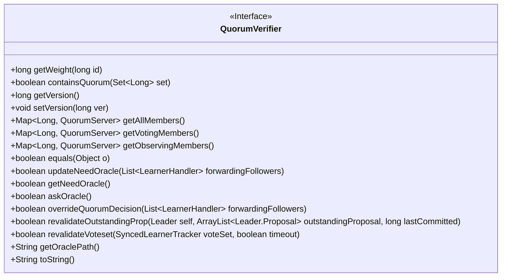

# 基础信息

|      |      |
|------|------|
| 名称 | QuorumVerifier |
| 编码语言 | .java |
| 代码路径 | zookeeper/zookeeper-server/src/main/java/org/apache/zookeeper/server/quorum/flexible/QuorumVerifier.java |
| 包名 | org.apache.zookeeper.server.quorum.flexible |
| 依赖项 | ['java.util.ArrayList', 'java.util.List', 'java.util.Map', 'java.util.Set', 'org.apache.zookeeper.server.quorum.Leader', 'org.apache.zookeeper.server.quorum.LearnerHandler', 'org.apache.zookeeper.server.quorum.QuorumPeer.QuorumServer', 'org.apache.zookeeper.server.quorum.SyncedLearnerTracker'] |
| 概述说明 | QuorumVerifier接口定义了法定人数验证功能，包括获取成员权重、检查法定人数、版本管理、成员分类及默认返回false的Oracle相关方法。 |

# 说明

QuorumVerifier是一个接口，定义了法定人数验证的相关方法。主要功能包括获取成员权重、检查是否达到法定人数、获取和设置版本号、获取所有成员、投票成员和观察成员列表。接口还提供了默认方法，如updateNeedOracle、getNeedOracle等，这些方法默认返回false或null，仅QuorumOracleMaj类会实现。此外，接口还包含equals和toString方法。该接口用于管理分布式系统中的法定人数验证逻辑。

# 类列表 Class Summary

| 名称   | 类型  | 说明 |
|-------|------|-------------|
| QuorumVerifier | interface | QuorumVerifier接口定义法定人数验证功能，包括成员权重、投票成员、观察成员查询及版本管理，默认方法提供Oracle相关操作支持但通常返回false。 |

## 类 QuorumVerifier

|      |      |
|------|------|
| 访问范围 | public |
| 类型 | interface |
| 名称 | QuorumVerifier |
| 说明 | QuorumVerifier接口定义法定人数验证功能，包括成员权重、投票成员、观察成员查询及版本管理，默认方法提供Oracle相关操作支持但通常返回false。 |

### UML类图

这段代码定义了一个名为`QuorumVerifier`的接口，主要用于处理分布式系统中的法定人数验证逻辑。接口包含核心方法如`getWeight`、`containsQuorum`用于权重计算和法定人数判断，以及成员管理方法如`getAllMembers`。特别提供了多个默认方法（如`updateNeedOracle`），这些方法主要由`QuorumOracleMaj`实现，其他实现类调用时会返回默认值。该接口还包含版本控制和对象比较功能，适用于需要动态调整验证规则的场景。

### 内部方法调用关系图

```mermaid
graph TD
    A["接口QuorumVerifier"]
    B["方法: long getWeight(long id)"]
    C["方法: boolean containsQuorum(Set<Long> set)"]
    D["方法: long getVersion()"]
    E["方法: void setVersion(long ver)"]
    F["方法: Map<Long, QuorumServer> getAllMembers()"]
    G["方法: Map<Long, QuorumServer> getVotingMembers()"]
    H["方法: Map<Long, QuorumServer> getObservingMembers()"]
    I["方法: boolean equals(Object o)"]
    J["默认方法: boolean updateNeedOracle(List<LearnerHandler>)"]
    K["默认方法: boolean getNeedOracle()"]
    L["默认方法: boolean askOracle()"]
    M["默认方法: boolean overrideQuorumDecision(List<LearnerHandler>)"]
    N["默认方法: boolean revalidateOutstandingProp(Leader, ArrayList<Proposal>, long)"]
    O["默认方法: boolean revalidateVoteset(SyncedLearnerTracker, boolean)"]
    P["默认方法: String getOraclePath()"]
    Q["方法: String toString()"]

    A --> B
    A --> C
    A --> D
    A --> E
    A --> F
    A --> G
    A --> H
    A --> I
    A --> J
    A --> K
    A --> L
    A --> M
    A --> N
    A --> O
    A --> P
    A --> Q
```

该流程图展示了QuorumVerifier接口的完整结构，包含12个核心方法定义和7个默认方法实现。接口主要提供集群法定人数验证功能，包括成员权重获取(getWeight)、法定人数判断(containsQuorum)、版本控制(getVersion/setVersion)以及三类成员视图获取方法(getAllMembers/getVotingMembers/getObservingMembers)。特别标注了5个专为QuorumOracleMaj实现预留的默认方法(如updateNeedOracle等)，这些方法在非Oracle实现类中会返回默认值。整体设计体现了接口的扩展性和对多种法定人数验证策略的支持。

### 字段列表 Field List

| 名称  | 类型  | 说明 |
|-------|-------|------|

### 方法列表 Method List

| 名称  | 类型  | 说明 |
|-------|-------|------|
| equals | boolean | 比较对象是否相等。 |
| setVersion | void | 设置版本号为长整型参数ver。 |
| revalidateVoteset | boolean | 方法revalidateVoteset接收投票集合和超时参数，始终返回false。 |
| containsQuorum | boolean | 检查集合是否满足法定人数要求。输入为长整型集合，返回布尔值表示结果。 |
| getOraclePath | String | 方法getOraclePath返回null，未实现具体逻辑。 |
| revalidateOutstandingProp | boolean | 方法revalidateOutstandingProp检查未提交提案，默认返回false。参数包括Leader对象、提案列表和最后提交位置。 |
| getAllMembers | Map<Long, QuorumServer> | 获取所有成员的长整型键与QuorumServer对象的映射表。 |
| getVersion | long | 获取版本号的方法。 |
| updateNeedOracle | boolean | 方法updateNeedOracle检查转发跟随者列表，默认返回false。 |
| getWeight | long | 获取指定ID对应的权重值。 |
| askOracle | boolean | 默认方法askOracle返回false。 |
| getNeedOracle | boolean | 默认返回false的布尔方法getNeedOracle。 |
| getObservingMembers | Map<Long, QuorumServer> | 获取观察成员映射表，键为长整型，值为QuorumServer对象。 |
| overrideQuorumDecision | boolean | 方法`overrideQuorumDecision`接收`LearnerHandler`列表参数，始终返回`false`。 |
| getVotingMembers | Map<Long, QuorumServer> | 获取投票成员的长整型键与QuorumServer值的映射。 |
| toString | String | 方法返回对象的字符串表示形式。 |

