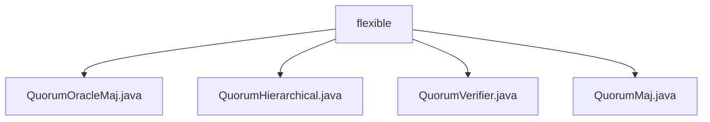

# 基础信息

|      |      |
|------|------|
| 名称 | flexible |
| 编码语言 | .java |
| 代码路径 | zookeeper/zookeeper-server/src/main/java/org/apache/zookeeper/server/quorum/flexible |
| 包名 | zookeeper.docs.zookeeper-server.src.main.java.org.apache.zookeeper.server.quorum.flexible |
| 概述说明 | QuorumOracleMaj扩展QuorumMaj，添加Oracle机制，含路径属性和决策方法。QuorumHierarchical管理分层法定人数验证，支持权重分组和过半判定。QuorumVerifier是接口，定义法定人数验证方法。QuorumMaj实现多数投票机制，维护成员映射和阈值计算。 |

# 说明

## 概述  
1.该模块是Zookeeper的法定人数(Quorum)验证系统，核心职责为分布式决策的权重计算与仲裁逻辑，类似议会投票机制。  
2.主要接口规范为QuorumVerifier定义的法定人数检查方法，例如`containsQuorum`验证投票集有效性。  
3.关键数据结构包括分层权重HashMap（QuorumHierarchical）和原子布尔标志（QuorumOracleMaj）。  
4.外部依赖项限于Zookeeper核心日志系统，例如通过SLF4J记录调试信息。  
5.实现采用策略模式，例如QuorumMaj提供简单多数决，QuorumHierarchical支持分组加权投票。  

## 主要业务场景  
1.支持Zookeeper集群的提案投票验证流程，例如判断事务提案是否获得足够成员认可。  
2.典型交互模式为同步权重计算，QuorumOracleMaj会异步读取Oracle文件辅助决策。  
3.功能完整性体现在支持多数决、分层权重、Oracle扩展三种验证策略。  
4.主要使用场景包括集群配置变更、Leader选举等需要法定人数的场景。  
5.提供Java接口API，例如QuorumVerifier定义核心验证契约。  
6.第三方集成案例为Zookeeper服务端核心模块，例如与Zab协议协同工作。

### 包内部结构视图

该流程图展示了Zookeeper服务器中灵活仲裁机制的核心文件结构。flexible作为父节点，包含四个实现类：QuorumOracleMaj、QuorumHierarchical、QuorumVerifier和QuorumMaj，这些类共同构成了Zookeeper的多样化仲裁验证体系，支持不同场景下的集群决策逻辑。

# 文件列表 File List

| 名称   | 类型  | 说明 |
|-------|------|-------------|
| [QuorumVerifier.java](QuorumVerifier.md) | file | QuorumVerifier接口定义了法定人数验证功能，包括获取成员权重、检查法定人数、版本管理、成员分类及默认返回false的Oracle相关方法。 |
| [QuorumHierarchical.java](QuorumHierarchical.md) | file | QuorumHierarchical类实现QuorumVerifier接口，管理服务器权重、分组及权重计算，支持配置文件解析，提供法定人数验证功能。 |
| [QuorumMaj.java](QuorumMaj.md) | file | QuorumMaj类实现QuorumVerifier接口，管理投票成员和观察成员，通过半数以上投票判断法定人数，提供成员管理、版本控制和权重计算功能。 |
| [QuorumOracleMaj.java](QuorumOracleMaj.md) | file | QuorumOracleMaj类扩展QuorumMaj，通过oracle路径设置决策机制，包含更新oracle需求、查询oracle结果及验证投票集等功能，适用于特定仲裁场景。 |

