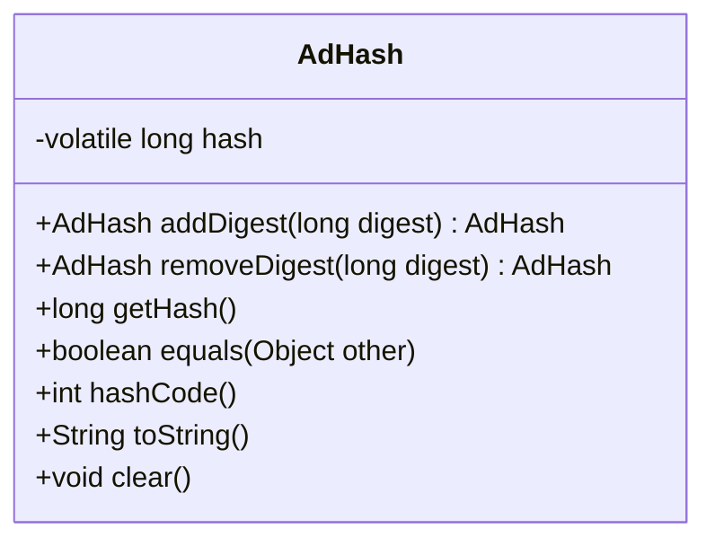
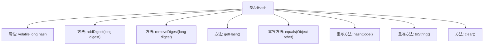

# 基础信息

|      |      |
|------|------|
| 名称 | AdHash |
| 编码语言 | .java |
| 代码路径 | zookeeper/zookeeper-server/src/main/java/org/apache/zookeeper/server/util/AdHash.java |
| 包名 | org.apache.zookeeper.server.util |
| 依赖项 | [] |
| 概述说明 | AdHash类维护一个64位长整型哈希值，提供添加、移除、获取哈希值的方法，支持链式操作，并重写了equals、hashCode、toString和clear方法。 |

# 说明

这是一个名为AdHash的Java类，用于维护一个64位的长整型哈希值。它提供了添加和移除摘要值的方法addDigest和removeDigest，均支持链式操作。getHash方法可获取当前哈希值。类重写了equals方法用于比较两个AdHash对象的哈希值是否相等，hashCode方法返回哈希值的哈希码，toString方法将哈希值转为十六进制字符串表示。clear方法可将哈希值重置为0。该类线程安全，使用volatile修饰hash变量确保可见性。

# 类列表 Class Summary

| 名称   | 类型  | 说明 |
|-------|------|-------------|
| AdHash | class | AdHash类维护64位长整型哈希值，提供添加、移除、获取哈希值及链式操作，支持相等判断、哈希码生成和清空功能。 |

## 类 AdHash

|      |      |
|------|------|
| 访问范围 | public |
| 类型 | class |
| 名称 | AdHash |
| 说明 | AdHash类维护64位长整型哈希值，提供添加、移除、获取哈希值及链式操作，支持相等判断、哈希码生成和清空功能。 |

### UML类图

这段代码定义了一个名为AdHash的类，主要用于维护和操作一个64位的长整型哈希值。该类提供了添加摘要(addDigest)、移除摘要(removeDigest)的方法，支持链式调用；同时提供了获取哈希值(getHash)、清空哈希值(clear)的功能，并重写了equals、hashCode和toString方法用于对象比较和字符串表示。hash字段使用volatile修饰确保多线程环境下的可见性。整个类设计简洁高效，适合需要快速计算和更新哈希值的场景。

### 内部方法调用关系图

该流程图展示了AdHash类的结构，包含一个volatile修饰的long类型hash属性，以及添加/移除摘要、获取哈希值、重写equals/hashCode/toString方法和清空哈希值等功能方法。类设计注重线程安全(volatile)和链式操作(返回this)，适用于需要高效哈希计算的场景。

### 字段列表 Field List

| 名称  | 类型  | 说明 |
|-------|-------|------|
| hash | long | 私有易变长整型哈希变量。 |

### 方法列表 Method List

| 名称  | 类型  | 说明 |
|-------|-------|------|
| getHash | long | 获取哈希值的方法，返回长整型变量hash。 |
| hashCode | int | 重写hashCode方法，返回长整型hash的哈希码。 |
| toString | String | 重写toString方法，返回hash的十六进制字符串表示。 |
| clear | void | 该方法清空哈希值，将变量hash重置为0。 |
| equals | boolean | 重写equals方法，检查对象是否为AdHash类型且hash值相等。 |
| removeDigest | AdHash | 该方法从AdHash对象中移除指定摘要值并返回当前对象。 |
| addDigest | AdHash | 方法addDigest将输入digest累加到hash并返回当前对象实例。 |

