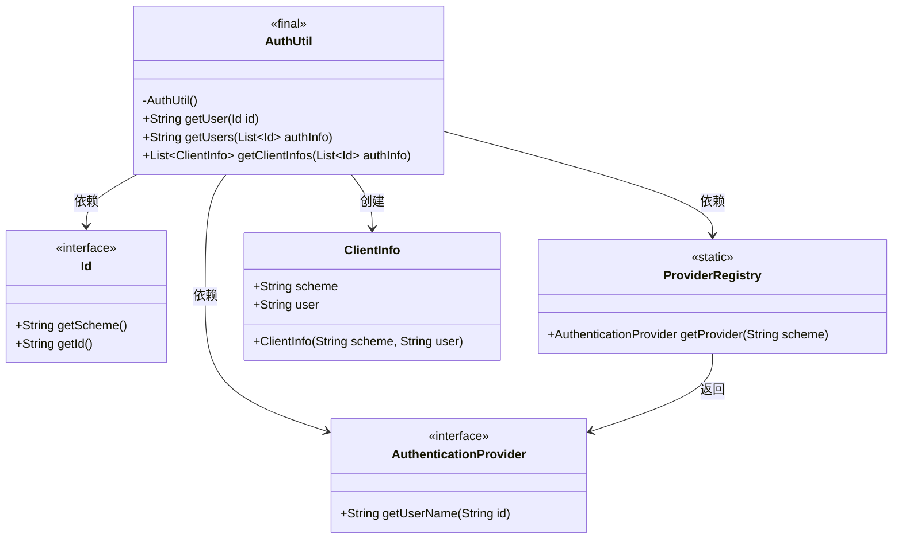
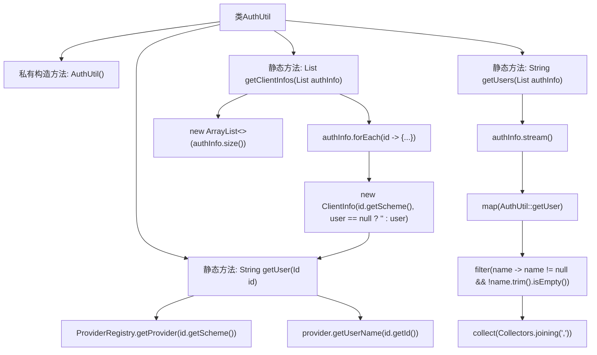

# 基础信息

|      |      |
|------|------|
| 名称 | AuthUtil |
| 编码语言 | .java |
| 代码路径 | zookeeper/zookeeper-server/src/main/java/org/apache/zookeeper/server/util/AuthUtil.java |
| 包名 | org.apache.zookeeper.server.util |
| 依赖项 | ['java.util.ArrayList', 'java.util.List', 'java.util.stream.Collectors', 'org.apache.zookeeper.data.ClientInfo', 'org.apache.zookeeper.data.Id', 'org.apache.zookeeper.server.auth.AuthenticationProvider', 'org.apache.zookeeper.server.auth.ProviderRegistry'] |
| 概述说明 | AuthUtil工具类提供用户认证相关功能：getUser根据ID获取用户名；getUsers返回逗号分隔的用户ID列表；getClientInfos生成客户端认证信息列表。均为静态方法，构造器私有。 |

# 说明

AuthUtil是一个工具类，提供静态方法处理用户认证信息。getUser方法根据Id对象获取用户名，若认证方案不存在或提供者返回null则返回null。getUsers方法将Id列表转换为逗号分隔的用户名字符串，忽略空值，若无有效用户则返回null。getClientInfos方法将Id列表转换为ClientInfo对象列表，包含方案和用户名（空字符串替代null）。所有方法均不处理null输入，结果可能包含未转义数据，适用于日志记录而非安全功能。

# 类列表 Class Summary

| 名称   | 类型  | 说明 |
|-------|------|-------------|
| AuthUtil | class | AuthUtil工具类提供静态方法：getUser根据ID获取用户名；getUsers将ID列表转为逗号分隔的用户名；getClientInfos将ID列表转为ClientInfo对象列表。所有方法均处理空值。 |

## 类 AuthUtil

|      |      |
|------|------|
| 访问范围 | public final |
| 类型 | class |
| 名称 | AuthUtil |
| 说明 | AuthUtil工具类提供静态方法：getUser根据ID获取用户名；getUsers将ID列表转为逗号分隔的用户名；getClientInfos将ID列表转为ClientInfo对象列表。所有方法均处理空值。 |

### UML类图

这段代码展示了一个认证工具类AuthUtil，它提供了三种静态方法处理用户认证信息。类图清晰地呈现了AuthUtil与Id接口、AuthenticationProvider接口、ProviderRegistry工具类以及ClientInfo类之间的关系。AuthUtil通过ProviderRegistry获取认证提供者，使用Id对象中的方案信息，最终生成用户信息或客户端信息列表。所有依赖关系都通过箭头明确标示，包括接口实现和对象创建关系。

### 内部方法调用关系图

这段代码展示了一个工具类AuthUtil，包含三个核心静态方法：getUser通过ID获取用户名，getUsers处理ID列表生成逗号分隔的用户名字符串，getClientInfos将ID列表转换为ClientInfo对象列表。流程图清晰展现了方法间的调用关系，特别是getUsers方法中的流式处理和getClientInfos方法中对getUser的复用。所有方法都考虑了空值和边界情况处理，体现了健壮的设计思想。

### 字段列表 Field List

| 名称  | 类型  | 说明 |
|-------|-------|------|

### 方法列表 Method List

| 名称  | 类型  | 说明 |
|-------|-------|------|
| getClientInfos | List<ClientInfo> | 静态方法`getClientInfos`接收ID列表，遍历生成包含方案和用户的`ClientInfo`对象列表。用户信息为空时设为空字符串。返回结果列表。 |
| getUser | String | 这是一个Java静态方法，根据ID获取用户名。先通过ID的Scheme从注册表获取认证提供者，若存在则返回用户名，否则返回null。 |
| getUsers | String | 静态方法`getUsers`接收ID列表`authInfo`，若为空返回null。否则将非空用户名用逗号拼接，结果为空时返回null。 |

