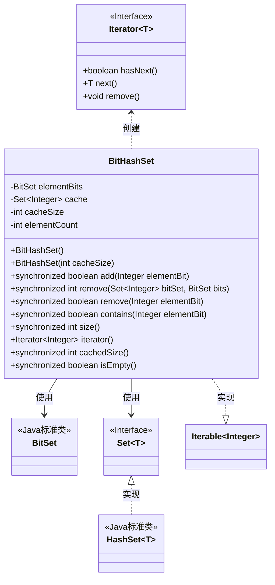
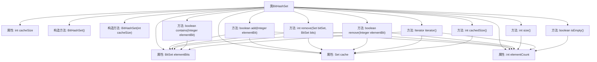

# 基础信息

|      |      |
|------|------|
| 名称 | BitHashSet |
| 编码语言 | .java |
| 代码路径 | zookeeper/zookeeper-server/src/main/java/org/apache/zookeeper/server/util/BitHashSet.java |
| 包名 | org.apache.zookeeper.server.util |
| 依赖项 | ['java.util.BitSet', 'java.util.HashSet', 'java.util.Iterator', 'java.util.Set'] |
| 概述说明 | BitHashSet结合BitSet和HashSet，优化元素存储与遍历。BitSet存储元素，HashSet缓存少量元素加速迭代。支持添加、删除、查询操作，线程安全，迭代器非线程安全需同步。 |

# 说明

BitHashSet是一个基于BitSet和HashSet实现的混合数据结构，用于高效存储和操作整数集合。它使用BitSet存储元素位信息，并通过HashSet缓存部分元素以优化迭代性能。主要功能包括添加、删除、查询元素，以及获取集合大小。通过同步方法确保线程安全，迭代器支持遍历操作。缓存机制避免了大位集下的低效遍历，默认缓存大小为10，可通过构造参数调整。

# 类列表 Class Summary

| 名称   | 类型  | 说明 |
|-------|------|-------------|
| BitHashSet | class | BitHashSet结合BitSet和HashSet存储整数，通过缓存优化迭代效率。支持添加、删除、查询操作，线程安全，元素计数准确。迭代器优先使用缓存，否则遍历BitSet。适用于元素数量有限的场景。 |

## 类 BitHashSet

|      |      |
|------|------|
| 访问范围 | public |
| 类型 | class |
| 名称 | BitHashSet |
| 说明 | BitHashSet结合BitSet和HashSet存储整数，通过缓存优化迭代效率。支持添加、删除、查询操作，线程安全，元素计数准确。迭代器优先使用缓存，否则遍历BitSet。适用于元素数量有限的场景。 |

### UML类图

这段代码定义了一个`BitHashSet`类，它实现了`Iterable<Integer>`接口，结合了`BitSet`和`HashSet`的特性来高效存储和操作整数集合。`BitSet`用于紧凑存储大量整数标记，而`HashSet`作为缓存优化迭代性能。类提供了线程安全的添加、删除、查询操作，并通过双重机制（当元素较少时使用HashSet迭代，否则使用BitSet的位扫描）确保迭代效率。所有公共方法都使用`synchronized`保证线程安全，适合多线程环境下的集合操作。

### 内部方法调用关系图

这段代码实现了一个基于位集和哈希缓存混合的整数集合BitHashSet。核心使用BitSet存储元素实现高效位操作，同时通过HashSet缓存部分元素优化遍历性能。主要功能包括添加/删除元素、查询包含性、获取大小等，所有公共方法都通过synchronized实现线程安全。iterator()方法根据缓存状态智能选择遍历方式，当缓存完整时直接使用缓存迭代器，否则通过BitSet的位扫描实现遍历。该设计在空间效率和遍历性能之间取得了平衡，特别适合元素分布稀疏但需要频繁遍历的场景。

### 字段列表 Field List

| 名称  | 类型  | 说明 |
|-------|-------|------|
| cacheSize | int | 私有整型变量cacheSize，用于存储缓存大小。 |
| cache = new HashSet<>() | Set<Integer> | 私有整数集合缓存初始化。 |
| elementCount = 0 | int | 私有整型变量elementCount初始化为0，用于计数。 |
| elementBits = new BitSet() | BitSet | 私有成员变量elementBits，使用BitSet类初始化。 |

### 方法列表 Method List

| 名称  | 类型  | 说明 |
|-------|-------|------|
| remove | int | 同步方法移除元素：清除缓存和位集，计算并返回移除的元素数量差。 |
| contains | boolean | 同步方法检查元素是否存在，若输入为空返回false，否则返回对应布尔值。 |
| remove | boolean | 同步方法移除指定整数元素，若元素不存在返回false；存在则清除缓存和位集标记，减少计数并返回true。 |
| add | boolean | 同步方法add检查元素是否已存在或为空，若否则加入缓存并标记位图，成功返回true，否则false。 |
| size | int | 这是一个同步方法，返回集合中元素的数量。方法名为size，返回值为int类型，通过elementCount变量获取当前元素总数。 |
| iterator | Iterator<Integer> | 重写迭代器方法，检查缓存大小后返回缓存迭代器或新建迭代器。新建迭代器遍历位集元素，不支持删除操作。 |
| cachedSize | int | 这是一个同步方法，返回缓存大小。方法名为cachedSize，使用synchronized确保线程安全，直接调用cache.size()获取当前缓存元素数量。 |
| isEmpty | boolean | 这是一个Java同步方法，检查集合是否为空，返回布尔值。当元素数量为0时返回true，否则返回false。 |

