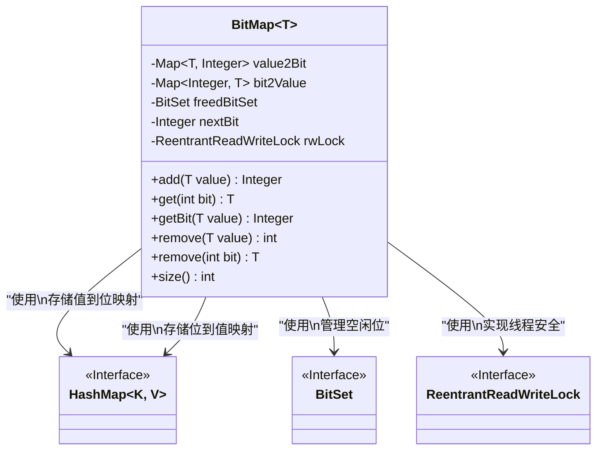
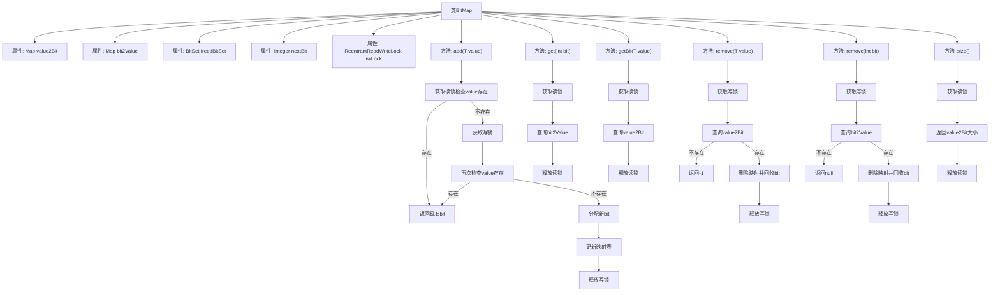

# 基础信息

|      |      |
|------|------|
| 名称 | BitMap |
| 编码语言 | .java |
| 代码路径 | zookeeper/zookeeper-server/src/main/java/org/apache/zookeeper/server/util/BitMap.java |
| 包名 | org.apache.zookeeper.server.util |
| 依赖项 | ['edu.umd.cs.findbugs.annotations.SuppressFBWarnings', 'java.util.BitSet', 'java.util.HashMap', 'java.util.Map', 'java.util.concurrent.locks.ReentrantReadWriteLock'] |
| 概述说明 | BitMap类实现线程安全的位图映射，支持双向查询（值到比特和比特到值）。使用读写锁保证并发安全，重用释放的比特位，优化频繁添加相同值的性能。提供添加、查询、删除和大小统计功能。 |

# 说明

BitMap类是一个线程安全的泛型位图实现，用于高效管理值与位索引的双向映射。它使用两个哈希表value2Bit和bit2Value存储双向映射关系，并通过BitSet回收空闲位。类采用读写锁保证线程安全，添加值时优先检查现有映射，若无则分配新位或重用回收位。提供获取值、获取位索引、删除映射及查询大小等方法，删除操作会回收位供后续重用。该实现特别优化了重复添加相同值的场景，适合高频访问场景。

# 类列表 Class Summary

| 名称   | 类型  | 说明 |
|-------|------|-------------|
| BitMap | class | BitMap类实现线程安全的双向位图映射，支持添加、查询、删除操作，利用读写锁优化性能，重用释放的位。 |

## 类 BitMap

|      |      |
|------|------|
| 访问范围 | public |
| 类型 | class |
| 名称 | BitMap |
| 说明 | BitMap类实现线程安全的双向位图映射，支持添加、查询、删除操作，利用读写锁优化性能，重用释放的位。 |

### UML类图

这段代码实现了一个泛型位图数据结构`BitMap<T>`，用于高效管理值与位索引之间的双向映射。类通过两个HashMap实现双向查找，使用BitSet回收空闲位，并通过读写锁(ReentrantReadWriteLock)保证线程安全。主要功能包括添加/获取/删除映射关系，特别优化了重复添加相同值的场景，适用于需要高频访问的监控系统等场景。

### 内部方法调用关系图

该流程图展示了BitMap类的核心结构和线程安全操作机制。类通过双Map实现值-bit双向映射，使用BitSet回收空闲bit，并通过读写锁保证并发安全。主要方法包括添加/查询/删除元素和获取大小，其中add方法采用双重检查锁定优化高频重复添加场景，remove方法实现bit资源回收。所有操作均遵循"获取锁->操作->释放锁"模式，确保线程安全性和资源正确释放。

### 字段列表 Field List

| 名称  | 类型  | 说明 |
|-------|-------|------|
| rwLock = new ReentrantReadWriteLock() | ReentrantReadWriteLock | 私有读写锁实例，使用ReentrantReadWriteLock实现线程同步。 |
| nextBit = Integer.valueOf(0) | Integer | 私有整型变量nextBit初始化为0。 |
| freedBitSet = new BitSet() | BitSet | 私有BitSet变量freedBitSet，用于标记释放状态。 |
| value2Bit = new HashMap<>() | Map<T, Integer> | 私有哈希映射，存储类型T到整数的键值对。 |
| bit2Value = new HashMap<>() | Map<Integer, T> | 私有哈希映射，键为整数，值为泛型类型T。 |

### 方法列表 Method List

| 名称  | 类型  | 说明 |
|-------|-------|------|
| getBit | Integer | 方法getBit通过读写锁保护线程安全，获取value对应的bit值，确保操作完成后释放锁。 |
| remove | int | 方法移除指定值并释放位，使用写锁确保线程安全。若值不存在返回-1，否则返回对应位并更新数据结构。 |
| add | Integer | 方法`add`为高效重复添加相同值设计，先读锁检查存在性，不存在时写锁分配新位并更新映射，最后释放锁。适用于高频操作场景。 |
| get | T | 方法get通过读写锁安全获取bit对应值，确保线程安全，操作后释放锁。 |
| remove | T | 该方法通过写锁保护并发操作，移除指定位置的位值并返回。若位值不存在则返回null，否则清除相关映射并释放位。最后确保锁被释放。 |
| size | int | 方法使用读锁保护，返回value2Bit的大小，确保线程安全。 |

