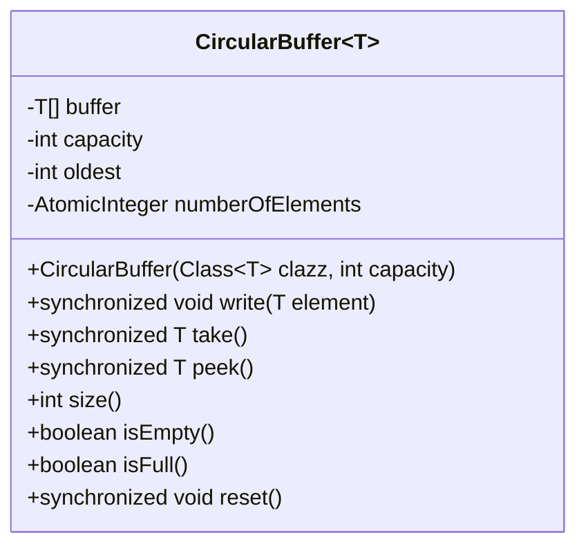
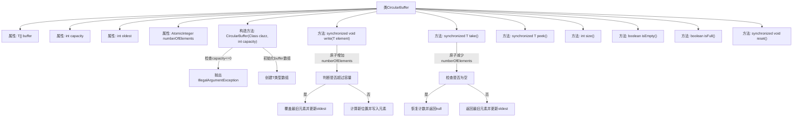

# 基础信息

|      |      |
|------|------|
| 名称 | CircularBuffer |
| 编码语言 | .java |
| 代码路径 | zookeeper/zookeeper-server/src/main/java/org/apache/zookeeper/server/util/CircularBuffer.java |
| 包名 | org.apache.zookeeper.server.util |
| 依赖项 | ['java.lang.reflect.Array', 'java.util.concurrent.atomic.AtomicInteger'] |
| 概述说明 | 循环缓冲区类，支持泛型，提供写入、读取、查看、重置功能，线程安全，容量固定，满时覆盖最旧元素，空时返回null。 |

# 说明

这是一个泛型循环缓冲区实现，使用数组存储元素，支持线程安全的写入和读取操作。缓冲区具有固定容量，当满时会覆盖最旧元素。提供写入、读取、查看、重置等同步方法，以及检查大小、空满状态的功能。使用原子整数跟踪元素数量，确保线程安全。写入时自动处理数组循环索引，读取遵循先进先出原则。

# 类列表 Class Summary

| 名称   | 类型  | 说明 |
|-------|------|-------------|
| CircularBuffer | class | 这是一个线程安全的环形缓冲区实现，支持写入、读取、查看、重置操作，容量固定，满时覆盖最旧数据，空时返回null。 |

## 类 CircularBuffer

|      |      |
|------|------|
| 访问范围 | public |
| 类型 | class |
| 名称 | CircularBuffer |
| 说明 | 这是一个线程安全的环形缓冲区实现，支持写入、读取、查看、重置操作，容量固定，满时覆盖最旧数据，空时返回null。 |

### UML类图

这段代码定义了一个泛型环形缓冲区类`CircularBuffer<T>`，实现了线程安全的循环写入和读取功能。类中包含核心字段：泛型数组buffer存储元素，capacity表示容量，oldest记录最老元素位置，AtomicInteger类型的numberOfElements原子计数当前元素数量。主要方法包括：write()实现循环写入（满时覆盖最老元素），take()实现FIFO读取，peek()查看但不移除元素，以及size()、isEmpty()、isFull()等状态查询方法。所有修改操作均用synchronized保证线程安全，通过模运算实现环形索引，适合生产者-消费者场景。

### 内部方法调用关系图

该流程图展示了CircularBuffer类的完整结构，包含构造方法和7个核心方法。构造方法会验证容量参数并初始化泛型数组，write()方法实现环形写入逻辑（满时覆盖最旧元素），take()方法实现FIFO读取，peek()查看但不移除元素。辅助方法包括size()、isEmpty()、isFull()状态检查，以及reset()重置功能。所有写操作都通过synchronized保证线程安全，使用AtomicInteger维护元素计数。

### 字段列表 Field List

| 名称  | 类型  | 说明 |
|-------|-------|------|
| numberOfElements = new AtomicInteger() | AtomicInteger | 私有原子整型变量numberOfElements，用于线程安全计数。 |
| buffer | T[] | 私有不可变数组buffer，类型为泛型T。 |
| oldest | int | 私有整型变量oldest，用于存储年龄最大值。 |
| capacity | int | 私有整型变量capacity，用于存储容量值。 |

### 方法列表 Method List

| 名称  | 类型  | 说明 |
|-------|-------|------|
| isEmpty | boolean | 检查元素数量是否小于等于0，返回布尔值表示是否为空。 |
| write | void | 同步写入方法，当元素超过容量时覆盖最旧数据，否则追加到缓冲区末尾。维护计数和索引。 |
| size | int | 该方法返回当前元素数量，通过调用numberOfElements.get()获取。 |
| take | T | 同步方法take从缓冲区取出元素。若缓冲区空则返回null，否则返回最旧元素并更新指针。 |
| peek | T | 同步方法peek检查队列元素数量，若为空返回null，否则返回最旧元素。 |
| isFull | boolean | 检查元素数量是否达到容量上限。 |
| reset | void | 同步方法reset，将元素数量置零。 |

