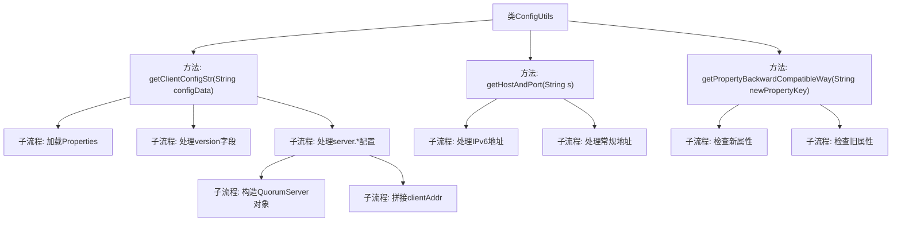
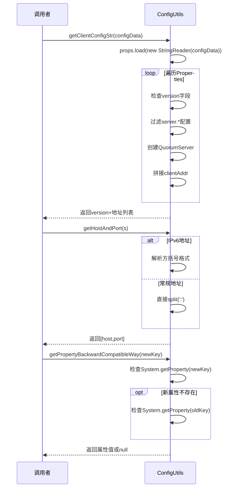

# 基础信息

|      |      |
|------|------|
| 名称 | ConfigUtils |
| 编码语言 | .java |
| 代码路径 | zookeeper/zookeeper-server/src/main/java/org/apache/zookeeper/server/util/ConfigUtils.java |
| 包名 | org.apache.zookeeper.server.util |
| 依赖项 | ['java.io.IOException', 'java.io.StringReader', 'java.util.Map.Entry', 'java.util.Properties', 'org.apache.zookeeper.server.quorum.QuorumPeer', 'org.apache.zookeeper.server.quorum.QuorumPeerConfig.ConfigException'] |
| 概述说明 | ConfigUtils类提供三个功能：1.解析配置数据并提取版本和服务器地址；2.拆分服务器配置为IP和端口；3.支持新旧属性键名兼容获取系统属性值。 |

# 说明

ConfigUtils类提供三个核心功能：1.getClientConfigStr方法解析配置数据，提取版本号及服务器地址列表；2.getHostAndPort方法拆分含IPv6的服务器地址为IP和端口数组；3.getPropertyBackwardCompatibleWay实现新旧配置键名的向后兼容查询，优先返回新键值。所有方法均包含异常处理，支持字符串处理和属性解析。

# 类列表 Class Summary

| 名称   | 类型  | 说明 |
|-------|------|-------------|
| ConfigUtils | class | ConfigUtils类提供配置处理功能：解析配置字符串并提取版本和服务器地址；拆分含IPv6的服务器地址为IP和端口；支持新旧属性键的向后兼容性检查。 |


## 类 ConfigUtils

|      |      |
|------|------|
| 访问范围 | public |
| 类型 | class |
| 名称 | ConfigUtils |
| 说明 | ConfigUtils类提供配置处理功能：解析配置字符串并提取版本和服务器地址；拆分含IPv6的服务器地址为IP和端口；支持新旧属性键的向后兼容性检查。 |


### UML类图

```mermaid
classDiagram
    class ConfigUtils {
        <<工具类>>
        +String getClientConfigStr(String configData)
        +String[] getHostAndPort(String s) throws ConfigException
        +String getPropertyBackwardCompatibleWay(String newPropertyKey)
    }
    class Properties {
        <<JDK类>>
        +void load(Reader reader) throws IOException
        +Set~Entry~ entrySet()
    }
    class QuorumPeer {
        <<外部类>>
        class QuorumServer {
            +InetSocketAddress clientAddr
            +QuorumServer(long id, String addr) throws ConfigException
        }
    }
    class ConfigException {
        <<异常类>>
        +ConfigException(String message)
    }

    ConfigUtils --> Properties : 使用\n解析配置数据
    ConfigUtils --> QuorumPeer.QuorumServer : 创建\n服务器配置
    ConfigUtils --> ConfigException : 抛出\n配置异常
```

这段代码展示了一个ZooKeeper配置工具类ConfigUtils，包含三个核心方法：1) 解析客户端配置字符串并提取版本和服务器地址；2) 解析主机端口配置（支持IPv6）；3) 实现新旧配置属性的向后兼容读取。类图清晰地反映了工具类与JDK Properties类、QuorumPeer内部类及自定义异常的交互关系，体现了配置解析、地址格式处理和属性兼容性检查等功能模块的协作方式。异常处理和数据格式验证贯穿始终，确保配置读取的健壮性。


### 内部方法调用关系图





流程图描述：该流程图展示了ConfigUtils类的三个核心方法调用关系。getClientConfigStr方法负责解析配置数据，处理version字段和server.*配置项；getHostAndPort方法处理服务器地址解析，支持IPv6和常规格式；getPropertyBackwardCompatibleWay方法实现新旧属性名的兼容性检查。时序图则详细展示了每个方法的调用流程和内部处理步骤，包括异常处理和条件分支。

### 字段列表 Field List

| 名称  | 类型  | 说明 |
|-------|-------|------|

### 方法列表 Method List

| 名称  | 类型  | 说明 |
|-------|-------|------|
| getClientConfigStr | String | 该方法解析配置数据，提取版本号及以"server."开头的配置项，生成客户端配置字符串。格式为"版本号 服务器地址列表"，地址间用逗号分隔。异常时返回空字符串。 |
| getHostAndPort | String[] | 解析主机和端口字符串，处理IPv6地址格式。若以'['开头，检查匹配的']'和端口分隔符':'，拆分后返回数组；否则直接按':'分割。异常时抛出ConfigException。 |
| getPropertyBackwardCompatibleWay | String | 该方法通过新旧属性键获取系统属性值，优先返回新键值，若无则尝试旧键并返回其值，均无则返回null。 |


