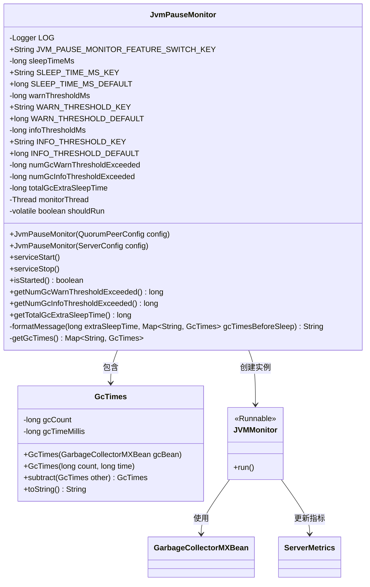
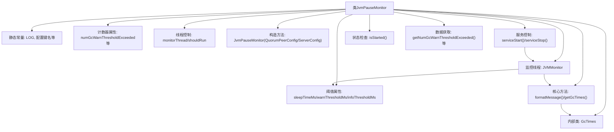

# 基础信息

|      |      |
|------|------|
| 名称 | JvmPauseMonitor |
| 编码语言 | .java |
| 代码路径 | zookeeper/zookeeper-server/src/main/java/org/apache/zookeeper/server/util/JvmPauseMonitor.java |
| 包名 | org.apache.zookeeper.server.util |
| 依赖项 | ['java.lang.management.GarbageCollectorMXBean', 'java.lang.management.ManagementFactory', 'java.time.Instant', 'java.util.ArrayList', 'java.util.HashMap', 'java.util.HashSet', 'java.util.List', 'java.util.Map', 'java.util.Set', 'org.apache.zookeeper.server.ServerConfig', 'org.apache.zookeeper.server.ServerMetrics', 'org.apache.zookeeper.server.quorum.QuorumPeerConfig', 'org.slf4j.Logger', 'org.slf4j.LoggerFactory'] |
| 概述说明 | JVM暂停监控类，检测GC暂停时间，超过阈值记录日志，默认警告阈值10秒，信息阈值1秒，支持启动停止监控线程。 |

# 说明

JvmPauseMonitor是一个用于监控JVM暂停时间的工具类，通过配置警告和信息阈值来检测GC暂停或主机停顿。主要功能包括：设置默认睡眠时间500ms、警告阈值10秒和信息阈值1秒；启动后台线程定期检查实际睡眠时间与预期差异；当暂停超过阈值时记录相应日志；统计总暂停时间和超阈值次数；支持从QuorumPeerConfig或ServerConfig初始化参数；提供启动、停止和状态查询方法；通过GcTimes类比较GC前后数据生成详细报告。

# 类列表 Class Summary

| 名称   | 类型  | 说明 |
|-------|------|-------------|
| JvmPauseMonitor | class | JvmPauseMonitor监控JVM暂停时间，默认检测间隔500ms，超1秒记录INFO，超10秒记录WARN，统计暂停次数和总时长。 |

## 类 JvmPauseMonitor

|      |      |
|------|------|
| 访问范围 | public |
| 类型 | class |
| 名称 | JvmPauseMonitor |
| 说明 | JvmPauseMonitor监控JVM暂停时间，默认检测间隔500ms，超1秒记录INFO，超10秒记录WARN，统计暂停次数和总时长。 |

### UML类图

这段代码实现了一个JVM暂停监控器，主要用于检测JVM或主机机器的暂停情况（如GC停顿）。核心类JvmPauseMonitor通过配置阈值参数(warnThresholdMs/infoThresholdMs)和轮询间隔(sleepTimeMs)，启动监控线程JVMMonitor来周期性检测实际暂停时间。当检测到超过阈值的停顿时，会记录相应级别的日志，并统计超标次数和总暂停时间。内部类GcTimes用于计算GC次数和时间差，formatMessage方法生成详细的暂停报告。该监控器支持通过QuorumPeerConfig或ServerConfig初始化，提供启动/停止服务的方法，并可通过MXBean获取GC数据。

### 内部方法调用关系图

流程图描述：该流程图展示了JvmPauseMonitor类的完整结构，包含配置参数、监控阈值、服务控制方法和核心监控逻辑。类通过两个构造方法初始化监控参数，通过serviceStart()启动独立监控线程JVMMonitor，该线程持续检测JVM停顿时间并与预设阈值比较，使用formatMessage()生成日志信息。内部类GcTimes用于计算GC统计差异，整体实现了一个完整的JVM停顿监控系统。

### 字段列表 Field List

| 名称  | 类型  | 说明 |
|-------|-------|------|
| totalGcExtraSleepTime = 0 | long | 私有长整型变量totalGcExtraSleepTime初始化为0，用于记录GC额外休眠时间总和。 |
| numGcWarnThresholdExceeded = 0 | long | 私有长整型变量numGcWarnThresholdExceeded记录GC警告阈值超限次数，初始值为0。 |
| SLEEP_TIME_MS_DEFAULT = 500 | long | 默认休眠时间为500毫秒。 |
| LOG = LoggerFactory.getLogger(JvmPauseMonitor.class) | Logger | 私有静态日志常量，记录JVM暂停监控类的日志。 |
| monitorThread | Thread | 私有线程监控线程变量。 |
| INFO_THRESHOLD_DEFAULT = 1000 | long | 静态常量INFO_THRESHOLD_DEFAULT值为1000，类型为long。 |
| SLEEP_TIME_MS_KEY = "jvm.pause.sleep.time.ms" | String | 定义静态常量SLEEP_TIME_MS_KEY，表示JVM暂停休眠时间的配置键。 |
| shouldRun = true | boolean | 私有易变布尔变量shouldRun初始值为true。 |
| infoThresholdMs | long | 声明一个受保护的长整型变量infoThresholdMs。 |
| warnThresholdMs | long | 声明一个受保护的长整型变量warnThresholdMs，用于存储警告阈值（毫秒）。 |
| INFO_THRESHOLD_KEY = "jvm.pause.info-threshold.ms" | String | 代码定义了一个静态常量字符串，键名为"jvm.pause.info-threshold.ms"，用于配置JVM暂停的警告阈值（毫秒）。 |
| JVM_PAUSE_MONITOR_FEATURE_SWITCH_KEY = "jvm.pause.monitor" | String | JVM暂停监控功能开关键定义为"jvm.pause.monitor"。 |
| WARN_THRESHOLD_DEFAULT = 10000 | long | 静态常量WARN_THRESHOLD_DEFAULT值为10000，用于警告阈值默认设置。 |
| sleepTimeMs | long | 受保护的长整型变量，表示休眠时间（毫秒）。 |
| numGcInfoThresholdExceeded = 0 | long | 变量numGcInfoThresholdExceeded记录GC信息阈值超限次数，初始值为0。 |
| WARN_THRESHOLD_KEY = "jvm.pause.warn-threshold.ms" | String | 关键点：定义静态常量WARN_THRESHOLD_KEY，用于表示JVM暂停警告阈值（毫秒）。 |

### 方法列表 Method List

| 名称  | 类型  | 说明 |
|-------|-------|------|
| getNumGcInfoThresholdExceeded | long | 方法返回超过GC信息阈值的次数统计。 |
| getTotalGcExtraSleepTime | long | 该方法返回总垃圾回收额外休眠时间。 |
| getGcTimes | Map<String, GcTimes> | 获取GC时间的方法：通过ManagementFactory获取垃圾收集器MXBean列表，遍历并存储各收集器名称及时间到HashMap中返回。 |
| serviceStart | void | 启动守护线程监控JVM状态。 |
| isStarted | boolean | 方法isStarted检查monitorThread是否非空，返回布尔值表示线程是否启动。 |
| getNumGcWarnThresholdExceeded | long | 获取GC警告阈值超限次数的长整型方法。 |
| serviceStop | void | 停止服务线程：设置运行标志为false，中断并等待监控线程结束，处理中断异常。 |
| formatMessage | String | 该方法用于检测JVM或主机停顿（如GC），计算停顿时间并生成报告。比较GC前后时间差，输出停顿时长及超过阈值的次数。若无GC则提示未检测到，否则列出各GC池的收集情况。 |

