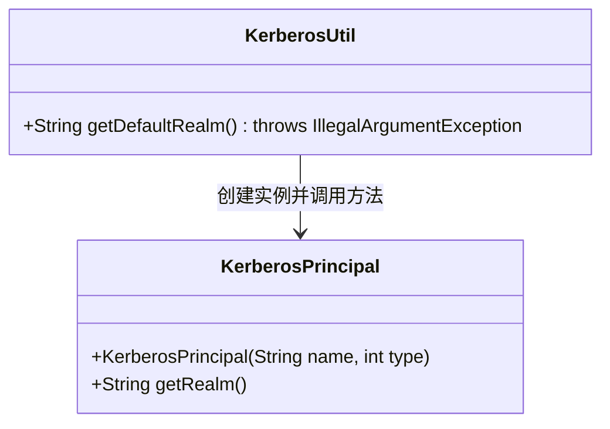
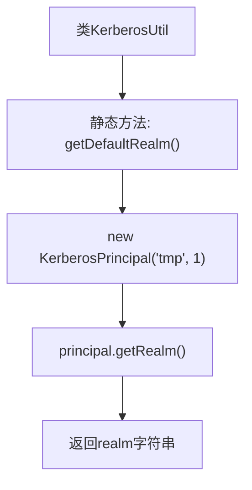

# 基础信息

|      |      |
|------|------|
| 名称 | KerberosUtil |
| 编码语言 | .java |
| 代码路径 | zookeeper/zookeeper-server/src/main/java/org/apache/zookeeper/server/util/KerberosUtil.java |
| 包名 | org.apache.zookeeper.server.util |
| 依赖项 | ['javax.security.auth.kerberos.KerberosPrincipal'] |
| 概述说明 | Java类KerberosUtil提供静态方法getDefaultRealm，通过KerberosPrincipal实例获取默认领域名，可能抛出IllegalArgumentException异常。 |

# 说明

该代码定义了一个名为KerberosUtil的公共类，其中包含一个静态方法getDefaultRealm。该方法通过创建KerberosPrincipal实例并传入参数"tmp"和1，调用getRealm方法获取默认领域值后返回。若过程中出现异常，会抛出IllegalArgumentException。整个功能封装简洁，专注于Kerberos领域信息的获取。

# 类列表 Class Summary

| 名称   | 类型  | 说明 |
|-------|------|-------------|
| KerberosUtil | class | Java类KerberosUtil提供静态方法getDefaultRealm，通过KerberosPrincipal获取默认领域名，可能抛出IllegalArgumentException异常。 |

## 类 KerberosUtil

|      |      |
|------|------|
| 访问范围 | public |
| 类型 | class |
| 名称 | KerberosUtil |
| 说明 | Java类KerberosUtil提供静态方法getDefaultRealm，通过KerberosPrincipal获取默认领域名，可能抛出IllegalArgumentException异常。 |

### UML类图

这段类图展示了KerberosUtil工具类与KerberosPrincipal类的关系。KerberosUtil提供一个静态方法getDefaultRealm()，该方法通过创建KerberosPrincipal实例并调用其getRealm()方法获取默认领域信息。KerberosPrincipal类包含构造方法和领域查询功能，两者形成简单的依赖关系，体现了工具类对核心类的封装调用。

### 内部方法调用关系图

该流程图展示了KerberosUtil类的核心逻辑：静态方法getDefaultRealm通过构造KerberosPrincipal对象并调用其getRealm()方法获取领域信息。流程从类定义开始，依次经过对象实例化、方法调用和返回值传递三个关键步骤，清晰地反映了代码的线性执行过程。图中特别注意标明了构造方法的参数传递（'tmp'和1）以及方法调用的层级关系。

### 字段列表 Field List

| 名称  | 类型  | 说明 |
|-------|-------|------|

### 方法列表 Method List

| 名称  | 类型  | 说明 |
|-------|-------|------|
| getDefaultRealm | String | Java方法getDefaultRealm返回KerberosPrincipal实例的默认领域，可能抛出非法参数异常。 |

