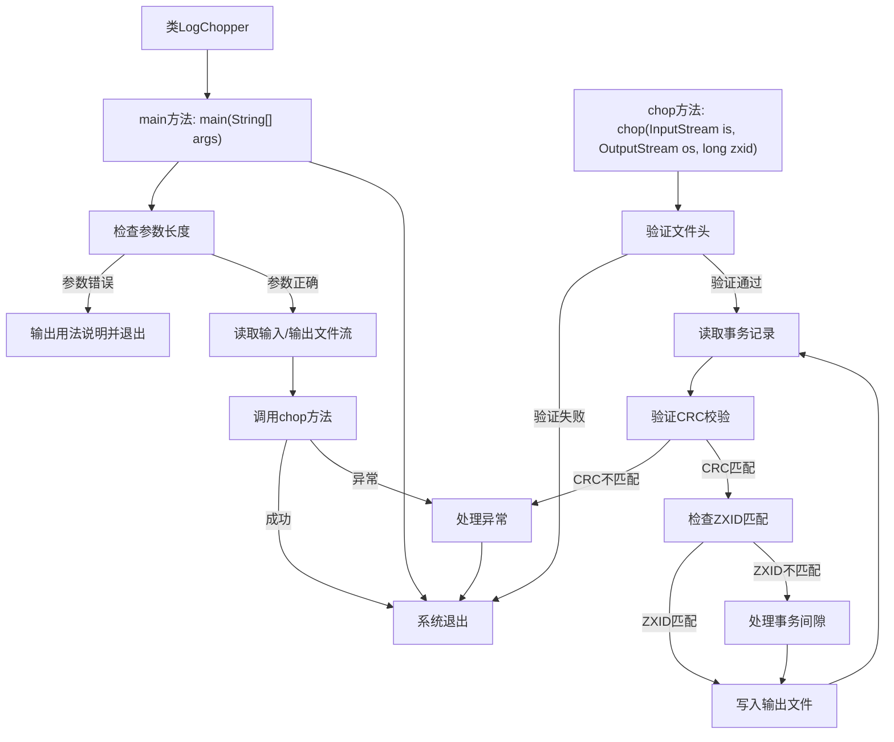

# 基础信息

|      |      |
|------|------|
| 名称 | LogChopper |
| 编码语言 | .java |
| 代码路径 | zookeeper/zookeeper-server/src/main/java/org/apache/zookeeper/server/util/LogChopper.java |
| 包名 | org.apache.zookeeper.server.util |
| 依赖项 | ['java.io.BufferedInputStream', 'java.io.BufferedOutputStream', 'java.io.EOFException', 'java.io.FileInputStream', 'java.io.FileOutputStream', 'java.io.IOException', 'java.io.InputStream', 'java.io.OutputStream', 'java.util.zip.Adler32', 'java.util.zip.Checksum', 'org.apache.jute.BinaryInputArchive', 'org.apache.jute.BinaryOutputArchive', 'org.apache.jute.Record', 'org.apache.yetus.audience.InterfaceAudience', 'org.apache.zookeeper.server.ExitCode', 'org.apache.zookeeper.server.TxnLogEntry', 'org.apache.zookeeper.server.persistence.FileHeader', 'org.apache.zookeeper.server.persistence.FileTxnLog', 'org.apache.zookeeper.txn.TxnHeader', 'org.apache.zookeeper.util.ServiceUtils'] |
| 概述说明 | LogChopper是Java工具类，用于截取ZooKeeper事务日志文件至指定zxid，输出到新文件。校验CRC和日志格式，处理事务间隙，确保数据一致性。 |

# 说明

LogChopper是一个公开类，用于处理ZooKeeper事务日志文件。主函数检查输入参数，要求三个参数：目标zxid、待处理日志文件和输出文件名。程序读取输入日志文件，复制所有事务直到指定zxid（包含该zxid）到输出文件。chop方法负责实际处理，验证日志文件头，检查CRC校验，处理事务条目，检测事务间隙，并在达到目标zxid时停止。若处理成功返回true，否则返回false。过程中会输出处理状态和错误信息，最终根据执行结果返回相应退出码。

# 类列表 Class Summary

| 名称   | 类型  | 说明 |
|-------|------|-------------|
| LogChopper | class | LogChopper类用于截取ZooKeeper事务日志文件，将指定zxid及之前的事务复制到新文件。包含输入验证、CRC校验和事务处理逻辑。 |

## 类 LogChopper

|      |      |
|------|------|
| 访问范围 | @InterfaceAudience.Public;public |
| 类型 | class |
| 名称 | LogChopper |
| 说明 | LogChopper类用于截取ZooKeeper事务日志文件，将指定zxid及之前的事务复制到新文件。包含输入验证、CRC校验和事务处理逻辑。 |

### UML类图

```mermaid
classDiagram
    class LogChopper {
        +main(String[] args) void
        +chop(InputStream is, OutputStream os, long zxid) boolean
    }
    class BinaryInputArchive {
        <<Interface>>
        +readLong(String tag) long
        +readBuffer(String tag) byte[]
        +readByte(String tag) byte
        +getArchive(InputStream is) BinaryInputArchive
    }
    class BinaryOutputArchive {
        <<Interface>>
        +writeLong(long value, String tag) void
        +writeBuffer(byte[] buf, String tag) void
        +writeByte(byte b, String tag) void
        +getArchive(OutputStream os) BinaryOutputArchive
    }
    class FileHeader {
        -long magic
        -long dbid
        -int version
        +deserialize(BinaryInputArchive archive, String tag) void
        +serialize(BinaryOutputArchive archive, String tag) void
        +getMagic() long
        +getDbid() long
        +getVersion() int
    }
    class TxnLogEntry {
        -TxnHeader header
        -Record txn
        +getHeader() TxnHeader
        +getTxn() Record
    }
    class Checksum {
        <<Interface>>
        +update(byte[] b, int off, int len) void
        +getValue() long
    }
    class Adler32 {
        +update(byte[] b, int off, int len) void
        +getValue() long
    }
    class ZxidUtils {
        <<Utility>>
        +getEpochFromZxid(long zxid) long
        +getCounterFromZxid(long zxid) long
    }
    class SerializeUtils {
        <<Utility>>
        +deserializeTxn(byte[] bytes) TxnLogEntry
    }
    class ServiceUtils {
        <<Utility>>
        +requestSystemExit(int code) void
    }

    LogChopper --> BinaryInputArchive : 依赖
    LogChopper --> BinaryOutputArchive : 依赖
    LogChopper --> FileHeader : 依赖
    LogChopper --> TxnLogEntry : 依赖
    LogChopper --> Checksum : 依赖
    LogChopper --> ZxidUtils : 依赖
    LogChopper --> SerializeUtils : 依赖
    LogChopper --> ServiceUtils : 依赖
    Adler32 ..|> Checksum : 实现
```

该代码实现了一个日志切割工具LogChopper，主要功能是从事务日志文件中读取数据，并截取到指定zxid（ZooKeeper事务ID）为止的记录到新文件。核心类包含日志归档读写接口、文件头处理、事务条目解析、CRC校验等组件，通过流式处理实现高效日志切割，并严格校验数据完整性和连续性。流程包含参数校验、文件头验证、事务记录遍历、CRC校验、zxid比对等关键步骤，确保数据一致性。

### 内部方法调用关系图

流程图描述：该流程图展示了LogChopper类的处理流程，从main方法开始检查参数有效性，通过后创建文件流并调用核心chop方法。chop方法负责验证日志文件头、循环读取事务记录、校验数据完整性，并根据ZXID判断是否截断日志。整个过程包含异常处理和系统退出控制，确保日志截取操作的安全性和可靠性。

### 字段列表 Field List

| 名称  | 类型  | 说明 |
|-------|-------|------|

### 方法列表 Method List

| 名称  | 类型  | 说明 |
|-------|-------|------|
| main | void | Java程序LogChopper用于截取事务日志文件，保留指定zxid及之前的记录。需3个参数：目标zxid、输入日志文件和输出文件名。成功执行返回0，失败返回错误码。 |
| chop | boolean | 方法chop处理ZooKeeper事务日志，验证文件头、CRC校验和事务完整性，按zxid截断日志。若找到指定zxid则返回true，否则返回false。处理中检测事务间隙并记录。 |

