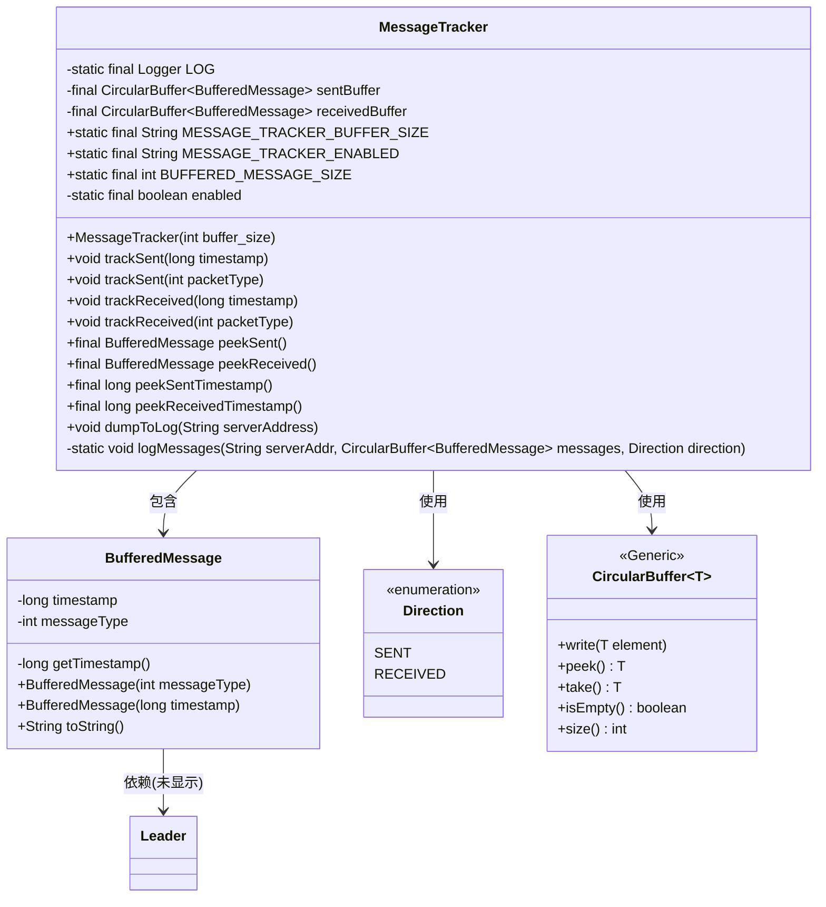

# 基础信息

|      |      |
|------|------|
| 名称 | MessageTracker |
| 编码语言 | .java |
| 代码路径 | zookeeper/zookeeper-server/src/main/java/org/apache/zookeeper/server/util/MessageTracker.java |
| 包名 | org.apache.zookeeper.server.util |
| 依赖项 | ['java.text.SimpleDateFormat', 'java.util.Date', 'org.apache.zookeeper.server.quorum.Leader', 'org.slf4j.Logger', 'org.slf4j.LoggerFactory'] |
| 概述说明 | MessageTracker类用于跟踪消息发送和接收，包含两个循环缓冲区存储时间戳和类型，支持日志记录和状态检查。 |

# 说明

MessageTracker类用于跟踪消息发送和接收状态，包含两个循环缓冲区sentBuffer和receivedBuffer，分别存储发送和接收的BufferedMessage对象。通过系统属性配置缓冲区大小和启用状态。提供trackSent和trackReceived方法记录时间戳或包类型，peek方法查看缓冲区内容，dumpToLog方法将缓冲区内容输出到日志。BufferedMessage内部类存储时间戳和消息类型，toString方法格式化输出时间戳和消息类型信息。日志记录区分发送和接收方向，显示最近的消息时间戳和类型。

# 类列表 Class Summary

| 名称   | 类型  | 说明 |
|-------|------|-------------|
| MessageTracker | class | MessageTracker类用于跟踪消息发送和接收，包含发送和接收缓冲区，支持时间戳和包类型记录，可配置缓冲区大小和启用状态，提供日志输出功能。 |

## 类 MessageTracker

|      |      |
|------|------|
| 访问范围 | public |
| 类型 | class |
| 名称 | MessageTracker |
| 说明 | MessageTracker类用于跟踪消息发送和接收，包含发送和接收缓冲区，支持时间戳和包类型记录，可配置缓冲区大小和启用状态，提供日志输出功能。 |

### UML类图

类图描述：MessageTracker类用于跟踪消息的发送和接收状态，包含两个CircularBuffer实例分别存储已发送和已接收的BufferedMessage对象。通过静态配置控制功能开关和缓冲区大小，提供时间戳和消息类型记录功能。内部类BufferedMessage封装消息数据，枚举Direction标识消息方向。整体设计采用环形缓冲区和条件检查机制，适合高吞吐场景下的消息跟踪需求。

### 内部方法调用关系图

```mermaid
graph TD
    A["类MessageTracker"]
    B["静态常量: MESSAGE_TRACKER_BUFFER_SIZE"]
    C["静态常量: MESSAGE_TRACKER_ENABLED"]
    D["静态变量: BUFFERED_MESSAGE_SIZE"]
    E["静态变量: enabled"]
    F["静态初始化块"]
    G["构造方法: MessageTracker(int buffer_size)"]
    H["方法: trackSent(long timestamp)"]
    I["方法: trackSent(int packetType)"]
    J["方法: trackReceived(long timestamp)"]
    K["方法: trackReceived(int packetType)"]
    L["方法: peekSent()"]
    M["方法: peekReceived()"]
    N["方法: peekSentTimestamp()"]
    O["方法: peekReceivedTimestamp()"]
    P["方法: dumpToLog(String serverAddress)"]
    Q["私有方法: logMessages(String, CircularBuffer<BufferedMessage>, Direction)"]
    R["内部枚举: Direction"]
    S["内部类: BufferedMessage"]

    A --> B
    A --> C
    A --> D
    A --> E
    A --> F
    A --> G
    A --> H
    A --> I
    A --> J
    A --> K
    A --> L
    A --> M
    A --> N
    A --> O
    A --> P
    P --> Q
    A --> R
    A --> S

    S --> SA["字段: long timestamp"]
    S --> SB["字段: int messageType"]
    S --> SC["方法: getTimestamp()"]
    S --> SD["构造方法: BufferedMessage(int)"]
    S --> SE["构造方法: BufferedMessage(long)"]
    S --> SF["重写方法: toString()"]
```

这段代码实现了一个消息跟踪器(MessageTracker)，用于记录发送和接收消息的时间戳或类型。核心功能包括：通过静态配置控制跟踪开关和缓冲区大小；使用环形缓冲区(CircularBuffer)存储消息；提供多种跟踪方法(trackSent/trackReceived)和查询方法(peek系列)；支持将跟踪数据输出到日志。内部类BufferedMessage封装了时间戳和消息类型，并实现格式化输出。流程图清晰展示了类结构、方法调用关系和内部类组成。

### 字段列表 Field List

| 名称  | 类型  | 说明 |
|-------|-------|------|
| receivedBuffer | CircularBuffer<BufferedMessage> | 私有环形缓冲区，存储接收到的消息。 |
| LOG = LoggerFactory.getLogger(MessageTracker.class) | Logger | 声明一个名为LOG的私有静态常量日志记录器，用于MessageTracker类的日志输出。 |
| sentBuffer | CircularBuffer<BufferedMessage> | 私有环形缓冲区，存储已发送的缓冲消息。 |
| MESSAGE_TRACKER_BUFFER_SIZE = "zookeeper.messageTracker.BufferSize" | String | 该代码定义了一个静态常量字符串，用于配置ZooKeeper消息跟踪器的缓冲区大小。 |
| enabled | boolean | 私有静态不可变布尔变量enabled。 |
| MESSAGE_TRACKER_ENABLED = "zookeeper.messageTracker.Enabled" | String | ZooKeeper消息追踪启用配置参数。 |
| BUFFERED_MESSAGE_SIZE | int | 静态常量BUFFERED_MESSAGE_SIZE表示缓冲消息大小。 |

### 方法列表 Method List

| 名称  | 类型  | 说明 |
|-------|-------|------|
| dumpToLog | void | 方法dumpToLog在启用时记录接收和发送的日志消息到指定服务器地址。 |
| peekReceived | BufferedMessage | 该方法返回接收缓冲区的顶部消息但不移除，类型为BufferedMessage。 |
| trackReceived | void | 该方法在启用状态下，将接收到的数据包类型写入接收缓冲区。 |
| trackReceived | void | 方法trackReceived在启用状态下，将带时间戳的消息写入接收缓冲区。 |
| peekSentTimestamp | long | 该方法返回发送缓冲区中最早消息的时间戳，若功能未启用则返回0。 |
| peekSent | BufferedMessage | 这是一个Java方法，用于返回发送缓冲区中的顶部消息但不移除它。方法名为peekSent，返回类型为BufferedMessage，使用peek()操作。 |
| trackSent | void | 该方法在启用状态下，将带时间戳的消息写入发送缓冲区。 |
| trackSent | void | 方法trackSent在启用状态下将packetType写入sentBuffer。 |
| peekReceivedTimestamp | long | 该方法返回接收缓冲区中最早消息的时间戳，若未启用则返回0。 |
| logMessages | void | 静态方法logMessages记录消息日志，根据方向（发送/接收）和服务器地址输出空或非空缓冲区警告信息，非空时逐个输出消息内容。 |

