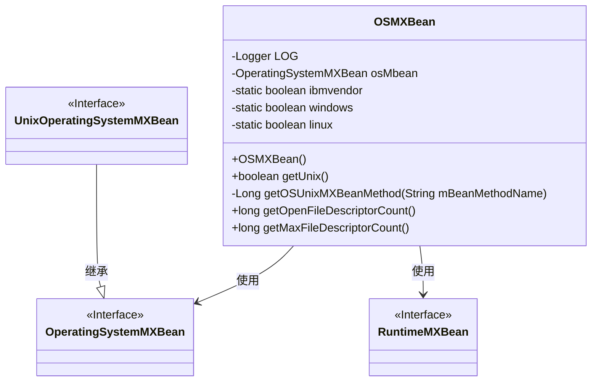
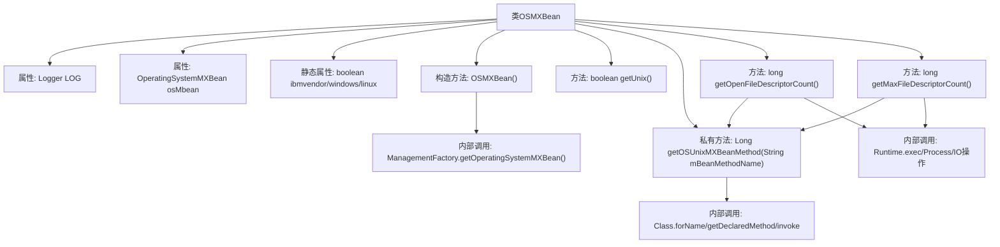

# 基础信息

|      |      |
|------|------|
| 名称 | OSMXBean |
| 编码语言 | .java |
| 代码路径 | zookeeper/zookeeper-server/src/main/java/org/apache/zookeeper/server/util/OSMXBean.java |
| 包名 | org.apache.zookeeper.server.util |
| 依赖项 | ['java.io.BufferedReader', 'java.io.IOException', 'java.io.InputStream', 'java.io.InputStreamReader', 'java.lang.management.ManagementFactory', 'java.lang.management.OperatingSystemMXBean', 'java.lang.management.RuntimeMXBean', 'java.lang.reflect.Method', 'org.slf4j.Logger', 'org.slf4j.LoggerFactory'] |
| 概述说明 | OSMXBean类用于获取操作系统信息，包括判断Unix系统、获取JVM打开文件描述符数量和最大文件描述符限制。支持Sun和IBM JVM，IBM下仅限Linux。Sun JVM使用com.sun.management接口，IBM JVM通过Linux命令实现。 |

# 说明

OSMXBean类用于获取操作系统相关信息，主要针对Unix/Linux系统。它通过ManagementFactory获取操作系统MXBean实例，并检查当前运行环境是否为IBM JVM或Windows/Linux系统。类中提供了判断Unix系统的方法getUnix()。对于Sun JVM，使用反射调用UnixOperatingSystemMXBean接口方法获取打开文件描述符数量和最大文件描述符限制；对于IBM JVM，则通过执行Linux命令实现相同功能。所有操作都包含错误处理并记录日志，无法获取信息时返回-1。

# 类列表 Class Summary

| 名称   | 类型  | 说明 |
|-------|------|-------------|
| OSMXBean | class | OSMXBean类用于获取操作系统信息，包括判断Unix系统、获取JVM打开文件描述符数量和系统最大文件描述符数量。支持Sun和IBM JVM，在IBM JVM下仅限Linux系统。 |

## 类 OSMXBean

|      |      |
|------|------|
| 访问范围 | public |
| 类型 | class |
| 名称 | OSMXBean |
| 说明 | OSMXBean类用于获取操作系统信息，包括判断Unix系统、获取JVM打开文件描述符数量和系统最大文件描述符数量。支持Sun和IBM JVM，在IBM JVM下仅限Linux系统。 |

### UML类图

类图描述：OSMXBean类封装了操作系统级别的监控功能，通过ManagementFactory获取OperatingSystemMXBean实例。它根据不同的JVM供应商（IBM/Sun）和操作系统（Windows/Linux）采用不同策略获取文件描述符信息：Sun JVM直接调用UnixOperatingSystemMXBean接口方法，IBM JVM则通过执行Linux命令实现。类中包含环境检测标志位和核心操作方法，体现了良好的平台适配能力。

### 内部方法调用关系图

流程图描述：该流程图展示了OSMXBean类的完整结构，包含属性初始化、构造方法、公共方法和私有方法的调用关系。核心是通过不同JVM环境（IBM/Sun）和操作系统（Windows/Linux）来获取系统级指标，主要涉及两种实现路径：对于Sun JVM使用MXBean接口反射调用，对于IBM JVM则通过执行Linux命令获取。流程中特别注意了异常处理和日志记录，体现了对跨平台兼容性和错误处理的周全考虑。

### 字段列表 Field List

| 名称  | 类型  | 说明 |
|-------|-------|------|
| ibmvendor = System.getProperty("java.vendor").contains("IBM") | boolean | 检查Java供应商是否为IBM，结果存入布尔变量ibmvendor。 |
| osMbean | OperatingSystemMXBean | 声明私有操作系统管理Bean变量osMbean。 |
| LOG = LoggerFactory.getLogger(OSMXBean.class) | Logger | 私有静态终态日志对象LOG，用于OSMXBean类的日志记录。 |
| linux = System.getProperty("os.name").startsWith("Linux") | boolean | 检查操作系统是否为Linux，结果存入布尔变量linux。 |
| windows = System.getProperty("os.name").startsWith("Windows") | boolean | 检测操作系统是否为Windows，结果存储在布尔变量windows中。 |

### 方法列表 Method List

| 名称  | 类型  | 说明 |
|-------|-------|------|
| getUnix | boolean | 该方法检查系统是否为Unix：非Windows且（非IBM或Linux）时返回true。 |
| getOpenFileDescriptorCount | long | 获取进程打开文件描述符数量：非IBM系统调用UnixMXBean方法，IBM系统通过Linux命令统计/proc/[pid]/fdinfo文件数，失败返回-1。 |
| getMaxFileDescriptorCount | long | 获取最大文件描述符数量。非IBM系统调用Unix方法，失败返回-1；IBM系统执行bash命令"ulimit -n"获取，失败返回-1。异常时记录警告。 |
| getOSUnixMXBeanMethod | Long | 通过反射调用Unix系统MXBean方法，获取性能数据。失败返回null并记录警告日志。 |

