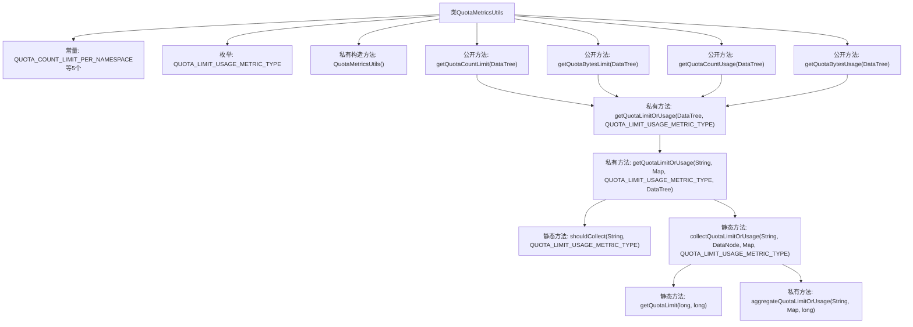

# 基础信息

|      |      |
|------|------|
| 名称 | QuotaMetricsUtils |
| 编码语言 | .java |
| 代码路径 | zookeeper/zookeeper-server/src/main/java/org/apache/zookeeper/server/util/QuotaMetricsUtils.java |
| 包名 | org.apache.zookeeper.server.util |
| 依赖项 | ['java.util.Map', 'java.util.concurrent.ConcurrentHashMap', 'org.apache.zookeeper.Quotas', 'org.apache.zookeeper.StatsTrack', 'org.apache.zookeeper.common.PathUtils', 'org.apache.zookeeper.server.DataNode', 'org.apache.zookeeper.server.DataTree'] |
| 概述说明 | QuotaMetricsUtils类提供命名空间配额限制和使用量的统计功能，包含获取配额计数、字节限制及使用量的方法，通过遍历数据树收集信息并汇总。 |

# 说明

QuotaMetricsUtils是一个工具类，用于处理命名空间配额指标。它包含五个静态字符串常量，表示配额计数限制、字节限制、计数使用量、字节使用量及超出配额错误。类中定义了枚举类型QUOTA_LIMIT_USAGE_METRIC_TYPE，用于区分配额限制和使用量类型。提供了四个公共方法：getQuotaCountLimit、getQuotaBytesLimit、getQuotaCountUsage和getQuotaBytesUsage，分别用于获取命名空间的配额计数限制、字节限制、计数使用量和字节使用量。这些方法通过遍历配额子树，收集并返回以顶级命名空间为键、配额指标为值的映射。内部方法shouldCollect和collectQuotaLimitOrUsage用于判断是否收集数据及处理数据聚合。工具类采用私有构造方法确保不可实例化。

# 类列表 Class Summary

| 名称   | 类型  | 说明 |
|-------|------|-------------|
| QuotaMetricsUtils | class | QuotaMetricsUtils类提供命名空间配额限制和使用量的统计功能，包含计数和字节两种类型，通过遍历数据树获取并聚合结果。 |


## 类 QuotaMetricsUtils

|      |      |
|------|------|
| 访问范围 | public final |
| 类型 | class |
| 名称 | QuotaMetricsUtils |
| 说明 | QuotaMetricsUtils类提供命名空间配额限制和使用量的统计功能，包含计数和字节两种类型，通过遍历数据树获取并聚合结果。 |


### UML类图

```mermaid
classDiagram
    class QuotaMetricsUtils {
        <<final>>
        +String QUOTA_COUNT_LIMIT_PER_NAMESPACE
        +String QUOTA_BYTES_LIMIT_PER_NAMESPACE
        +String QUOTA_COUNT_USAGE_PER_NAMESPACE
        +String QUOTA_BYTES_USAGE_PER_NAMESPACE
        +String QUOTA_EXCEEDED_ERROR_PER_NAMESPACE
        -String LIMIT_END_STRING
        -String STATS_END_STRING
        -QuotaMetricsUtils()
        +Map~String, Number~ getQuotaCountLimit(DataTree dataTree)
        +Map~String, Number~ getQuotaBytesLimit(DataTree dataTree)
        +Map~String, Number~ getQuotaCountUsage(DataTree dataTree)
        +Map~String, Number~ getQuotaBytesUsage(DataTree dataTree)
        -static Map~String, Number~ getQuotaLimitOrUsage(DataTree dataTree, QUOTA_LIMIT_USAGE_METRIC_TYPE type)
        -static void getQuotaLimitOrUsage(String path, Map~String, Number~ metricsMap, QUOTA_LIMIT_USAGE_METRIC_TYPE type, DataTree dataTree)
        -static boolean shouldCollect(String path, QUOTA_LIMIT_USAGE_METRIC_TYPE type)
        -static void collectQuotaLimitOrUsage(String path, DataNode node, Map~String, Number~ metricsMap, QUOTA_LIMIT_USAGE_METRIC_TYPE type)
        -static long getQuotaLimit(long hardLimit, long limit)
        -static void aggregateQuotaLimitOrUsage(String namespace, Map~String, Number~ metricsMap, long limitOrUsage)
    }

    enum QUOTA_LIMIT_USAGE_METRIC_TYPE {
        <<enumeration>>
        QUOTA_COUNT_LIMIT
        QUOTA_BYTES_LIMIT
        QUOTA_COUNT_USAGE
        QUOTA_BYTES_USAGE
    }

    class DataTree {
        <<external>>
    }

    class DataNode {
        <<external>>
    }

    class StatsTrack {
        <<external>>
    }

    class PathUtils {
        <<external>>
    }

    class Quotas {
        <<external>>
    }

    QuotaMetricsUtils --> DataTree : 依赖
    QuotaMetricsUtils --> DataNode : 依赖
    QuotaMetricsUtils --> StatsTrack : 依赖
    QuotaMetricsUtils --> PathUtils : 依赖
    QuotaMetricsUtils --> Quotas : 依赖
    QuotaMetricsUtils .. QUOTA_LIMIT_USAGE_METRIC_TYPE
```

这段代码定义了一个名为QuotaMetricsUtils的工具类，主要用于处理配额限制和使用情况的度量数据。该类包含多个公共静态方法，用于获取不同命名空间下的配额计数限制、字节限制、计数使用情况和字节使用情况。通过遍历配额子树并收集相关数据，最终返回一个以命名空间为键、配额数据为值的映射。类中还定义了一个枚举类型QUOTA_LIMIT_USAGE_METRIC_TYPE，用于标识不同的配额度量类型。该类依赖于多个外部类，如DataTree、DataNode、StatsTrack等，用于获取和处理数据。整体设计简洁高效，适用于处理配额相关的度量数据。


### 内部方法调用关系图



这段代码实现了一个配额指标工具类，主要用于从数据树中收集和计算不同命名空间下的配额限制和使用情况。通过递归遍历数据树结构，根据路径后缀和指标类型判断是否需要收集数据，并将结果聚合到映射表中。核心逻辑包含配额数据的条件判断、递归遍历、硬限制优先处理以及命名空间级别的数据聚合等功能。

### 字段列表 Field List

| 名称  | 类型  | 说明 |
|-------|-------|------|
| QUOTA_BYTES_USAGE_PER_NAMESPACE = "quota_bytes_usage_per_namespace" | String | 静态常量字符串，定义命名空间字节配额使用量的键名。 |
| QUOTA_COUNT_LIMIT_PER_NAMESPACE = "quota_count_limit_per_namespace" | String | 常量QUOTA_COUNT_LIMIT_PER_NAMESPACE定义命名空间的配额计数限制。 |
| QUOTA_BYTES_LIMIT_PER_NAMESPACE = "quota_bytes_limit_per_namespace" | String | 静态常量字符串，定义命名空间字节配额限制键名。 |
| STATS_END_STRING = "/" + Quotas.statNode | String | 静态字符串STATS_END_STRING定义为斜杠加Quotas.statNode的值。 |
| LIMIT_END_STRING = "/" + Quotas.limitNode | String | 静态常量LIMIT_END_STRING定义为斜杠加Quotas.limitNode的值。 |
| QUOTA_COUNT_USAGE_PER_NAMESPACE = "quota_count_usage_per_namespace" | String | 静态常量字符串，定义配额使用计数变量名"quota_count_usage_per_namespace"。 |
| QUOTA_EXCEEDED_ERROR_PER_NAMESPACE = "quota_exceeded_error_per_namespace" | String | 常量定义：命名空间配额超限错误标识符。 |

### 方法列表 Method List

| 名称  | 类型  | 说明 |
|-------|-------|------|
| getQuotaLimit | long | 该方法根据硬限制值返回配额限制：若硬限制大于-1则返回硬限制，否则返回默认限制值。 |
| aggregateQuotaLimitOrUsage | void | 聚合配额限制或使用量：将给定命名空间的数值累加到metricsMap中，键为namespace，值为原值（默认为0）加上limitOrUsage。 |
| getQuotaLimitOrUsage | void | 获取配额限制或使用情况的方法，递归遍历数据树节点，收集指定路径下的指标数据。若节点无子节点且符合条件则收集数据。 |
| getQuotaLimitOrUsage | Map<String, Number> | 私有静态方法`getQuotaLimitOrUsage`根据类型返回配额限制或使用情况。接收DataTree和枚举类型参数，返回线程安全的ConcurrentHashMap。若DataTree非空，调用同名方法处理数据。 |
| getQuotaCountUsage | Map<String, Number> | 获取配额计数使用情况的静态方法，返回数据树中配额使用量的映射。 |
| getQuotaCountLimit | Map<String, Number> | 静态方法getQuotaCountLimit返回配额计数限制，通过调用getQuotaLimitOrUsage并传入QUOTA_COUNT_LIMIT类型参数实现。 |
| shouldCollect | boolean | 静态方法判断是否收集数据：路径以特定字符串结尾且类型匹配配额限制或使用统计。 |
| getQuotaBytesLimit | Map<String, Number> | 获取数据树的字节配额限制，返回字符串与数值的映射。 |
| getQuotaBytesUsage | Map<String, Number> | 获取数据树中配额字节使用量的静态方法，返回键值对映射。 |
| collectQuotaLimitOrUsage | void | 方法collectQuotaLimitOrUsage用于收集配额限制或使用情况。根据输入类型处理节点数据，统计命名空间下的配额计数或字节数，结果存入metricsMap。处理失败时直接返回。 |


