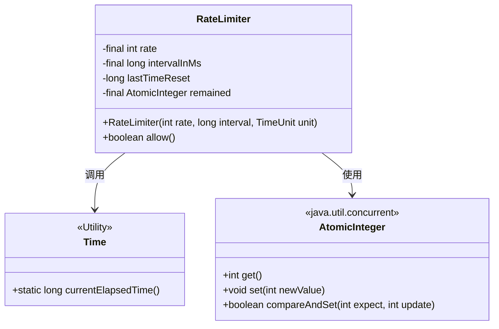
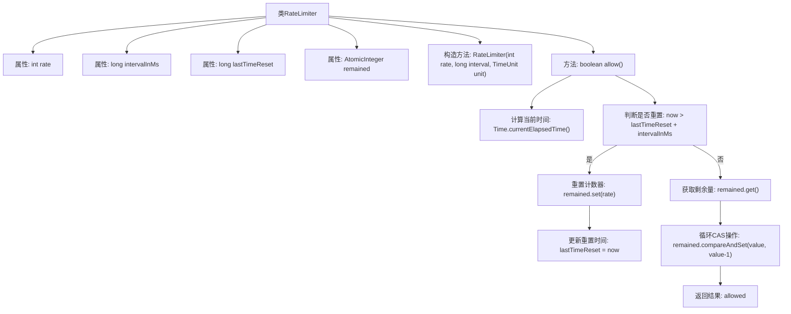

# 基础信息

|      |      |
|------|------|
| 名称 | RateLimiter |
| 编码语言 | .java |
| 代码路径 | zookeeper/zookeeper-server/src/main/java/org/apache/zookeeper/server/util/RateLimiter.java |
| 包名 | org.apache.zookeeper.server.util |
| 依赖项 | ['java.util.concurrent.TimeUnit', 'java.util.concurrent.atomic.AtomicInteger', 'org.apache.zookeeper.common.Time'] |
| 概述说明 | Java限流器类，支持设置速率和时间间隔，通过原子操作确保线程安全，检查是否允许请求。 |

# 说明

该内容描述了一个速率限制器类，用于控制单位时间内的请求数量。类中包含速率、时间间隔、上次重置时间和剩余请求数等关键属性。构造函数接收速率值、时间间隔和时间单位参数，初始化相关属性。核心方法allow()检查当前时间是否超过间隔，若超过则重置剩余请求数。通过原子操作处理并发情况，确保线程安全。方法返回布尔值表示是否允许当前请求。

# 类列表 Class Summary

| 名称   | 类型  | 说明 |
|-------|------|-------------|
| RateLimiter | class | Java限流器类，支持设置速率和间隔时间，通过原子操作确保线程安全，允许请求时检查时间间隔并重置剩余配额。 |

## 类 RateLimiter

|      |      |
|------|------|
| 访问范围 | public |
| 类型 | class |
| 名称 | RateLimiter |
| 说明 | Java限流器类，支持设置速率和间隔时间，通过原子操作确保线程安全，允许请求时检查时间间隔并重置剩余配额。 |

### UML类图

这段代码展示了一个基于令牌桶算法的速率限制器实现。RateLimiter类通过AtomicInteger保证线程安全，使用Time工具类获取当前时间，核心逻辑在allow()方法中：当超过时间间隔时会重置令牌数，并通过CAS操作原子性减少剩余令牌。该设计适用于高并发场景，能有效控制单位时间内的请求通过量，同时避免了多线程竞争导致的计数不准确问题。

### 内部方法调用关系图

这段代码实现了一个基于时间窗口的速率限制器，通过原子操作保证线程安全。流程图展示了核心逻辑：构造方法初始化速率参数，allow()方法先判断是否到达时间窗口重置点，然后通过CAS循环原子递减剩余配额。整个过程严格遵循"检查-重置-扣减"的顺序，确保在高并发场景下精确控制请求速率。

### 字段列表 Field List

| 名称  | 类型  | 说明 |
|-------|-------|------|
| rate | int | 私有整型变量rate，不可修改。 |
| intervalInMs | long | 私有长整型变量intervalInMs，表示时间间隔（毫秒）。 |
| lastTimeReset | long | 私有长整型变量，记录上次重置时间。 |
| remained | AtomicInteger | 私有原子整型变量remained，用于线程安全计数。 |

### 方法列表 Method List

| 名称  | 类型  | 说明 |
|-------|-------|------|
| allow | boolean | 这段代码实现了一个基于时间的速率限制器。它检查当前时间是否超过重置间隔，如果是则重置剩余请求数。通过原子操作确保线程安全，当剩余请求数大于0时允许请求并减少计数。 |

