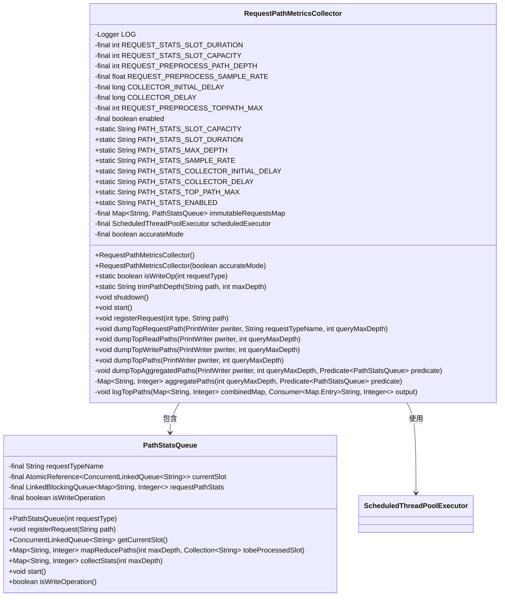
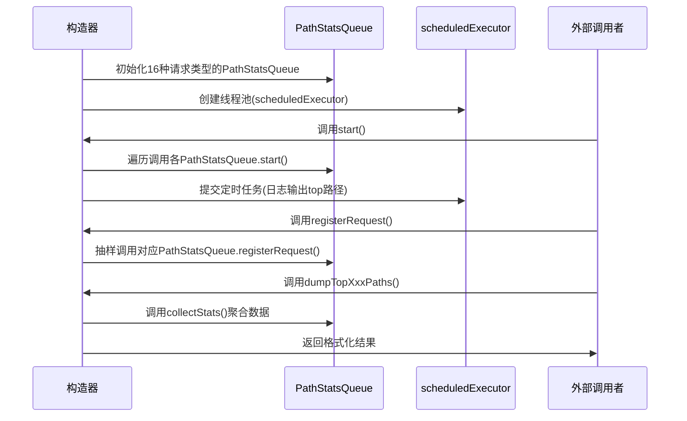

# 基础信息

|      |      |
|------|------|
| 名称 | RequestPathMetricsCollector |
| 编码语言 | .java |
| 代码路径 | zookeeper/zookeeper-server/src/main/java/org/apache/zookeeper/server/util/RequestPathMetricsCollector.java |
| 包名 | org.apache.zookeeper.server.util |
| 依赖项 | ['org.apache.zookeeper.ZooDefs.OpCode.checkWatches', 'org.apache.zookeeper.ZooDefs.OpCode.create', 'org.apache.zookeeper.ZooDefs.OpCode.create2', 'org.apache.zookeeper.ZooDefs.OpCode.createContainer', 'org.apache.zookeeper.ZooDefs.OpCode.delete', 'org.apache.zookeeper.ZooDefs.OpCode.deleteContainer', 'org.apache.zookeeper.ZooDefs.OpCode.exists', 'org.apache.zookeeper.ZooDefs.OpCode.getACL', 'org.apache.zookeeper.ZooDefs.OpCode.getChildren', 'org.apache.zookeeper.ZooDefs.OpCode.getChildren2', 'org.apache.zookeeper.ZooDefs.OpCode.getData', 'org.apache.zookeeper.ZooDefs.OpCode.removeWatches', 'org.apache.zookeeper.ZooDefs.OpCode.setACL', 'org.apache.zookeeper.ZooDefs.OpCode.setData', 'org.apache.zookeeper.ZooDefs.OpCode.setWatches2', 'org.apache.zookeeper.ZooDefs.OpCode.sync', 'java.io.PrintWriter', 'java.util.Arrays', 'java.util.Collection', 'java.util.Comparator', 'java.util.HashMap', 'java.util.Map', 'java.util.StringTokenizer', 'java.util.concurrent.ConcurrentHashMap', 'java.util.concurrent.ConcurrentLinkedQueue', 'java.util.concurrent.Executors', 'java.util.concurrent.LinkedBlockingQueue', 'java.util.concurrent.ScheduledThreadPoolExecutor', 'java.util.concurrent.ThreadLocalRandom', 'java.util.concurrent.TimeUnit', 'java.util.concurrent.atomic.AtomicReference', 'java.util.function.Consumer', 'java.util.function.Predicate', 'org.apache.zookeeper.ZooDefs', 'org.apache.zookeeper.server.Request', 'org.slf4j.Logger', 'org.slf4j.LoggerFactory'] |
| 概述说明 | RequestPathMetricsCollector类用于收集ZooKeeper请求路径的统计信息，支持读写操作分类、路径深度限制、采样率控制，并定期输出高频路径。包含初始化配置、路径处理、统计聚合和定时任务调度功能。 |

# 说明

RequestPathMetricsCollector是一个用于收集和分析ZooKeeper请求路径指标的类。它通过采样机制记录不同操作类型的请求路径，并支持按读写操作分类统计。核心功能包括：配置采样率、路径深度、时间槽容量等参数；使用时间槽机制存储历史数据；提供路径修剪和聚合功能；支持定时输出读写操作的热门路径统计。该类通过多线程调度实现异步处理，并提供了多种数据输出接口，便于监控和分析系统请求模式。

# 类列表 Class Summary

| 名称   | 类型  | 说明 |
|-------|------|-------------|
| RequestPathMetricsCollector | class | RequestPathMetricsCollector类用于收集ZooKeeper请求路径的统计信息，支持读写操作分类、路径深度限制、采样率控制，并通过定时任务汇总和输出Top路径。 |

## 类 RequestPathMetricsCollector

|      |      |
|------|------|
| 访问范围 | public |
| 类型 | class |
| 名称 | RequestPathMetricsCollector |
| 说明 | RequestPathMetricsCollector类用于收集ZooKeeper请求路径的统计信息，支持读写操作分类、路径深度限制、采样率控制，并通过定时任务汇总和输出Top路径。 |

### UML类图

这段代码描述了一个请求路径指标收集器系统，主要用于监控和分析ZooKeeper请求路径的使用情况。RequestPathMetricsCollector类作为主控制器，负责初始化配置、启动/停止收集器、注册请求和输出统计结果。其核心功能通过内部类PathStatsQueue实现，后者采用分槽统计机制来高效收集路径访问频率，支持读写操作分类统计和采样处理。系统通过定时任务自动聚合数据，并提供多种查询接口输出Top访问路径，具有可配置的采样率、路径深度和统计时间窗口等参数。

### 内部方法调用关系图

```mermaid
graph TD
    A["类RequestPathMetricsCollector"]
    B["常量: 配置参数和默认值"]
    C["属性: Map<String, PathStatsQueue> immutableRequestsMap"]
    D["属性: ScheduledThreadPoolExecutor scheduledExecutor"]
    E["构造方法: RequestPathMetricsCollector(boolean accurateMode)"]
    F["方法: start()"]
    G["方法: shutdown()"]
    H["方法: registerRequest(int type, String path)"]
    I["方法: dumpTopRequestPath()"]
    J["方法: dumpTopReadPaths()"]
    K["方法: dumpTopWritePaths()"]
    L["方法: dumpTopPaths()"]
    M["内部类: PathStatsQueue"]
    N["静态方法: isWriteOp(int requestType)"]
    O["静态方法: trimPathDepth(String path, int maxDepth)"]

    A --> B
    A --> C
    A --> D
    A --> E
    A --> F
    A --> G
    A --> H
    A --> I
    A --> J
    A --> K
    A --> L
    A --> M
    A -.-> N
    A -.-> O

    M --> P["属性: requestTypeName/isWriteOperation"]
    M --> Q["属性: currentSlot/requestPathStats"]
    M --> R["方法: registerRequest()"]
    M --> S["方法: collectStats()"]
    M --> T["方法: start()"]
    M --> U["方法: mapReducePaths()"]
```

该流程图展示了RequestPathMetricsCollector类的核心结构和数据流向。作为ZooKeeper请求路径统计收集器，它通过PathStatsQueue内部类实现请求路径的采样统计，使用定时任务聚合数据并输出Top访问路径。主要功能包括：初始化时创建16种请求类型的统计队列，通过抽样机制(默认10%)记录请求路径，定时(默认5分钟)聚合统计结果，并提供多种数据输出接口。关键设计点在于使用ConcurrentLinkedQueue实现无锁写入，通过map-reduce模式高效处理路径统计，并支持读写操作分类统计。

### 字段列表 Field List

| 名称  | 类型  | 说明 |
|-------|-------|------|
| COLLECTOR_DELAY | long | 私有长整型常量COLLECTOR_DELAY |
| PATH_STATS_SLOT_CAPACITY = "zookeeper.pathStats.slotCapacity" | String | 该代码定义了一个静态常量字符串，表示ZooKeeper中路径统计的槽容量配置键。 |
| PATH_STATS_MAX_DEPTH = "zookeeper.pathStats.maxDepth" | String | ZooKeeper路径统计最大深度配置参数。 |
| PATH_STATS_ENABLED = "zookeeper.pathStats.enabled" | String | ZooKeeper路径统计功能启用配置项。 |
| REQUEST_STATS_SLOT_DURATION | int | 私有整型常量，用于定义统计请求的时段时长。 |
| accurateMode | boolean | 私有布尔变量accurateMode，用于控制精确模式。 |
| scheduledExecutor | ScheduledThreadPoolExecutor | 私有定时线程池执行器scheduledExecutor。 |
| COLLECTOR_INITIAL_DELAY | long | 私有长整型变量，表示收集器的初始延迟时间。 |
| REQUEST_PREPROCESS_PATH_DEPTH | int | 私有整型常量，定义请求预处理路径深度。 |
| PATH_STATS_COLLECTOR_DELAY = "zookeeper.pathStats.delay" | String | 这是一个Java静态常量，定义了ZooKeeper路径统计收集器的延迟配置键，用于设置延迟时间。 |
| LOG = LoggerFactory.getLogger(RequestPathMetricsCollector.class) | Logger | 私有静态日志常量LOG，用于RequestPathMetricsCollector类的日志记录。 |
| PATH_STATS_COLLECTOR_INITIAL_DELAY = "zookeeper.pathStats.initialDelay" | String | ZooKeeper路径统计初始延迟配置项。 |
| PATH_STATS_SLOT_DURATION = "zookeeper.pathStats.slotDuration" | String | 定义常量PATH_STATS_SLOT_DURATION，表示ZooKeeper路径统计的槽位时长配置项。 |
| enabled | boolean | 私有布尔变量enabled，表示启用状态。 |
| immutableRequestsMap | Map<String, PathStatsQueue> | 私有不可变映射，键为字符串，值为PathStatsQueue类型。 |
| REQUEST_PREPROCESS_SAMPLE_RATE | float | 私有浮点常量，用于请求预处理采样率。 |
| REQUEST_STATS_SLOT_CAPACITY | int | 私有常量，定义请求统计的槽位容量，类型为整型。 |
| REQUEST_PREPROCESS_TOPPATH_MAX | int | 私有常量REQUEST_PREPROCESS_TOPPATH_MAX，类型为整型，用于限制预处理顶级路径的最大值。 |
| PATH_STATS_SAMPLE_RATE = "zookeeper.pathStats.sampleRate" | String | 这是一个Java静态常量，定义ZooKeeper路径统计的采样率配置键。 |
| PATH_SEPARATOR = "/" | String | 定义静态常量PATH_SEPARATOR，值为斜杠"/"。 |
| PATH_STATS_TOP_PATH_MAX = "zookeeper.pathStats.topPathMax" | String | 这是一个静态常量字符串，定义ZooKeeper路径统计中最大路径数的配置键。 |

### 方法列表 Method List

| 名称  | 类型  | 说明 |
|-------|-------|------|
| dumpTopRequestPath | void | 方法dumpTopRequestPath输出指定请求类型的路径统计。若查询深度小于1或无统计则返回，否则收集并打印前N条路径及其计数。 |
| registerRequest | void | 方法registerRequest根据类型和路径处理请求。若未启用或随机采样未命中则直接返回。命中时从immutableRequestsMap获取对应队列并注册请求，若类型不存在则记录错误。 |
| start | void | 启动请求路径收集器：检查启用状态后，记录日志并初始化各操作类型队列。定时每5分钟统计并输出前4条高频读写路径，分别展示读写操作及其计数。 |
| shutdown | void | 方法shutdown检查enabled为false则直接返回，否则记录日志并立即关闭scheduledExecutor。 |
| isWriteOp | boolean | 判断ZooKeeper请求类型是否为写操作，包括创建、删除、设置数据等操作类型。 |
| trimPathDepth | String | 静态方法trimPathDepth用于截取路径字符串的前maxDepth层。通过StringTokenizer分割路径，循环拼接分隔符和节点，直到达到指定层数。返回截取后的路径。 |
| dumpTopReadPaths | void | 方法dumpTopReadPaths输出读取请求的顶部路径，通过调用dumpTopAggregatedPaths并筛选非写操作队列，参数包括PrintWriter和最大查询深度。 |
| dumpTopWritePaths | void | 方法dumpTopWritePaths输出最高写入请求，调用dumpTopAggregatedPaths并筛选写操作队列，参数为PrintWriter和最大查询深度。 |
| dumpTopPaths | void | 方法dumpTopPaths输出最高请求，调用dumpTopAggregatedPaths并筛选所有队列项，参数为PrintWriter和最大查询深度。 |
| dumpTopAggregatedPaths | void | 私有方法`dumpTopAggregatedPaths`：当启用时，聚合路径数据并按条件筛选后，将结果输出到指定写入器。 |
| aggregatePaths | Map<String, Integer> | 聚合路径统计：根据查询深度和条件筛选请求，合并路径计数到映射表。返回路径及其出现次数的集合。 |
| logTopPaths | void | 
该代码对combinedMap按值降序排序，取前REQUEST_PREPROCESS_TOPPATH_MAX条记录，通过output消费者输出。 |

