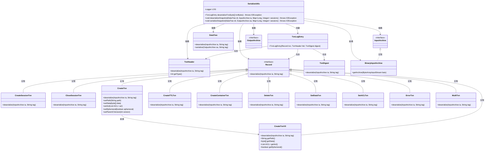
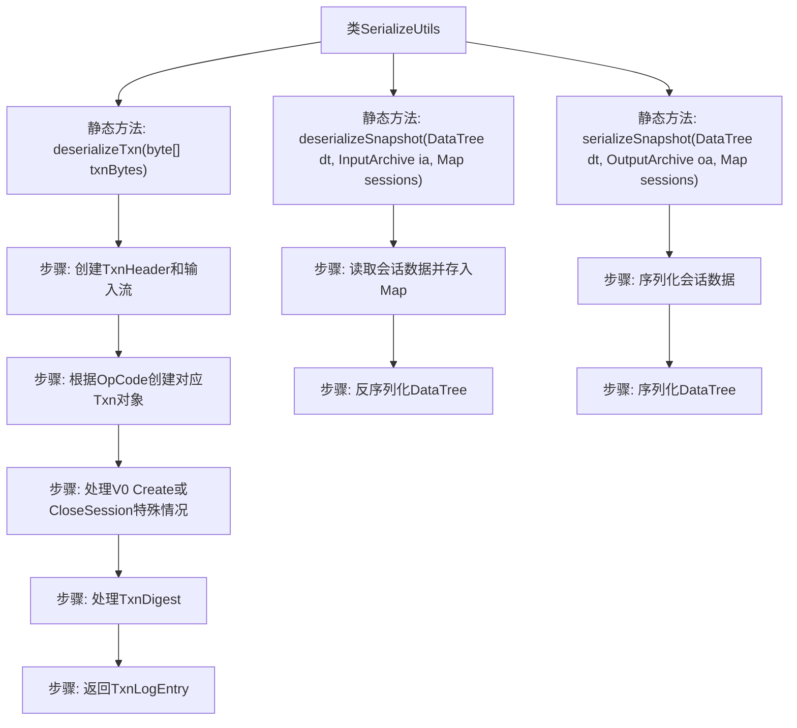

# 基础信息

|      |      |
|------|------|
| 名称 | SerializeUtils |
| 编码语言 | .java |
| 代码路径 | zookeeper/zookeeper-server/src/main/java/org/apache/zookeeper/server/util/SerializeUtils.java |
| 包名 | org.apache.zookeeper.server.util |
| 依赖项 | ['java.io.ByteArrayInputStream', 'java.io.EOFException', 'java.io.IOException', 'java.util.HashMap', 'java.util.Map', 'java.util.Map.Entry', 'org.apache.jute.BinaryInputArchive', 'org.apache.jute.InputArchive', 'org.apache.jute.OutputArchive', 'org.apache.jute.Record', 'org.apache.zookeeper.ZooDefs.OpCode', 'org.apache.zookeeper.server.DataTree', 'org.apache.zookeeper.server.TxnLogEntry', 'org.apache.zookeeper.server.ZooKeeperServer', 'org.apache.zookeeper.server.ZooTrace', 'org.apache.zookeeper.txn.CloseSessionTxn', 'org.apache.zookeeper.txn.CreateContainerTxn', 'org.apache.zookeeper.txn.CreateSessionTxn', 'org.apache.zookeeper.txn.CreateTTLTxn', 'org.apache.zookeeper.txn.CreateTxn', 'org.apache.zookeeper.txn.CreateTxnV0', 'org.apache.zookeeper.txn.DeleteTxn', 'org.apache.zookeeper.txn.ErrorTxn', 'org.apache.zookeeper.txn.MultiTxn', 'org.apache.zookeeper.txn.SetACLTxn', 'org.apache.zookeeper.txn.SetDataTxn', 'org.apache.zookeeper.txn.TxnDigest', 'org.apache.zookeeper.txn.TxnHeader', 'org.slf4j.Logger', 'org.slf4j.LoggerFactory'] |
| 概述说明 | SerializeUtils类提供事务反序列化和快照处理功能。反序列化方法根据事务类型创建对应对象，处理不同版本兼容性。快照方法支持序列化和反序列化会话数据及数据树。 |

# 说明

SerializeUtils类提供事务日志和快照的序列化与反序列化功能。deserializeTxn方法根据事务头类型反序列化不同事务对象，处理旧版本兼容性问题，并支持摘要校验。deserializeSnapshot和serializeSnapshot方法分别实现从快照加载会话数据到DataTree，以及将会话数据和DataTree序列化到快照中。日志记录用于跟踪会话加载过程。

# 类列表 Class Summary

| 名称   | 类型  | 说明 |
|-------|------|-------------|
| SerializeUtils | class | SerializeUtils类提供事务日志和快照的序列化与反序列化功能。反序列化事务时根据类型创建对应事务对象并处理异常情况。快照处理包括会话超时和数据结构序列化。 |

## 类 SerializeUtils

|      |      |
|------|------|
| 访问范围 | public |
| 类型 | class |
| 名称 | SerializeUtils |
| 说明 | SerializeUtils类提供事务日志和快照的序列化与反序列化功能。反序列化事务时根据类型创建对应事务对象并处理异常情况。快照处理包括会话超时和数据结构序列化。 |

### UML类图

这段代码是ZooKeeper中用于序列化和反序列化事务日志的工具类。SerializeUtils提供三个核心方法：deserializeTxn用于根据事务类型反序列化不同的事务对象，deserializeSnapshot用于加载数据树和会话超时信息，serializeSnapshot用于保存数据树和会话信息到快照。类图展示了事务类型之间的继承关系，以及工具类与ZooKeeper核心组件（如TxnHeader、DataTree）的交互关系，体现了ZooKeeper事务处理的灵活性和版本兼容性设计。

### 内部方法调用关系图

该流程图展示了SerializeUtils类的三个核心方法处理过程。deserializeTxn方法通过字节流反序列化事务日志，包含事务头解析、事务类型判断、特殊版本兼容处理及摘要验证；deserializeSnapshot方法先加载会话超时数据再反序列化数据树；serializeSnapshot则相反，先序列化会话数据再处理数据树。每个方法都包含完整的异常处理逻辑，确保ZooKeeper事务数据的可靠持久化。

### 字段列表 Field List

| 名称  | 类型  | 说明 |
|-------|-------|------|
| LOG = LoggerFactory.getLogger(SerializeUtils.class) | Logger | 声明SerializeUtils类的私有静态日志常量LOG，使用LoggerFactory获取Logger实例。 |

### 方法列表 Method List

| 名称  | 类型  | 说明 |
|-------|-------|------|
| deserializeTxn | TxnLogEntry | 该代码实现了一个事务日志反序列化方法，根据事务类型创建对应对象并解析数据，支持多种操作类型和版本兼容处理，最终返回包含事务、头信息和摘要的日志条目。 |
| deserializeSnapshot | void | 静态方法deserializeSnapshot从输入存档读取会话数据（ID和超时）存入Map，并反序列化数据树。含日志跟踪逻辑。 |
| serializeSnapshot | void | 序列化数据树和会话信息到输出存档，包括会话ID和超时时间，最后序列化数据树。 |

