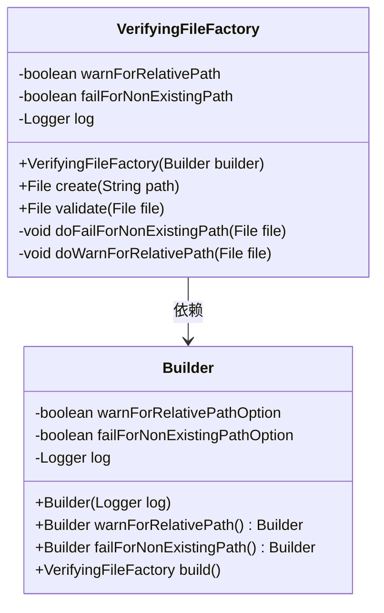
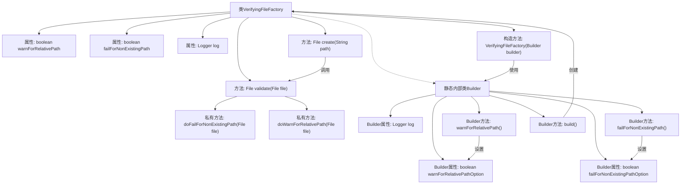

# 基础信息

|      |      |
|------|------|
| 名称 | VerifyingFileFactory |
| 编码语言 | .java |
| 代码路径 | zookeeper/zookeeper-server/src/main/java/org/apache/zookeeper/server/util/VerifyingFileFactory.java |
| 包名 | org.apache.zookeeper.server.util |
| 依赖项 | ['java.io.File', 'org.slf4j.Logger'] |
| 概述说明 | VerifyingFileFactory类用于创建和验证文件路径，支持警告相对路径和检查路径是否存在，通过Builder配置选项。 |

# 说明

VerifyingFileFactory是一个用于创建和验证文件路径的Java类，通过Builder模式配置。主要功能包括检查相对路径警告和非存在路径失败选项。构造函数接收Builder对象，初始化警告和失败标志及日志对象。create方法根据路径创建文件并验证，validate方法执行具体验证逻辑。doFailForNonExistingPath检查文件是否存在，不存在则抛出异常。doWarnForRelativePath检查是否为相对路径并记录警告。Builder类提供链式方法设置选项并构建实例。

# 类列表 Class Summary

| 名称   | 类型  | 说明 |
|-------|------|-------------|
| VerifyingFileFactory | class | VerifyingFileFactory类用于验证文件路径，支持警告相对路径和检查路径是否存在，通过Builder模式配置选项。 |

## 类 VerifyingFileFactory

|      |      |
|------|------|
| 访问范围 | public final |
| 类型 | class |
| 名称 | VerifyingFileFactory |
| 说明 | VerifyingFileFactory类用于验证文件路径，支持警告相对路径和检查路径是否存在，通过Builder模式配置选项。 |

### UML类图

这段代码展示了一个文件工厂模式，VerifyingFileFactory类负责创建和验证文件路径，通过Builder模式进行灵活配置。工厂类包含路径警告和存在性检查功能，Builder类提供链式配置选项。类图清晰地反映了构造器模式的关系，其中工厂类依赖Builder来初始化配置参数，实现了创建逻辑与配置的分离。

### 内部方法调用关系图

这段代码展示了一个文件工厂验证模式，通过Builder模式构建具有路径验证功能的File对象。主类包含相对路径警告和文件存在性检查功能，Builder类提供链式配置。流程图清晰呈现了类结构、属性关系和方法调用链，特别是Builder与主类的构造关系。验证逻辑包含对相对路径的警告日志记录和对不存在文件的异常抛出，体现了防御性编程思想。

### 字段列表 Field List

| 名称  | 类型  | 说明 |
|-------|-------|------|
| log | Logger | 私有日志记录器实例。 |
| failForNonExistingPath | boolean | 私有布尔变量，标识是否对不存在的路径报错。 |
| warnForRelativePath | boolean | 私有布尔变量，用于警告相对路径。 |

### 方法列表 Method List

| 名称  | 类型  | 说明 |
|-------|-------|------|
| validate | File | 验证文件方法：检查相对路径警告和非存在路径失败选项，返回原文件。 |
| create | File | 创建文件方法：接收路径参数，生成文件对象并验证后返回。 |
| doFailForNonExistingPath | void | 检查文件是否存在，不存在则抛出异常提示文件缺失。 |
| doWarnForRelativePath | void | 检查文件路径是否为相对路径，若非绝对路径且不以"./"开头，则警告建议添加"./"前缀以明确路径意图。 |

