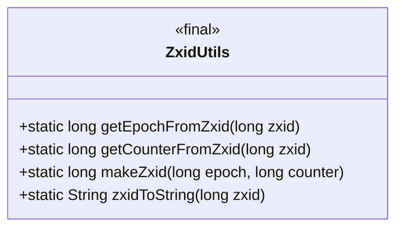
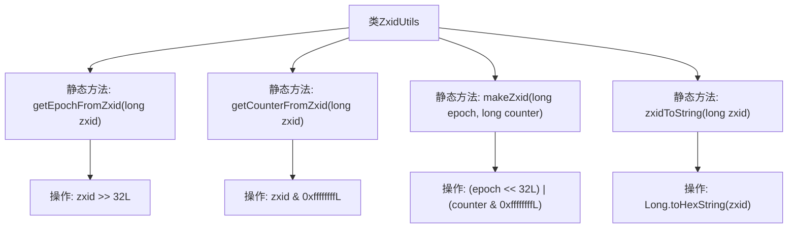

# 基础信息

|      |      |
|------|------|
| 名称 | ZxidUtils |
| 编码语言 | .java |
| 代码路径 | zookeeper/zookeeper-server/src/main/java/org/apache/zookeeper/server/util/ZxidUtils.java |
| 包名 | org.apache.zookeeper.server.util |
| 依赖项 | [] |
| 概述说明 | ZxidUtils类提供处理zxid的静态方法：提取epoch、提取counter、合成zxid、转为16进制字符串。 |

# 说明

ZxidUtils类提供了处理zxid（事务ID）的实用方法。getEpochFromZxid通过右移32位获取zxid的高32位纪元值。getCounterFromZxid通过掩码操作获取zxid的低32位计数器值。makeZxid将纪元值和计数器值组合生成完整zxid。zxidToString将zxid转换为十六进制字符串表示。这些方法用于zxid的解析和生成。

# 类列表 Class Summary

| 名称   | 类型  | 说明 |
|-------|------|-------------|
| ZxidUtils | class | ZxidUtils类提供处理zxid的静态方法：提取epoch和counter，合成zxid，以及转为十六进制字符串。 |

## 类 ZxidUtils

|      |      |
|------|------|
| 访问范围 | public |
| 类型 | class |
| 名称 | ZxidUtils |
| 说明 | ZxidUtils类提供处理zxid的静态方法：提取epoch和counter，合成zxid，以及转为十六进制字符串。 |

### UML类图

该类图展示了ZxidUtils工具类，这是一个不可实例化的工具类（用<<final>>标记），专门用于处理64位ZXID（ZooKeeper事务ID）的编解码操作。它提供四个静态方法：getEpochFromZxid通过右移32位提取高32位纪元号；getCounterFromZxid通过掩码获取低32位计数器；makeZxid将纪元号和计数器组合成ZXID；zxidToString实现十六进制字符串转换。这些方法共同完成了ZXID的拆分、合成和格式化功能，适用于分布式系统中事务ID的位操作场景。

### 内部方法调用关系图

该流程图展示了ZxidUtils工具类的结构，包含4个核心静态方法：getEpochFromZxid通过右移32位获取zxid的epoch部分；getCounterFromZxid通过位与运算获取低32位计数器；makeZxid通过位运算组合epoch和counter生成新zxid；zxidToString将zxid转为十六进制字符串。所有方法都直接操作long型数据，采用位运算实现高效处理，适用于分布式系统中zxid(事务ID)的解析和生成场景。

### 字段列表 Field List

| 名称  | 类型  | 说明 |
|-------|-------|------|

### 方法列表 Method List

| 名称  | 类型  | 说明 |
|-------|-------|------|
| getCounterFromZxid | long | 该方法从zxid中提取计数器值，通过位运算zxid与0xffffffffL的按位与操作实现。 |
| getEpochFromZxid | long | 该方法从zxid中提取epoch值，通过右移32位实现。 |
| makeZxid | long | 该代码将epoch左移32位后与counter的低32位进行或运算，生成一个64位的zxid。 |
| zxidToString | String | 将长整型zxid转换为十六进制字符串。 |

