# 基础信息

|      |      |
|------|------|
| 名称 | util |
| 编码语言 | .java |
| 代码路径 | zookeeper/zookeeper-server/src/main/java/org/apache/zookeeper/server/util |
| 包名 | zookeeper.docs.zookeeper-server.src.main.java.org.apache.zookeeper.server.util |
| 概述说明 | RateLimiter控制请求速率；LogChopper处理事务日志；ZxidUtils解析zxid；KerberosUtil获取Kerberos领域；AdHash维护64位哈希；BitHashSet高效存储整数；ConfigUtils处理配置；OSMXBean获取系统信息；AuthUtil处理认证；JvmPauseMonitor监控JVM暂停；QuotaMetricsUtils处理配额指标；VerifyingFileFactory验证文件路径；BitMap管理位图；SerializeUtils序列化数据；CircularBuffer实现循环缓冲区；MessageTracker跟踪消息；RequestPathMetricsCollector分析请求路径。 |

# 说明

## 概述  
该模块是ZooKeeper服务器的核心工具集，提供速率控制、日志处理、ID转换等基础功能。主要接口包括原子操作的速率限制器、事务日志切割器和Zxid解析工具，例如RateLimiter通过令牌桶算法实现请求控制。关键数据结构包含循环缓冲区和位图索引，类似文件系统的路径映射。外部依赖限于JVM系统库和Kerberos认证模块，例如通过OSMXBean获取系统资源信息。

## 主要业务场景  
支持ZooKeeper事务日志处理、配额监控和请求路径分析等核心流程，例如LogChopper按Zxid切割事务日志。采用线程安全的交互模式，如BitHashSet混合结构优化集合操作。功能覆盖从Kerberos领域获取到JVM暂停监控，例如JvmPauseMonitor检测GC停顿。主要用于服务器运维调试和性能分析，提供Utils类API与Builder模式集成。第三方可通过类似MessageTracker的消息跟踪器集成监控系统。

### 包内部结构视图

```mermaid
graph TD
    util --> RateLimiter.java
    util --> LogChopper.java
    util --> ZxidUtils.java
    util --> KerberosUtil.java
    util --> AdHash.java
    util --> BitHashSet.java
    util --> ConfigUtils.java
    util --> OSMXBean.java
    util --> AuthUtil.java
    util --> JvmPauseMonitor.java
    util --> QuotaMetricsUtils.java
    util --> VerifyingFileFactory.java
    util --> BitMap.java
    util --> SerializeUtils.java
    util --> CircularBuffer.java
    util --> MessageTracker.java
    util --> RequestPathMetricsCollector.java
```

该流程图展示了Zookeeper服务器工具类(util)目录下的17个Java工具文件，包括RateLimiter、LogChopper等核心组件，这些文件直接隶属于util节点，没有更深层级的子目录结构。所有文件均用于提供Zookeeper服务器运行时的各种工具支持功能，如速率限制、日志处理、身份验证等基础服务能力。

# 文件列表 File List

| 名称   | 类型  | 说明 |
|-------|------|-------------|
| [KerberosUtil.java](KerberosUtil.md) | file | Java类KerberosUtil提供静态方法getDefaultRealm，通过KerberosPrincipal实例获取默认领域名，可能抛出IllegalArgumentException异常。 |
| [ZxidUtils.java](ZxidUtils.md) | file | ZxidUtils类提供处理zxid的静态方法：提取epoch、提取counter、合成zxid、转为16进制字符串。 |
| [LogChopper.java](LogChopper.md) | file | LogChopper是Java工具类，用于截取ZooKeeper事务日志文件至指定zxid，输出到新文件。校验CRC和日志格式，处理事务间隙，确保数据一致性。 |
| [RateLimiter.java](RateLimiter.md) | file | Java限流器类，支持设置速率和时间间隔，通过原子操作确保线程安全，检查是否允许请求。 |
| [BitHashSet.java](BitHashSet.md) | file | BitHashSet结合BitSet和HashSet，优化元素存储与遍历。BitSet存储元素，HashSet缓存少量元素加速迭代。支持添加、删除、查询操作，线程安全，迭代器非线程安全需同步。 |
| [AdHash.java](AdHash.md) | file | AdHash类维护一个64位长整型哈希值，提供添加、移除、获取哈希值的方法，支持链式操作，并重写了equals、hashCode、toString和clear方法。 |
| [BitMap.java](BitMap.md) | file | BitMap类实现线程安全的位图映射，支持双向查询（值到比特和比特到值）。使用读写锁保证并发安全，重用释放的比特位，优化频繁添加相同值的性能。提供添加、查询、删除和大小统计功能。 |
| [VerifyingFileFactory.java](VerifyingFileFactory.md) | file | VerifyingFileFactory类用于创建和验证文件路径，支持警告相对路径和检查路径是否存在，通过Builder配置选项。 |
| [QuotaMetricsUtils.java](QuotaMetricsUtils.md) | file | QuotaMetricsUtils类提供命名空间配额限制和使用量的统计功能，包含获取配额计数、字节限制及使用量的方法，通过遍历数据树收集信息并汇总。 |
| [JvmPauseMonitor.java](JvmPauseMonitor.md) | file | JVM暂停监控类，检测GC暂停时间，超过阈值记录日志，默认警告阈值10秒，信息阈值1秒，支持启动停止监控线程。 |
| [AuthUtil.java](AuthUtil.md) | file | AuthUtil工具类提供用户认证相关功能：getUser根据ID获取用户名；getUsers返回逗号分隔的用户ID列表；getClientInfos生成客户端认证信息列表。均为静态方法，构造器私有。 |
| [OSMXBean.java](OSMXBean.md) | file | OSMXBean类用于获取操作系统信息，包括判断Unix系统、获取JVM打开文件描述符数量和最大文件描述符限制。支持Sun和IBM JVM，IBM下仅限Linux。Sun JVM使用com.sun.management接口，IBM JVM通过Linux命令实现。 |
| [RequestPathMetricsCollector.java](RequestPathMetricsCollector.md) | file | RequestPathMetricsCollector类用于收集ZooKeeper请求路径的统计信息，支持读写操作分类、路径深度限制、采样率控制，并定期输出高频路径。包含初始化配置、路径处理、统计聚合和定时任务调度功能。 |
| [MessageTracker.java](MessageTracker.md) | file | MessageTracker类用于跟踪消息发送和接收，包含两个循环缓冲区存储时间戳和类型，支持日志记录和状态检查。 |
| [CircularBuffer.java](CircularBuffer.md) | file | 循环缓冲区类，支持泛型，提供写入、读取、查看、重置功能，线程安全，容量固定，满时覆盖最旧元素，空时返回null。 |
| [SerializeUtils.java](SerializeUtils.md) | file | SerializeUtils类提供事务反序列化和快照处理功能。反序列化方法根据事务类型创建对应对象，处理不同版本兼容性。快照方法支持序列化和反序列化会话数据及数据树。 |
| [ConfigUtils.java](ConfigUtils.md) | file | ConfigUtils类提供三个功能：1.解析配置数据并提取版本和服务器地址；2.拆分服务器配置为IP和端口；3.支持新旧属性键名兼容获取系统属性值。 |

