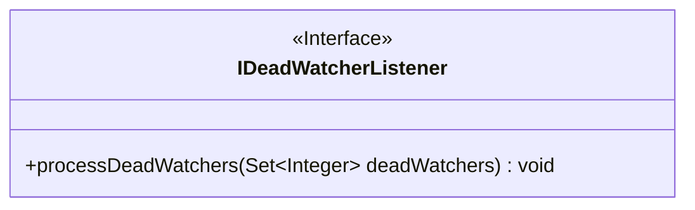
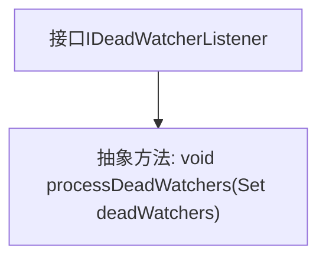

# 基础信息

|      |      |
|------|------|
| 名称 | IDeadWatcherListener |
| 编码语言 | .java |
| 代码路径 | zookeeper/zookeeper-server/src/main/java/org/apache/zookeeper/server/watch/IDeadWatcherListener.java |
| 包名 | org.apache.zookeeper.server.watch |
| 依赖项 | ['java.util.Set'] |
| 概述说明 | 接口IDeadWatcherListener定义方法processDeadWatchers，用于处理已关闭连接的监视器集合。参数为deadWatchers，类型为Set<Integer>。 |

# 说明

这是一个公开接口IDeadWatcherListener的定义，包含一个方法processDeadWatchers，用于处理已关闭连接的监视器。该方法接收一个Integer类型的Set集合deadWatchers作为参数，表示已关闭连接的监视器集合。接口通过Java文档注释说明了方法用途和参数含义。

# 类列表 Class Summary

| 名称   | 类型  | 说明 |
|-------|------|-------------|
| IDeadWatcherListener | interface | 接口IDeadWatcherListener定义方法processDeadWatchers，用于处理已关闭连接的监视器集合。参数deadWatchers为关闭连接的监视器ID集合。 |

## 类 IDeadWatcherListener

|      |      |
|------|------|
| 访问范围 | public |
| 类型 | interface |
| 名称 | IDeadWatcherListener |
| 说明 | 接口IDeadWatcherListener定义方法processDeadWatchers，用于处理已关闭连接的监视器集合。参数deadWatchers为关闭连接的监视器ID集合。 |

### UML类图

这段代码定义了一个名为`IDeadWatcherListener`的接口，该接口包含一个方法`processDeadWatchers`，用于处理已关闭连接的监视器集合。接口方法接收一个`Set<Integer>`类型的参数`deadWatchers`，表示需要处理的死亡监视器ID集合，返回类型为`void`。该接口主要用于实现死亡监视器的回调机制，允许外部类通过实现此接口来定义具体的处理逻辑。

### 内部方法调用关系图

这段流程图描述了一个名为IDeadWatcherListener的Java接口，该接口定义了一个抽象方法processDeadWatchers，用于处理已关闭连接的监视器集合。接口通过单一方法强制实现类必须提供处理死亡监视器的逻辑，箭头表示接口与方法之间的从属关系。该设计模式常用于事件监听场景，允许外部对象接收并处理监视器失效事件。

### 字段列表 Field List

| 名称  | 类型  | 说明 |
|-------|-------|------|

### 方法列表 Method List

| 名称  | 类型  | 说明 |
|-------|-------|------|
| processDeadWatchers | void | 处理死观察者集合，移除无效监控项。 |

