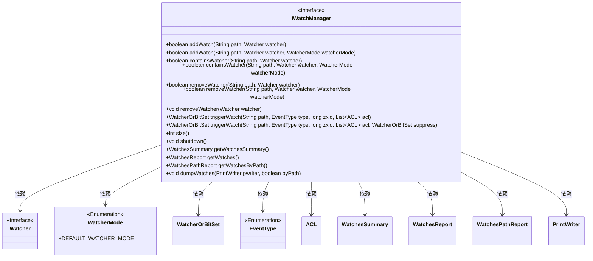

# 基础信息

|      |      |
|------|------|
| 名称 | IWatchManager |
| 编码语言 | .java |
| 代码路径 | zookeeper/zookeeper-server/src/main/java/org/apache/zookeeper/server/watch/IWatchManager.java |
| 包名 | org.apache.zookeeper.server.watch |
| 依赖项 | ['java.io.PrintWriter', 'java.util.List', 'javax.annotation.Nullable', 'org.apache.zookeeper.Watcher', 'org.apache.zookeeper.Watcher.Event.EventType', 'org.apache.zookeeper.data.ACL'] |
| 概述说明 | IWatchManager接口提供管理ZooKeeper节点监视器的功能，包括添加、检查、移除监视器，触发事件通知，获取监视器统计信息及清理资源。支持默认和自定义监视模式。 |

# 说明

IWatchManager接口定义了管理监视器的核心功能，包括添加、检查、移除监视器，触发监视事件，获取监视器统计信息等。主要方法包括：addWatch用于添加路径监视器，支持默认模式和自定义模式；containsWatcher检查监视器是否存在；removeWatcher移除指定监视器；triggerWatch分发监视事件；size获取监视器数量；shutdown清理资源；getWatchesSummary等获取监视统计报告；dumpWatches输出监视器详细信息。接口处理路径、监视器对象、事件类型等参数，并支持不同监视模式的操作。

# 类列表 Class Summary

| 名称   | 类型  | 说明 |
|-------|------|-------------|
| IWatchManager | interface | IWatchManager接口用于管理路径监视器，提供添加、检查、移除监视器功能，支持触发事件、获取监视器状态及清理资源。包含默认实现和扩展模式处理。 |

## 类 IWatchManager

|      |      |
|------|------|
| 访问范围 | public |
| 类型 | interface |
| 名称 | IWatchManager |
| 说明 | IWatchManager接口用于管理路径监视器，提供添加、检查、移除监视器功能，支持触发事件、获取监视器状态及清理资源。包含默认实现和扩展模式处理。 |

### UML类图

这段代码定义了一个IWatchManager接口，用于管理Watcher对象的注册、删除和触发。接口提供了多种方法来添加、检查和移除Watcher，支持不同的WatcherMode模式，并能触发事件通知。它还包含获取监控摘要、报告以及调试输出的功能。该接口与Watcher、WatcherMode、EventType等多个辅助类交互，构成了一个完整的监控管理系统。

### 内部方法调用关系图

```mermaid
graph TD
    A["接口IWatchManager"]
    B["方法: boolean addWatch(String path, Watcher watcher)"]
    C["默认方法: boolean addWatch(String path, Watcher watcher, WatcherMode watcherMode)"]
    D["方法: boolean containsWatcher(String path, Watcher watcher)"]
    E["默认方法: boolean containsWatcher(String path, Watcher watcher, WatcherMode watcherMode)"]
    F["方法: boolean removeWatcher(String path, Watcher watcher)"]
    G["默认方法: boolean removeWatcher(String path, Watcher watcher, WatcherMode watcherMode)"]
    H["方法: void removeWatcher(Watcher watcher)"]
    I["方法: WatcherOrBitSet triggerWatch(String path, EventType type, long zxid, List<ACL> acl)"]
    J["方法: WatcherOrBitSet triggerWatch(String path, EventType type, long zxid, List<ACL> acl, WatcherOrBitSet suppress)"]
    K["方法: int size()"]
    L["方法: void shutdown()"]
    M["方法: WatchesSummary getWatchesSummary()"]
    N["方法: WatchesReport getWatches()"]
    O["方法: WatchesPathReport getWatchesByPath()"]
    P["方法: void dumpWatches(PrintWriter pwriter, boolean byPath)"]

    A --> B
    A --> C
    A --> D
    A --> E
    A --> F
    A --> G
    A --> H
    A --> I
    A --> J
    A --> K
    A --> L
    A --> M
    A --> N
    A --> O
    A --> P
```

该流程图展示了IWatchManager接口的所有方法及其默认实现。接口核心功能包括添加/检查/移除监视器、触发监视事件、获取监视器状态报告等。默认方法处理特定WatcherMode的逻辑，非默认模式会抛出UnsupportedOperationException。流程清晰体现了接口对ZooKeeper监视器管理的完整能力，包括状态查询和事件分发机制。

### 字段列表 Field List

| 名称  | 类型  | 说明 |
|-------|-------|------|

### 方法列表 Method List

| 名称  | 类型  | 说明 |
|-------|-------|------|
| removeWatcher | boolean | 移除指定路径的监听器，返回操作是否成功。 |
| shutdown | void | 关闭系统或终止程序运行。 |
| triggerWatch | WatcherOrBitSet | 方法`triggerWatch`用于监视指定路径`path`的事件类型`type`，返回`WatcherOrBitSet`对象。参数包括事务ID`zxid`和访问控制列表`acl`。 |
| getWatchesByPath | WatchesPathReport | 获取路径下的监视项列表。 |
| size | int | 获取容器大小的方法。 |
| getWatchesSummary | WatchesSummary | 获取手表摘要信息，包含关键数据和重要细节，简洁明了。 |
| removeWatcher | void | 移除指定观察者。 |
| containsWatcher | boolean | 检查指定路径是否包含特定监视器。 |
| addWatch | boolean | 方法`addWatch`接受路径、观察者和观察模式参数。若观察模式为默认，则调用重载方法；否则抛出未支持操作异常。自定义实现需覆盖此行为。 |
| addWatch | boolean | 添加文件路径监视器，返回操作是否成功。 |
| getWatches | WatchesReport | 获取手表报告数据的方法，返回手表信息列表。 |
| removeWatcher | boolean | 方法removeWatcher移除指定路径的监听器。若watcherMode为空或默认，调用无模式参数的重载方法；否则抛出不支持持久监听的异常。 |
| containsWatcher | boolean | 检查路径是否包含监视器，若模式为空或默认则调用基础方法，否则抛出不支持持久监视的异常。 |
| triggerWatch | WatcherOrBitSet | 监视或位集触发监视器方法，用于监控路径事件，指定事件类型、事务ID、权限列表，并可抑制特定监视器。 |
| dumpWatches | void | 函数dumpWatches输出监视信息到PrintWriter，参数byPath决定是否按路径排序。 |

