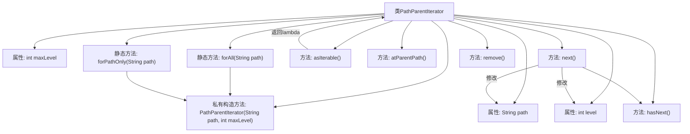

# 基础信息

|      |      |
|------|------|
| 名称 | PathParentIterator |
| 编码语言 | .java |
| 代码路径 | zookeeper/zookeeper-server/src/main/java/org/apache/zookeeper/server/watch/PathParentIterator.java |
| 包名 | org.apache.zookeeper.server.watch |
| 依赖项 | ['java.util.Iterator', 'java.util.NoSuchElementException'] |
| 概述说明 | PathParentIterator迭代路径及其父路径，支持全路径或单路径迭代，提供hasNext、next等方法，不可修改路径。 |

# 说明

PathParentIterator是一个迭代器类，用于遍历给定路径及其所有父路径。它提供两个静态工厂方法：forAll生成遍历所有父路径的迭代器，forPathOnly仅返回初始路径。迭代器通过hasNext和next方法实现路径遍历，next方法每次返回当前路径并更新为父路径。atParentPath方法可检查当前是否处于父路径。迭代器还支持通过asIterable转换为单次使用的Iterable。该类禁止remove操作，路径处理逻辑包含对根路径的特殊处理。

# 类列表 Class Summary

| 名称   | 类型  | 说明 |
|-------|------|-------------|
| PathParentIterator | class | PathParentIterator迭代器用于遍历路径及其父路径，支持设置最大层级，提供静态方法创建实例，可转换为Iterable用于循环。 |


## 类 PathParentIterator

|      |      |
|------|------|
| 访问范围 | public |
| 类型 | class |
| 名称 | PathParentIterator |
| 说明 | PathParentIterator迭代器用于遍历路径及其父路径，支持设置最大层级，提供静态方法创建实例，可转换为Iterable用于循环。 |


### UML类图

```mermaid
classDiagram
    class PathParentIterator {
        -String path
        -int maxLevel
        -int level
        +static PathParentIterator forAll(String path)
        +static PathParentIterator forPathOnly(String path)
        -PathParentIterator(String path, int maxLevel)
        +Iterable~String~ asIterable()
        +boolean hasNext()
        +boolean atParentPath()
        +String next()
        +void remove()
    }

    class "Iterator~String~" <<Interface>> {
        <<Interface>>
        +boolean hasNext()
        +String next()
        +void remove()
    }

    class "Iterable~String~" <<Interface>> {
        <<Interface>>
        +Iterator~String~ iterator()
    }

    PathParentIterator ..|> "Iterator~String~" : 实现
    PathParentIterator --> "Iterable~String~" : 通过asIterable()返回
```

该类图展示了PathParentIterator类的结构及其与Java标准接口的关系。PathParentIterator是一个路径父级迭代器，实现了Iterator<String>接口，用于迭代给定路径的所有父级路径。它包含三个私有字段(path、maxLevel、level)，两个静态工厂方法(forAll和forPathOnly)，以及核心迭代逻辑方法(hasNext、next等)。特别地，它还提供了asIterable()方法将自身转换为Iterable视图，使其可用于for-each循环。该类通过level字段跟踪当前迭代层级，并能判断是否处于父路径(atParentPath)。


### 内部方法调用关系图



该流程图展示了PathParentIterator类的完整结构，包含3个私有属性和6个关键方法。核心逻辑体现在next()方法中，它会根据当前路径状态（是否根路径）进行层级遍历，同时更新path和level属性。静态工厂方法forAll()和forPathOnly()通过构造方法初始化迭代器，hasNext()控制遍历边界，atParentPath()提供状态检查功能。整个设计实现了从给定路径到所有父路径的迭代能力，支持链式调用和for-each语法。

### 字段列表 Field List

| 名称  | 类型  | 说明 |
|-------|-------|------|
| level = -1 | int | 私有整型变量level，初始值为-1。 |
| path | String | 私有字符串变量path。 |
| maxLevel | int | 私有整型常量maxLevel，用于存储最大级别值。 |

### 方法列表 Method List

| 名称  | 类型  | 说明 |
|-------|-------|------|
| forPathOnly | PathParentIterator | 静态方法`forPathOnly`接收字符串路径参数，返回`PathParentIterator`实例，初始化时层级设为0。 |
| next | String | 重写next方法，检查路径有效性后更新路径并返回原路径。若路径为根目录则重置为空，否则截取上级目录。无下一元素时抛出异常。 |
| remove | void | 重写remove方法，抛出UnsupportedOperationException异常表示不支持该操作。 |
| asIterable | Iterable<String> | 该方法返回一个可迭代的字符串集合，迭代器为当前类的PathParentIterator实例。 |
| atParentPath | boolean | 检查层级是否大于0，返回布尔值。 |
| hasNext | boolean | 这是一个Java方法，检查迭代器是否有下一个元素。条件是路径不为空且当前层级小于最大层级。 |
| forAll | PathParentIterator | 静态方法forAll接收路径字符串，返回遍历所有父目录的迭代器。 |


