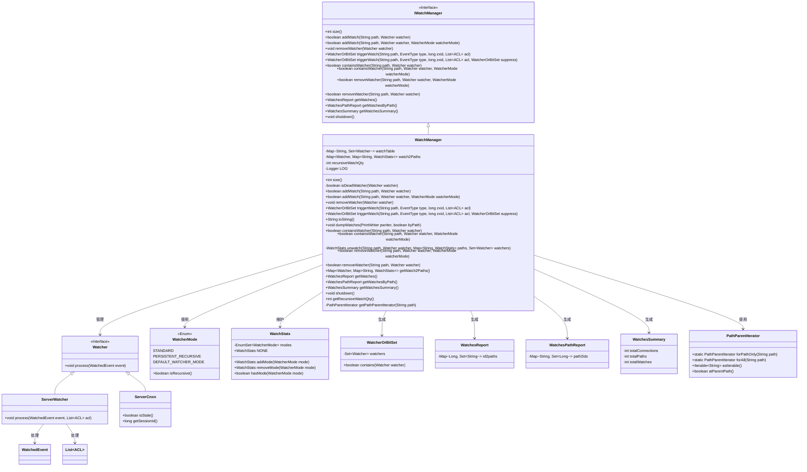

# 基础信息

|      |      |
|------|------|
| 名称 | WatchManager |
| 编码语言 | .java |
| 代码路径 | zookeeper/zookeeper-server/src/main/java/org/apache/zookeeper/server/watch/WatchManager.java |
| 包名 | org.apache.zookeeper.server.watch |
| 依赖项 | ['java.io.PrintWriter', 'java.util.Collections', 'java.util.HashMap', 'java.util.HashSet', 'java.util.Iterator', 'java.util.List', 'java.util.Map', 'java.util.Map.Entry', 'java.util.Set', 'org.apache.zookeeper.WatchedEvent', 'org.apache.zookeeper.Watcher', 'org.apache.zookeeper.Watcher.Event.EventType', 'org.apache.zookeeper.Watcher.Event.KeeperState', 'org.apache.zookeeper.data.ACL', 'org.apache.zookeeper.server.ServerCnxn', 'org.apache.zookeeper.server.ServerMetrics', 'org.apache.zookeeper.server.ServerWatcher', 'org.apache.zookeeper.server.ZooTrace', 'org.slf4j.Logger', 'org.slf4j.LoggerFactory'] |
| 概述说明 | WatchManager类管理监视器，提供添加、移除、触发监视器功能，支持递归和持久模式，维护路径与监视器映射关系，统计监视器数量。 |

# 说明

WatchManager是一个管理监视器的类，实现了IWatchManager接口。它使用两个主要映射结构：watchTable记录路径到监视器集合的映射，watch2Paths记录监视器到路径及统计信息的映射。提供添加、移除、触发监视器的功能，支持多种监视模式（如递归模式）。通过同步方法确保线程安全，包含统计监视器数量、生成报告等方法，同时处理无效监视器的清理。触发监视器时会根据事件类型更新指标，并支持按路径或会话ID导出监视信息。

# 类列表 Class Summary

| 名称   | 类型  | 说明 |
|-------|------|-------------|
| WatchManager | class | WatchManager类管理监视器路径和事件，包含添加、移除、触发监视器功能，支持递归和持久化模式，使用同步方法确保线程安全。 |

## 类 WatchManager

|      |      |
|------|------|
| 访问范围 | public |
| 类型 | class |
| 名称 | WatchManager |
| 说明 | WatchManager类管理监视器路径和事件，包含添加、移除、触发监视器功能，支持递归和持久化模式，使用同步方法确保线程安全。 |

### UML类图

这段代码实现了一个WatchManager类，用于管理Watcher的注册、触发和移除。WatchManager维护了两个核心数据结构：watchTable记录路径到Watcher集合的映射，watch2Paths记录Watcher到路径统计信息的映射。它支持多种Watcher模式（标准/递归），提供触发事件、统计报表等功能，并通过同步机制保证线程安全。该实现通过接口IWatchManager定义契约，与ServerCnxn、WatcherMode等组件协作，构成ZooKeeper的Watcher管理核心模块。

### 内部方法调用关系图

```mermaid
graph TD
    A["类WatchManager"]
    B["属性: Map<String, Set<Watcher>> watchTable"]
    C["属性: Map<Watcher, Map<String, WatchStats>> watch2Paths"]
    D["属性: int recursiveWatchQty"]
    E["方法: int size()"]
    F["方法: boolean isDeadWatcher(Watcher)"]
    G["方法: boolean addWatch(String, Watcher)"]
    H["方法: boolean addWatch(String, Watcher, WatcherMode)"]
    I["方法: void removeWatcher(Watcher)"]
    J["方法: WatcherOrBitSet triggerWatch(String, EventType, long, List<ACL>)"]
    K["方法: WatcherOrBitSet triggerWatch(String, EventType, long, List<ACL>, WatcherOrBitSet)"]
    L["方法: String toString()"]
    M["方法: void dumpWatches(PrintWriter, boolean)"]
    N["方法: boolean containsWatcher(String, Watcher)"]
    O["方法: boolean containsWatcher(String, Watcher, WatcherMode)"]
    P["方法: WatchStats unwatch(String, Watcher, Map<String,WatchStats>, Set<Watcher>)"]
    Q["方法: boolean removeWatcher(String, Watcher, WatcherMode)"]
    R["方法: boolean removeWatcher(String, Watcher)"]
    S["方法: Map<Watcher, Map<String,WatchStats>> getWatch2Paths()"]
    T["方法: WatchesReport getWatches()"]
    U["方法: WatchesPathReport getWatchesByPath()"]
    V["方法: WatchesSummary getWatchesSummary()"]
    W["方法: void shutdown()"]
    X["方法: int getRecursiveWatchQty()"]
    Y["方法: PathParentIterator getPathParentIterator(String)"]

    A --> B
    A --> C
    A --> D
    A --> E
    A --> F
    A --> G
    A --> H
    A --> I
    A --> J
    A --> K
    A --> L
    A --> M
    A --> N
    A --> O
    A --> P
    A --> Q
    A --> R
    A --> S
    A --> T
    A --> U
    A --> V
    A --> W
    A --> X
    A --> Y
```

这段代码实现了一个WatchManager类，用于管理Watcher的注册、删除和触发。核心功能包括通过两个HashMap(watchTable和watch2Paths)维护路径与观察者的双向映射关系，支持递归监听模式，提供线程安全的增删查改操作，并能生成多种格式的监控报告。关键方法如addWatch()实现观察者注册，triggerWatch()处理事件触发，removeWatcher()执行清理操作，同时包含多种辅助方法用于状态查询和调试输出。

### 字段列表 Field List

| 名称  | 类型  | 说明 |
|-------|-------|------|
| watch2Paths = new HashMap<>() | Map<Watcher, Map<String, WatchStats>> | 私有哈希表watch2Paths存储观察者到路径和统计信息的映射。 |
| recursiveWatchQty = 0 | int | 私有整型变量recursiveWatchQty初始化为0。 |
| watchTable = new HashMap<>() | Map<String, Set<Watcher>> | 私有哈希表watchTable，键为字符串，值为Watcher集合。 |
| LOG = LoggerFactory.getLogger(WatchManager.class) | Logger | 声明一个静态不可变日志对象LOG，用于WatchManager类的日志记录。 |

### 方法列表 Method List

| 名称  | 类型  | 说明 |
|-------|-------|------|
| toString | String | 重写toString方法，统计并输出监视路径数量和总监视数。 |
| containsWatcher | boolean | 该方法检查指定路径是否包含特定监视器和模式。若路径或监视器不存在则返回false，存在且模式匹配则返回true。 |
| removeWatcher | boolean | 同步方法重写，移除指定路径的观察者，调用同名方法并传入空参数。 |
| addWatch | boolean | 方法`addWatch`用于添加路径监视器：检查无效监视器后，将监视器存入路径对应的集合，并更新统计信息。若模式为递归则增加计数，成功返回true，否则false。 |
| size | int | 同步方法`size()`计算并返回`watchTable`中所有`Watcher`集合的总大小。 |
| shutdown | void | 重写shutdown方法，空实现无操作。 |
| addWatch | boolean | 重载addWatch方法，调用默认模式添加监视器。 |
| triggerWatch | WatcherOrBitSet | 重写方法triggerWatch，调用同名方法并添加null参数。 |
| removeWatcher | boolean | 该方法用于移除指定路径的观察者。检查路径和观察者有效性，根据模式更新状态。若移除递归观察者则减少计数。返回状态是否变化。 |
| getWatches | WatchesReport | 同步方法getWatches返回WatchesReport，将watch2Paths中的会话ID和路径映射存入id2paths并生成报告。 |
| getWatch2Paths | Map<Watcher, Map<String, WatchStats>> | 方法getWatch2Paths返回一个映射，键为Watcher对象，值为另一个映射（键为字符串，值为WatchStats对象）。 |
| removeWatcher | void | 同步方法移除观察者：从映射中删除观察者及其路径，若路径无观察者则移除路径，递归观察者数量相应减少。 |
| containsWatcher | boolean | 这是一个Java方法重写，同步检查指定路径是否包含特定Watcher，调用另一个重载方法完成实际逻辑。 |
| triggerWatch | WatcherOrBitSet | 该方法处理ZooKeeper路径事件，遍历路径及其父路径，收集并触发符合条件的监视器，更新状态和统计信息，最后返回触发结果。 |
| isDeadWatcher | boolean | 检查Watcher是否为无效的ServerCnxn连接。 |
| unwatch | WatchStats | 该方法用于移除指定路径的监视器和相关统计信息。若路径不存在则返回空统计；移除后若路径或监视器集合为空，则清理对应映射表。返回被移除的统计信息。 |
| dumpWatches | void | 同步方法dumpWatches按路径或会话ID输出监视器信息，分别遍历watchTable和watch2Paths，打印路径和会话ID。 |
| getWatchesByPath | WatchesPathReport | 同步方法`getWatchesByPath`遍历`watchTable`，收集路径对应的会话ID集合，返回`WatchesPathReport`对象。 |
| getWatchesSummary | WatchesSummary | 同步方法getWatchesSummary统计watch2Paths和watchTable数据，返回包含路径数、表大小和总监视数的WatchesSummary对象。 |
| getRecursiveWatchQty | int | 同步方法返回递归监视数量。 |
| getPathParentIterator | PathParentIterator | 私有方法getPathParentIterator根据递归监视数量返回路径父迭代器：数量为0时仅迭代当前路径，否则迭代所有父路径。 |

