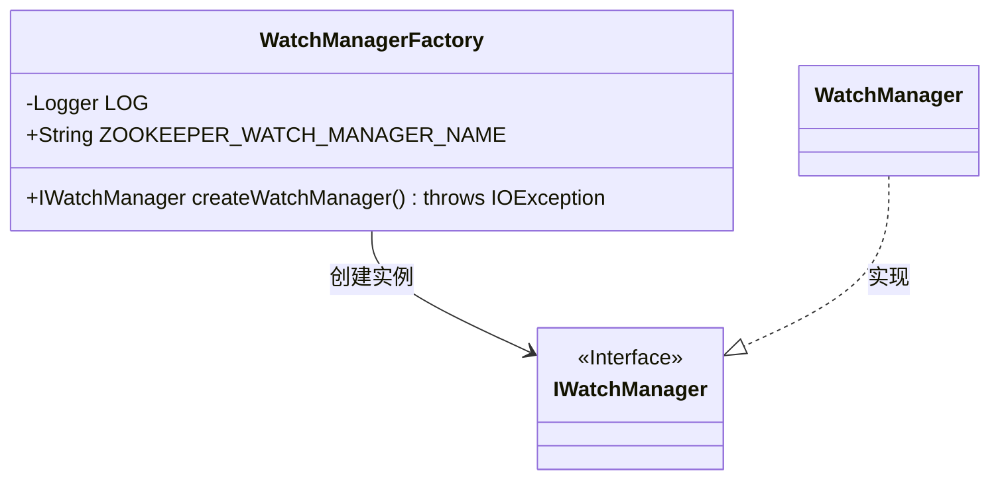
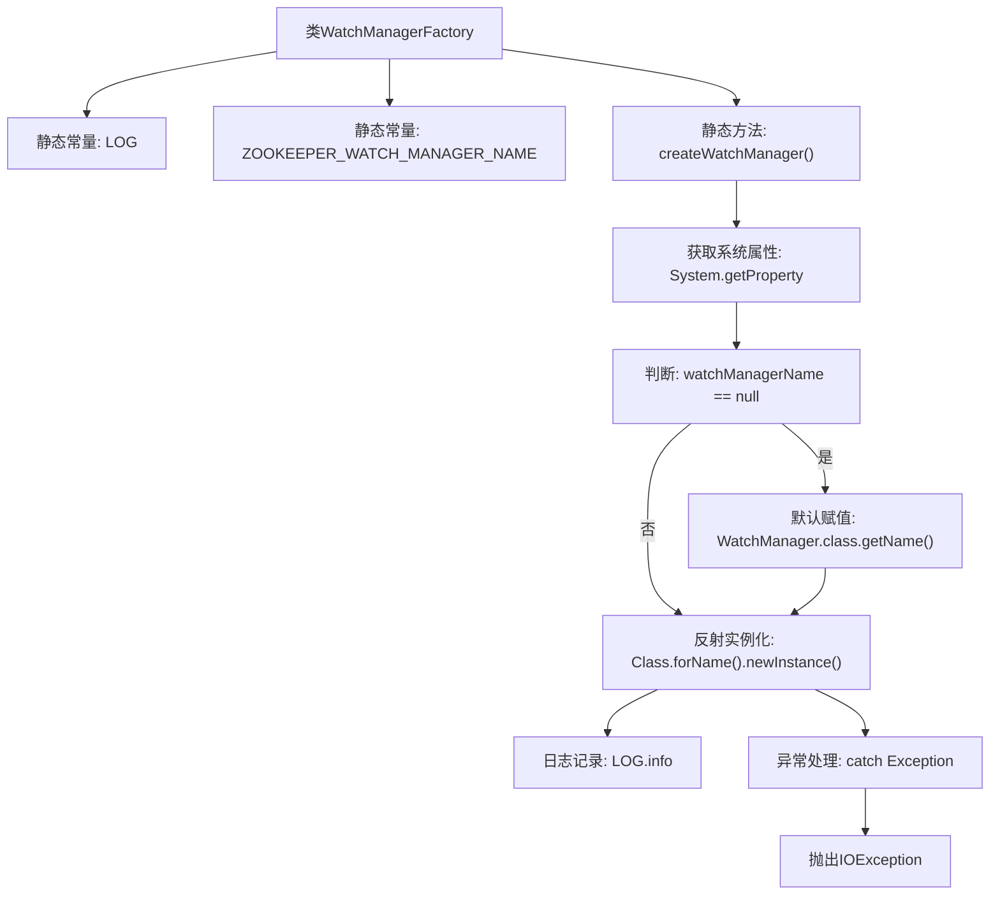

# 基础信息

|      |      |
|------|------|
| 名称 | WatchManagerFactory |
| 编码语言 | .java |
| 代码路径 | zookeeper/zookeeper-server/src/main/java/org/apache/zookeeper/server/watch/WatchManagerFactory.java |
| 包名 | org.apache.zookeeper.server.watch |
| 依赖项 | ['java.io.IOException', 'org.slf4j.Logger', 'org.slf4j.LoggerFactory'] |
| 概述说明 | WatchManagerFactory类提供静态方法createWatchManager，通过系统属性或默认类名创建IWatchManager实例，失败时抛出IOException。 |

# 说明

WatchManagerFactory是一个工厂类，用于创建IWatchManager实例。它包含一个静态常量ZOOKEEPER_WATCH_MANAGER_NAME，用于指定系统属性键。createWatchManager方法首先检查系统属性是否设置了自定义管理器类名，若未设置则默认使用WatchManager类。通过反射实例化指定类，成功则返回实例并记录日志，失败则抛出包含原始异常的IOException。整个过程实现了灵活的可配置性和异常处理。

# 类列表 Class Summary

| 名称   | 类型  | 说明 |
|-------|------|-------------|
| WatchManagerFactory | class | WatchManagerFactory类提供静态方法createWatchManager，通过系统属性或默认类名创建IWatchManager实例，失败时抛出IOException。 |

## 类 WatchManagerFactory

|      |      |
|------|------|
| 访问范围 | public |
| 类型 | class |
| 名称 | WatchManagerFactory |
| 说明 | WatchManagerFactory类提供静态方法createWatchManager，通过系统属性或默认类名创建IWatchManager实例，失败时抛出IOException。 |

### UML类图

这段代码展示了一个工厂模式实现，WatchManagerFactory类负责动态创建IWatchManager接口的实现类实例。通过系统属性ZOOKEEPER_WATCH_MANAGER_NAME指定实现类名，默认使用WatchManager类。工厂方法包含完整的异常处理逻辑，当实例化失败时会抛出包含原始异常的IOException。类图清晰地表现了工厂类、接口和默认实现类之间的关系，体现了依赖注入和接口编程的设计思想。

### 内部方法调用关系图

这段代码流程图展示了WatchManagerFactory类的核心逻辑。该工厂类通过系统属性动态加载指定的IWatchManager实现，若未配置则使用默认的WatchManager。主要流程包括：获取系统属性、判断空值、反射实例化组件，并包含完整的异常处理链。图中清晰呈现了条件分支和异常捕获路径，体现了工厂模式与反射机制的典型应用场景。

### 字段列表 Field List

| 名称  | 类型  | 说明 |
|-------|-------|------|
| ZOOKEEPER_WATCH_MANAGER_NAME = "zookeeper.watchManagerName" | String | ZOOKEEPER_WATCH_MANAGER_NAME是ZooKeeper的静态常量字符串，用于指定watch管理器的名称。 |
| LOG = LoggerFactory.getLogger(WatchManagerFactory.class) | Logger | 定义静态常量LOG，用于WatchManagerFactory类的日志记录。 |

### 方法列表 Method List

| 名称  | 类型  | 说明 |
|-------|-------|------|
| createWatchManager | IWatchManager | 创建WatchManager实例，默认使用WatchManager类，若系统属性指定则按指定类名实例化，失败时抛出IO异常。 |

