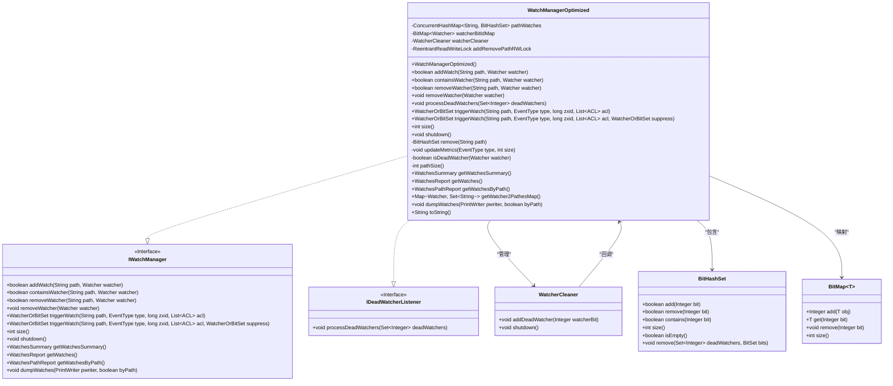

# 基础信息

|      |      |
|------|------|
| 名称 | WatchManagerOptimized |
| 编码语言 | .java |
| 代码路径 | zookeeper/zookeeper-server/src/main/java/org/apache/zookeeper/server/watch/WatchManagerOptimized.java |
| 包名 | org.apache.zookeeper.server.watch |
| 依赖项 | ['java.io.PrintWriter', 'java.util.BitSet', 'java.util.HashMap', 'java.util.HashSet', 'java.util.List', 'java.util.Map', 'java.util.Map.Entry', 'java.util.Set', 'java.util.concurrent.ConcurrentHashMap', 'java.util.concurrent.locks.ReentrantReadWriteLock', 'org.apache.zookeeper.WatchedEvent', 'org.apache.zookeeper.Watcher', 'org.apache.zookeeper.Watcher.Event.EventType', 'org.apache.zookeeper.Watcher.Event.KeeperState', 'org.apache.zookeeper.data.ACL', 'org.apache.zookeeper.server.ServerCnxn', 'org.apache.zookeeper.server.ServerMetrics', 'org.apache.zookeeper.server.ServerWatcher', 'org.apache.zookeeper.server.util.BitHashSet', 'org.apache.zookeeper.server.util.BitMap', 'org.slf4j.Logger', 'org.slf4j.LoggerFactory'] |
| 概述说明 | WatchManagerOptimized类实现高效监视器管理，使用并发哈希表存储路径监视器，位图映射监视器ID，读写锁控制并发，支持添加、移除、触发监视器及清理失效监视器，提供统计和报告功能。 |

# 说明

WatchManagerOptimized类实现了IWatchManager和IDeadWatcherListener接口，用于高效管理路径监视器。它使用ConcurrentHashMap存储路径与BitHashSet的映射，通过BitMap管理监视器ID，并采用读写锁确保线程安全。核心功能包括添加/移除监视器、触发监视事件、清理死亡监视器，以及生成监视报告。通过WatcherCleaner异步清理死亡监视器，减少锁竞争。提供多种统计和报告方法，支持按路径或会话ID查询监视状态，同时包含性能指标记录功能。

# 类列表 Class Summary

| 名称   | 类型  | 说明 |
|-------|------|-------------|
| WatchManagerOptimized | class | WatchManagerOptimized类实现了IWatchManager和IDeadWatcherListener接口，用于管理路径监视器。它使用ConcurrentHashMap存储路径与监视器的映射，通过BitMap和BitHashSet高效管理监视器。提供添加、移除、触发监视器功能，支持并发操作，并通过WatcherCleaner清理无效监视器。包含统计和报告功能。 |

## 类 WatchManagerOptimized

|      |      |
|------|------|
| 访问范围 | public |
| 类型 | class |
| 名称 | WatchManagerOptimized |
| 说明 | WatchManagerOptimized类实现了IWatchManager和IDeadWatcherListener接口，用于管理路径监视器。它使用ConcurrentHashMap存储路径与监视器的映射，通过BitMap和BitHashSet高效管理监视器。提供添加、移除、触发监视器功能，支持并发操作，并通过WatcherCleaner清理无效监视器。包含统计和报告功能。 |

### UML类图

这段类图展示了WatchManagerOptimized的核心结构和关系。该类实现了IWatchManager和IDeadWatcherListener接口，主要负责管理Watcher的注册、触发和清理。通过ConcurrentHashMap和BitHashSet高效存储路径与观察者的映射关系，利用BitMap实现Watcher到比特ID的转换，并通过WatcherCleaner异步清理失效Watcher。读写锁(addRemovePathRWLock)确保线程安全，同时优化了性能关键路径。整体设计体现了高并发场景下的精细锁控制和资源管理策略。

### 内部方法调用关系图

```mermaid
graph TD
    A["类WatchManagerOptimized"]
    B["属性: ConcurrentHashMap<String, BitHashSet> pathWatches"]
    C["属性: BitMap<Watcher> watcherBitIdMap"]
    D["属性: WatcherCleaner watcherCleaner"]
    E["属性: ReentrantReadWriteLock addRemovePathRWLock"]
    F["构造方法: WatchManagerOptimized()"]
    G["方法: boolean addWatch(String path, Watcher watcher)"]
    H["方法: boolean containsWatcher(String path, Watcher watcher)"]
    I["方法: boolean removeWatcher(String path, Watcher watcher)"]
    J["方法: void removeWatcher(Watcher watcher)"]
    K["方法: void processDeadWatchers(Set<Integer> deadWatchers)"]
    L["方法: WatcherOrBitSet triggerWatch(String path, EventType type, long zxid, List<ACL> acl)"]
    M["方法: WatcherOrBitSet triggerWatch(String path, EventType type, long zxid, List<ACL> acl, WatcherOrBitSet suppress)"]
    N["方法: int size()"]
    O["方法: void shutdown()"]
    P["方法: BitHashSet remove(String path)"]
    Q["方法: void updateMetrics(EventType type, int size)"]
    R["方法: boolean isDeadWatcher(Watcher watcher)"]
    S["方法: int pathSize()"]
    T["方法: WatchesSummary getWatchesSummary()"]
    U["方法: WatchesReport getWatches()"]
    V["方法: WatchesPathReport getWatchesByPath()"]
    W["方法: Map<Watcher, Set<String>> getWatcher2PathesMap()"]
    X["方法: void dumpWatches(PrintWriter pwriter, boolean byPath)"]
    Y["方法: String toString()"]

    A --> B
    A --> C
    A --> D
    A --> E
    A --> F
    A --> G
    A --> H
    A --> I
    A --> J
    A --> K
    A --> L
    A --> M
    A --> N
    A --> O
    A --> P
    A --> Q
    A --> R
    A --> S
    A --> T
    A --> U
    A --> V
    A --> W
    A --> X
    A --> Y

    G -->|"加读锁"| E
    G -->|"检查watcher状态"| R
    G -->|"更新pathWatches"| B
    G -->|"更新watcherBitIdMap"| C
    I -->|"加写锁"| E
    I -->|"更新pathWatches"| B
    J -->|"加写锁"| E
    J -->|"调用watcherCleaner"| D
    K -->|"清理pathWatches"| B
    K -->|"清理watcherBitIdMap"| C
    L -->|"调用remove方法"| P
    L -->|"触发watcher事件"| C
    L -->|"更新metrics"| Q
    M -->|"调用remove方法"| P
    M -->|"触发watcher事件"| C
    M -->|"更新metrics"| Q
    P -->|"加写锁"| E
    P -->|"操作pathWatches"| B
    F -->|"初始化watcherCleaner"| D
```

这段代码实现了一个高性能的Watcher管理器，采用位图优化存储结构，通过读写锁控制并发访问。核心功能包括添加/移除Watcher、触发事件通知、清理死亡Watcher、生成监控报告等。流程图展示了类结构、主要属性及方法调用关系，重点突出了并发控制机制和Watcher生命周期管理流程。该设计通过位图压缩存储、读写锁分离和延迟清理等优化手段，显著提升了大规模Watcher场景下的性能表现。

### 字段列表 Field List

| 名称  | 类型  | 说明 |
|-------|-------|------|
| addRemovePathRWLock = new ReentrantReadWriteLock() | ReentrantReadWriteLock | 私有读写锁实例，用于控制路径增删操作的并发访问。 |
| LOG = LoggerFactory.getLogger(WatchManagerOptimized.class) | Logger | 定义WatchManagerOptimized类的私有静态日志对象LOG，使用LoggerFactory获取日志实例。 |
| watcherBitIdMap = new BitMap<>() | BitMap<Watcher> | 私有成员变量watcherBitIdMap，使用BitMap存储Watcher对象。 |
| pathWatches = new ConcurrentHashMap<>() | ConcurrentHashMap<String, BitHashSet> | 私有并发哈希映射，键为字符串，值为BitHashSet，用于路径监控。 |
| watcherCleaner | WatcherCleaner | 私有不可变的WatcherCleaner实例。 |

### 方法列表 Method List

| 名称  | 类型  | 说明 |
|-------|-------|------|
| pathSize | int | 这是一个方法，返回路径监视列表的大小。 |
| toString | String | 重写toString方法，输出监控连接数、路径数和总监控数。 |
| triggerWatch | WatcherOrBitSet | 该方法用于触发路径监视事件，处理事件类型、状态和ACL，同步遍历监视器集合，跳过无效或需抑制的监视器，执行处理逻辑并更新统计，最后返回触发的监视器集合。 |
| removeWatcher | void | 方法移除监视器时先加写锁检查有效性，确认后解锁再异步清理，避免锁阻塞。 |
| processDeadWatchers | void | 处理死监视器：将死监视器ID存入BitSet，遍历pathWatches移除对应监视器，最后清理watcherBitIdMap。避免锁争用，不主动清空pathWatches。 |
| removeWatcher | boolean | 方法`removeWatcher`直接获取写锁移除指定路径的监听器，若监听器不存在或移除失败返回false，成功则返回true，并在无监听器时清理路径。 |
| shutdown | void | 重写shutdown方法，关闭watcherCleaner非空实例。 |
| updateMetrics | void | 方法updateMetrics根据事件类型更新对应监控指标：节点创建、删除、数据变更、子节点变更时分别累加size值，其他类型不处理。 |
| triggerWatch | WatcherOrBitSet | 重载方法触发监视器，调用同名方法并传入空参数。 |
| addWatch | boolean | 方法`addWatch`用于添加路径监视器，使用读锁避免竞争，检查监视器有效性后更新位图集合，返回操作结果。 |
| remove | BitHashSet | 使用写锁移除路径监视，确保线程安全。 |
| size | int | 重写size方法，遍历pathWatches中的BitHashSet并累加元素数量，返回总和。 |
| containsWatcher | boolean | 检查指定路径是否包含特定监视器，返回布尔值。 |
| getWatchesSummary | WatchesSummary | 重写getWatchesSummary方法，返回包含监控数量、路径数和总大小的WatchesSummary对象。 |
| getWatcher2PathesMap | Map<Watcher, Set<String>> | 方法getWatcher2PathesMap返回Watcher到路径集合的映射。遍历pathWatches，同步处理每个路径的watchers，将watcher和对应路径存入map。避免竞态条件。 |
| isDeadWatcher | boolean | 检查监视器是否失效：若为ServerCnxn类型且状态失效则返回真。 |
| getWatches | WatchesReport | 该方法获取监视器报告，将监视器映射的会话ID和路径集存入Map，返回包含该Map的报告对象。 |
| getWatchesByPath | WatchesPathReport | 重写方法getWatchesByPath，遍历pathWatches生成路径到会话ID集合的映射，返回WatchesPathReport对象。 |
| dumpWatches | void | 该方法用于输出监视器信息，支持按路径或会话ID分类。按路径时遍历路径和对应监视器，输出会话ID；按会话ID时遍历监视器和对应路径，输出路径信息。 |

