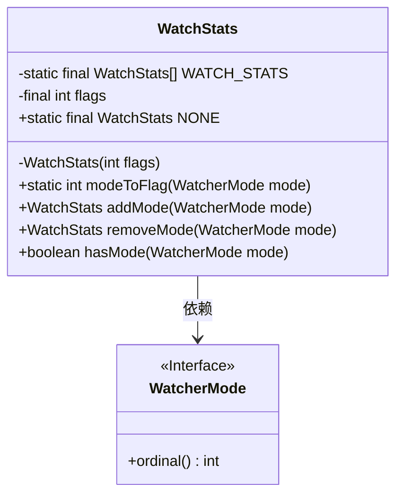
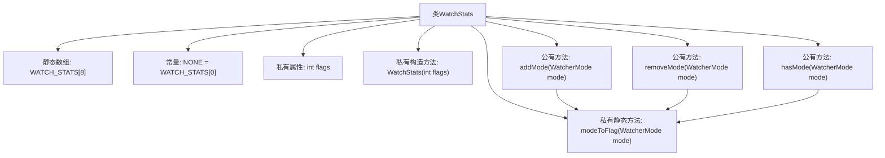

# 基础信息

|      |      |
|------|------|
| 名称 | WatchStats |
| 编码语言 | .java |
| 代码路径 | zookeeper/zookeeper-server/src/main/java/org/apache/zookeeper/server/watch/WatchStats.java |
| 包名 | org.apache.zookeeper.server.watch |
| 依赖项 | [] |
| 概述说明 | WatchStats类管理节点监听模式，通过标志位存储组合状态，提供添加、移除和检查监听模式的方法。 |

# 说明

这是一个用于管理节点监听状态的WatchStats类。它使用标志位来记录不同监听模式（STANDARD、PERSISTENT等）的组合状态。类中预定义了8种可能的组合状态，通过静态数组WATCH_STATS存储。提供了三个核心方法：addMode用于添加监听模式并返回新状态；removeMode用于移除监听模式并返回新状态或NONE；hasMode用于检查是否包含特定监听模式。通过位运算高效管理多种监听模式的组合状态。

# 类列表 Class Summary

| 名称   | 类型  | 说明 |
|-------|------|-------------|
| WatchStats | class | WatchStats类管理观察者模式状态，通过flags位运算实现添加、移除和检查模式功能，包含8种预定义状态。 |

## 类 WatchStats

|      |      |
|------|------|
| 访问范围 | public final |
| 类型 | class |
| 名称 | WatchStats |
| 说明 | WatchStats类管理观察者模式状态，通过flags位运算实现添加、移除和检查模式功能，包含8种预定义状态。 |

### UML类图

这段代码描述了一个用于管理观察者模式状态的`WatchStats`类，它通过位标志(`flags`)来跟踪不同的观察模式(`WatcherMode`)。类中包含静态工厂数组`WATCH_STATS`预定义所有可能的组合状态，提供`addMode`/`removeMode`方法动态计算新状态，并通过`hasMode`检查特定模式是否激活。`WatcherMode`作为接口提供枚举序数用于位运算，两者构成典型的标志位管理模式。

### 内部方法调用关系图

这段代码流程图展示了WatchStats类的完整结构。该类使用位标志(flags)来管理不同的WatcherMode状态，通过静态数组WATCH_STATS预定义了8种可能的组合状态。核心功能包括：添加模式(addMode)、移除模式(removeMode)和检查模式(hasMode)，这些操作都依赖于私有方法modeToFlag进行位运算转换。NONE常量作为初始状态，整个设计采用了享元模式，通过预先生成的对象数组来优化性能。

### 字段列表 Field List

| 名称  | 类型  | 说明 |
|-------|-------|------|
| NONE = WATCH_STATS[0] | WatchStats | 静态常量NONE引用WATCH_STATS数组的首元素。 |
| WATCH_STATS = new WatchStats[] {            new WatchStats(0), // NONE            new WatchStats(1), // STANDARD            new WatchStats(2), // PERSISTENT            new WatchStats(3), // STANDARD + PERSISTENT            new WatchStats(4), // PERSISTENT_RECURSIVE            new WatchStats(5), // STANDARD + PERSISTENT_RECURSIVE            new WatchStats(6), // PERSISTENT + PERSISTENT_RECURSIVE            new WatchStats(7), // STANDARD + PERSISTENT + PERSISTENT_RECURSIVE    } | WatchStats[] | 定义WatchStats数组，包含8种监控类型，分别对应不同组合：无、标准、持久、标准+持久、持久递归、标准+持久递归、持久+持久递归、标准+持久+持久递归。 |
| flags | int | 私有整型变量flags，用于存储标志位信息。 |

### 方法列表 Method List

| 名称  | 类型  | 说明 |
|-------|-------|------|
| addMode | WatchStats | 该方法`addMode`接收`WatcherMode`参数，通过位运算合并模式标志，返回对应`WATCH_STATS`数组中的统计结果。 |
| modeToFlag | int | 将枚举模式转换为对应的位标志值，通过左移操作实现。 |
| removeMode | WatchStats | 该方法移除指定监听模式并返回更新后的监听统计状态。若移除后无监听模式则返回NONE，否则返回对应状态。 |
| hasMode | boolean | 检查当前标志是否包含指定模式。若包含返回true，否则false。 |

