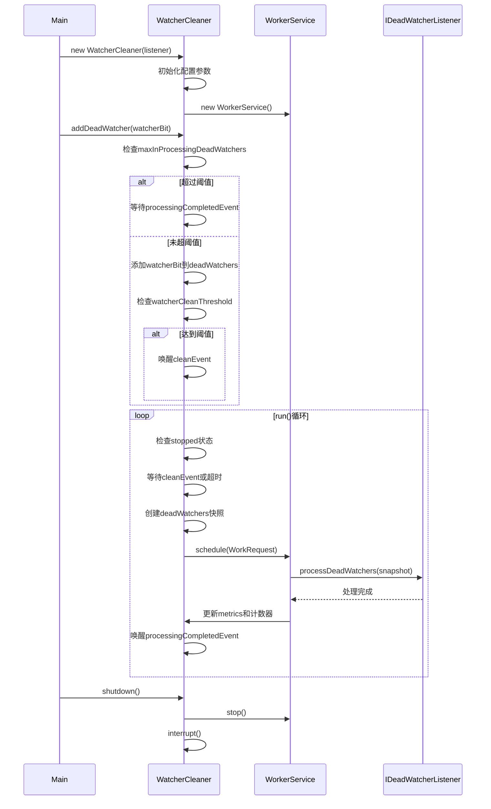

# 基础信息

|      |      |
|------|------|
| 名称 | WatcherCleaner |
| 编码语言 | .java |
| 代码路径 | zookeeper/zookeeper-server/src/main/java/org/apache/zookeeper/server/watch/WatcherCleaner.java |
| 包名 | org.apache.zookeeper.server.watch |
| 依赖项 | ['java.util.HashSet', 'java.util.Set', 'java.util.concurrent.ThreadLocalRandom', 'java.util.concurrent.atomic.AtomicInteger', 'org.apache.zookeeper.common.Time', 'org.apache.zookeeper.server.RateLogger', 'org.apache.zookeeper.server.ServerMetrics', 'org.apache.zookeeper.server.WorkerService', 'org.apache.zookeeper.server.WorkerService.WorkRequest', 'org.slf4j.Logger', 'org.slf4j.LoggerFactory'] |
| 概述说明 | WatcherCleaner线程类，用于清理ZooKeeper中的死观察者。包含阈值控制、批量处理、多线程清理及性能监控功能。通过监听器处理死观察者，支持动态配置和优雅关闭。 |

# 说明

WatcherCleaner是一个用于清理死监视器的线程类，通过阈值和间隔时间控制清理频率。主要功能包括：添加死监视器到队列，当队列达到阈值或间隔时间到期时触发批量清理。清理过程在独立线程中完成，避免阻塞主流程。支持配置清理阈值、间隔时间、线程数和最大处理中死监视器数量。通过同步机制确保线程安全，并提供关闭功能。监控指标记录清理延迟和队列状态。

# 类列表 Class Summary

| 名称   | 类型  | 说明 |
|-------|------|-------------|
| WatcherCleaner | class | WatcherCleaner线程类，用于清理ZooKeeper死监听器。包含阈值控制、批量处理、并发限制及性能监控功能。通过工作线程池异步处理，支持动态配置参数和优雅关闭。 |


## 类 WatcherCleaner

|      |      |
|------|------|
| 访问范围 | public |
| 类型 | class |
| 名称 | WatcherCleaner |
| 说明 | WatcherCleaner线程类，用于清理ZooKeeper死监听器。包含阈值控制、批量处理、并发限制及性能监控功能。通过工作线程池异步处理，支持动态配置参数和优雅关闭。 |


### UML类图

```mermaid
classDiagram
    class WatcherCleaner {
        -Logger LOG
        -RateLogger RATE_LOGGER
        -volatile boolean stopped
        -Object cleanEvent
        -Object processingCompletedEvent
        -WorkerService cleaners
        -Set~Integer~ deadWatchers
        -IDeadWatcherListener listener
        -int watcherCleanThreshold
        -int watcherCleanIntervalInSeconds
        -int maxInProcessingDeadWatchers
        -AtomicInteger totalDeadWatchers
        +WatcherCleaner(IDeadWatcherListener listener)
        +WatcherCleaner(IDeadWatcherListener listener, int watcherCleanThreshold, int watcherCleanIntervalInSeconds, int watcherCleanThreadsNum, int maxInProcessingDeadWatchers)
        +addDeadWatcher(int watcherBit)
        +run()
        +shutdown()
    }

    <<Interface>> IDeadWatcherListener {
        +processDeadWatchers(Set~Integer~ snapshot)
    }

    class WorkerService {
        +WorkerService(String name, int numThreads, boolean daemon)
        +schedule(WorkRequest request)
        +stop()
    }

    <<Interface>> WorkRequest {
        +doWork()
    }

    WatcherCleaner --> IDeadWatcherListener : 依赖
    WatcherCleaner --> WorkerService : 包含
    WorkerService --> WorkRequest : 处理
```

这段代码展示了一个用于清理死亡观察者(Watcher)的多线程系统。WatcherCleaner类继承自Thread，包含核心清理逻辑，通过WorkerService管理清理线程池，并与IDeadWatcherListener接口协作处理具体的清理操作。系统通过阈值触发机制(watcherCleanThreshold)和定期检查(watcherCleanIntervalInSeconds)来优化清理效率，同时使用原子计数器和同步机制确保线程安全。类图中清晰地呈现了各组件间的依赖关系和职责划分。


### 内部方法调用关系图

```mermaid
graph TD
    A["类WatcherCleaner extends Thread"]
    B["属性: Logger LOG"]
    C["属性: RateLogger RATE_LOGGER"]
    D["属性: volatile boolean stopped"]
    E["属性: Object cleanEvent"]
    F["属性: Object processingCompletedEvent"]
    G["属性: WorkerService cleaners"]
    H["属性: Set<Integer> deadWatchers"]
    I["属性: IDeadWatcherListener listener"]
    J["属性: int watcherCleanThreshold"]
    K["属性: int watcherCleanIntervalInSeconds"]
    L["属性: int maxInProcessingDeadWatchers"]
    M["属性: AtomicInteger totalDeadWatchers"]
    N["构造方法: WatcherCleaner(IDeadWatcherListener)"]
    O["构造方法: WatcherCleaner(IDeadWatcherListener, int, int, int, int)"]
    P["方法: addDeadWatcher(int)"]
    Q["方法: run()"]
    R["方法: shutdown()"]
    S["内部类: WorkRequest"]

    A --> B
    A --> C
    A --> D
    A --> E
    A --> F
    A --> G
    A --> H
    A --> I
    A --> J
    A --> K
    A --> L
    A --> M
    A --> N
    A --> O
    A --> P
    A --> Q
    A --> R
    Q --> S
```





WatcherCleaner是一个用于清理死亡观察者的线程类，通过阈值控制和定期批量处理机制来高效管理观察者资源。流程图展示了类的结构组成，包括核心属性、构造方法和关键操作。时序图详细描述了从初始化、添加观察者到批量处理的全过程，突出显示了阈值检查、事件等待和线程协作机制。该设计通过WorkerService实现异步处理，利用双事件对象(cleanEvent/processingCompletedEvent)实现生产-消费模式，确保在高负载下仍能平稳运行。

### 字段列表 Field List

| 名称  | 类型  | 说明 |
|-------|-------|------|
| stopped = false | boolean | 私有易变布尔变量stopped初始值为false。 |
| LOG = LoggerFactory.getLogger(WatcherCleaner.class) | Logger | WatcherCleaner类定义了一个私有静态日志对象LOG。 |
| cleanEvent = new Object() | Object | 私有常量cleanEvent初始化为新Object对象。 |
| watcherCleanIntervalInSeconds | int | 私有整型变量，用于设置监视器清理间隔秒数。 |
| RATE_LOGGER = new RateLogger(LOG) | RateLogger | 私有常量RATE_LOGGER初始化为RateLogger实例，传入LOG参数。 |
| watcherCleanThreshold | int | 私有整型变量watcherCleanThreshold，用于设置清理阈值。 |
| maxInProcessingDeadWatchers | int | 私有整型常量，用于限制处理中死亡监视器的最大数量。 |
| totalDeadWatchers = new AtomicInteger() | AtomicInteger | 私有原子整型变量，用于统计死亡观察者总数。 |
| listener | IDeadWatcherListener | 私有成员listener，类型为IDeadWatcherListener接口。 |
| cleaners | WorkerService | 私有不可变的WorkerService实例cleaners。 |
| processingCompletedEvent = new Object() | Object | 私有final对象processingCompletedEvent初始化为新Object实例。 |
| deadWatchers | Set<Integer> | 私有不可变整数集合deadWatchers |

### 方法列表 Method List

| 名称  | 类型  | 说明 |
|-------|-------|------|
| addDeadWatcher | void | 方法`addDeadWatcher`用于添加待关闭的监视器。若当前处理中的监视器数量超过上限，则等待清理。添加监视器时更新计数，若达到清理阈值则触发清理事件。记录等待时间和队列状态。 |
| run | void | 线程循环检查并清理无效观察者。若无效观察者数量未达阈值，随机等待；否则批量清理并记录耗时。线程退出时记录日志。 |
| shutdown | void | 方法shutdown执行关闭操作：设置停止标志，清空观察者列表，停止清理线程，中断当前线程，并记录日志。 |


