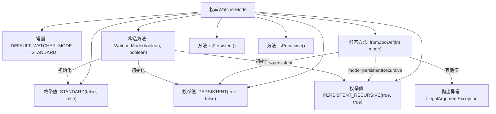

# 基础信息

|      |      |
|------|------|
| 名称 | WatcherMode |
| 编码语言 | .java |
| 代码路径 | zookeeper/zookeeper-server/src/main/java/org/apache/zookeeper/server/watch/WatcherMode.java |
| 包名 | org.apache.zookeeper.server.watch |
| 依赖项 | ['org.apache.zookeeper.ZooDefs'] |
| 概述说明 | WatcherMode枚举定义了三种监听模式：标准、持久、持久递归，包含属性和转换方法。默认模式为标准。 |

# 说明

该内容定义了一个枚举类WatcherMode，包含三种模式：STANDARD（非持久非递归）、PERSISTENT（持久非递归）和PERSISTENT_RECURSIVE（持久递归）。默认模式为STANDARD。枚举类提供了从ZooDef整数转换为对应枚举值的方法fromZooDef，若输入不合法会抛出异常。每个枚举值包含两个布尔属性isPersistent和isRecursive，分别表示是否持久和是否递归，并通过对应方法可获取这两个属性值。

# 类列表 Class Summary

| 名称   | 类型  | 说明 |
|-------|------|-------------|
| WatcherMode | enum | WatcherMode枚举定义了三种监听模式：标准、持久和持久递归，默认为标准模式。提供从ZooDef转换的方法及属性检查方法。 |


## 类 WatcherMode

|      |      |
|------|------|
| 访问范围 | public |
| 类型 | enum |
| 名称 | WatcherMode |
| 说明 | WatcherMode枚举定义了三种监听模式：标准、持久和持久递归，默认为标准模式。提供从ZooDef转换的方法及属性检查方法。 |


### UML类图

```mermaid
classDiagram
    class WatcherMode {
        <<enumeration>>
        +STANDARD
        +PERSISTENT
        +PERSISTENT_RECURSIVE
        +DEFAULT_WATCHER_MODE$ WatcherMode
        -boolean isPersistent
        -boolean isRecursive
        +WatcherMode(boolean isPersistent, boolean isRecursive)
        +boolean isPersistent()
        +boolean isRecursive()
        +static WatcherMode fromZooDef(int mode)
    }

    // ZooDefs.AddWatchModes 是外部枚举，WatcherMode 依赖其常量值
    WatcherMode --> ZooDefs.AddWatchModes : 依赖
```

这段代码定义了一个枚举类 `WatcherMode`，用于表示不同的观察者模式类型。枚举包含三种模式：STANDARD（标准）、PERSISTENT（持久）和 PERSISTENT_RECURSIVE（持久递归），每种模式通过构造器初始化持久性和递归性标志。类提供了静态方法 `fromZooDef` 从 ZooDefs 的整型模式转换为枚举值，并包含两个查询方法检查当前枚举实例的属性。DEFAULT_WATCHER_MODE 指定了默认模式为 STANDARD。


### 内部方法调用关系图



这段代码定义了一个枚举类型WatcherMode，用于表示ZooKeeper的观察者模式。包含STANDARD、PERSISTENT和PERSISTENT_RECURSIVE三种枚举值，每个枚举值通过构造方法初始化isPersistent和isRecursive属性。提供了fromZooDef方法从ZooDefs参数转换枚举值，以及isPersistent/isRecursive两个查询方法。当传入非法参数时会抛出IllegalArgumentException异常。该枚举主要用于管理ZooKeeper客户端的监听模式状态。

### 字段列表 Field List

| 名称  | 类型  | 说明 |
|-------|-------|------|

### 方法列表 Method List

| 名称  | 类型  | 说明 |
|-------|-------|------|


