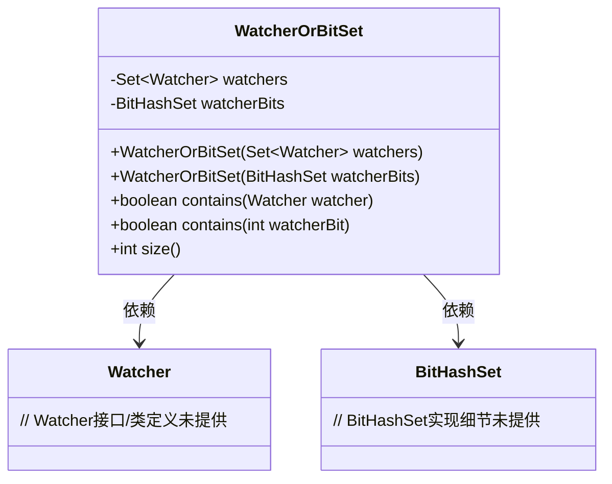
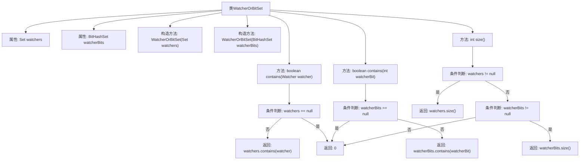

# 基础信息

|      |      |
|------|------|
| 名称 | WatcherOrBitSet |
| 编码语言 | .java |
| 代码路径 | zookeeper/zookeeper-server/src/main/java/org/apache/zookeeper/server/watch/WatcherOrBitSet.java |
| 包名 | org.apache.zookeeper.server.watch |
| 依赖项 | ['java.util.Set', 'org.apache.zookeeper.Watcher', 'org.apache.zookeeper.server.util.BitHashSet'] |
| 概述说明 | 类WatcherOrBitSet管理Watcher集合或BitHashSet，提供contains和size方法检查元素存在及集合大小。 |

# 说明

WatcherOrBitSet类是一个用于管理Watcher对象集合或位集合的实用工具类。它提供了两种构造方式：一种通过Set<Watcher>初始化，另一种通过BitHashSet初始化。类中包含两个核心方法：contains方法用于检查集合中是否包含指定的Watcher对象或位值，size方法返回当前集合的大小。当集合未初始化时，contains方法返回false，size方法返回0。该类实现了对两种不同类型集合的统一封装和操作。

# 类列表 Class Summary

| 名称   | 类型  | 说明 |
|-------|------|-------------|
| WatcherOrBitSet | class | Java类WatcherOrBitSet，包含watchers集合和watcherBits位集，提供构造方法和检查存在性及大小的功能。 |

## 类 WatcherOrBitSet

|      |      |
|------|------|
| 访问范围 | public |
| 类型 | class |
| 名称 | WatcherOrBitSet |
| 说明 | Java类WatcherOrBitSet，包含watchers集合和watcherBits位集，提供构造方法和检查存在性及大小的功能。 |

### UML类图

这段代码展示了一个WatcherOrBitSet类，它通过两种不同的数据结构（Set<Watcher>和BitHashSet）来存储和查询监控器信息。类提供了两种构造方式，分别基于Watcher集合或位集合初始化，并实现了contains方法的重载版本用于检查元素存在性，以及size方法返回当前存储元素数量。类图清晰地展示了WatcherOrBitSet与Watcher、BitHashSet之间的依赖关系，体现了灵活的数据存储策略设计。

### 内部方法调用关系图

这段代码定义了一个名为WatcherOrBitSet的类，用于管理Watcher集合或BitHashSet集合。类中包含两个构造方法，分别接受Set<Watcher>和BitHashSet作为参数初始化对应属性。提供了contains方法用于检查元素是否存在，size方法返回集合大小。所有方法都包含空值检查逻辑，确保在属性为null时返回安全值（false或0）。流程图清晰展示了类结构和各方法的分支处理逻辑。

### 字段列表 Field List

| 名称  | 类型  | 说明 |
|-------|-------|------|
| watchers | Set<Watcher> | 私有集合变量watchers，存储Watcher类型元素。 |
| watcherBits | BitHashSet | 私有变量watcherBits，类型为BitHashSet。 |

### 方法列表 Method List

| 名称  | 类型  | 说明 |
|-------|-------|------|
| contains | boolean | 检查watchers列表是否包含指定watcher，若列表为空返回false。 |
| contains | boolean | 
检查watcherBits是否包含指定watcherBit，若为空则返回false。 |
| size | int | 该方法返回监视器数量。若watchers非空返回其大小，否则检查watcherBits非空则返回其大小，都空则返回0。 |

