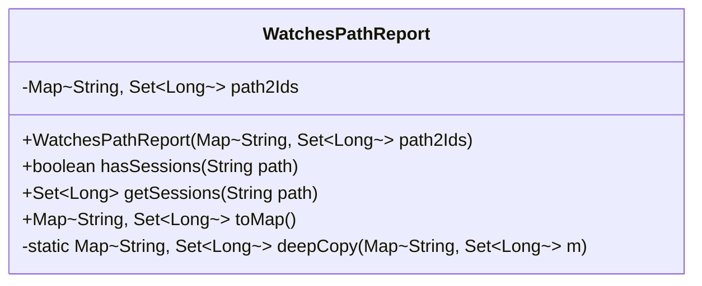
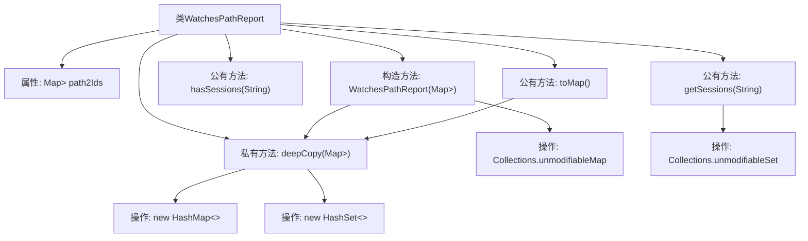

# 基础信息

|      |      |
|------|------|
| 名称 | WatchesPathReport |
| 编码语言 | .java |
| 代码路径 | zookeeper/zookeeper-server/src/main/java/org/apache/zookeeper/server/watch/WatchesPathReport.java |
| 包名 | org.apache.zookeeper.server.watch |
| 依赖项 | ['java.util.Collections', 'java.util.HashMap', 'java.util.HashSet', 'java.util.Map', 'java.util.Set'] |
| 概述说明 | WatchesPathReport类跟踪路径与监听会话ID的映射，提供查询路径监听状态、获取会话ID及导出映射的方法，确保数据不可变性和线程安全。 |

# 说明

WatchesPathReport类用于管理路径与会话ID的映射关系，存储路径和对应会话ID集合。构造函数接收一个映射表并通过深拷贝创建不可修改的副本。提供三个方法：hasSessions检查指定路径是否存在会话；getSessions返回路径对应的不可修改会话ID集合，若不存在返回null；toMap返回当前数据的可变深拷贝映射表。所有操作均确保原始数据不被外部修改。

# 类列表 Class Summary

| 名称   | 类型  | 说明 |
|-------|------|-------------|
| WatchesPathReport | class | WatchesPathReport类跟踪路径与监听会话ID的映射，提供检查路径监听、获取会话ID及转换为可变映射的方法，确保数据不可变性和深拷贝安全。 |

## 类 WatchesPathReport

|      |      |
|------|------|
| 访问范围 | public |
| 类型 | class |
| 名称 | WatchesPathReport |
| 说明 | WatchesPathReport类跟踪路径与监听会话ID的映射，提供检查路径监听、获取会话ID及转换为可变映射的方法，确保数据不可变性和深拷贝安全。 |

### UML类图

该代码展示了一个监控路径报告类，主要用于跟踪哪些会话ID监听了特定路径。类中包含一个不可修改的映射表path2Ids，存储路径到会话ID集合的映射。提供了三个主要方法：检查路径是否有监听会话(hasSessions)、获取路径对应的会话ID集合(getSessions)以及将报告转换为可修改映射表(toMap)。私有方法deepCopy用于创建映射表的深度拷贝，确保数据隔离性。所有返回的集合都是不可修改的，保证了数据安全性。

### 内部方法调用关系图

这段代码流程图展示了WatchesPathReport类的核心结构和调用关系。该类用于管理路径与会话ID的映射关系，主要功能包括：通过构造方法初始化不可修改的Map，深度拷贝原始数据；提供hasSessions检查路径是否存在监听；getSessions获取不可修改的会话ID集合；toMap生成可修改的副本。私有方法deepCopy实现了嵌套集合的深拷贝逻辑，确保数据隔离性。所有返回集合都经过不可变包装，体现了良好的防御性编程思想。

### 字段列表 Field List

| 名称  | 类型  | 说明 |
|-------|-------|------|
| path2Ids | Map<String, Set<Long>> | 私有映射变量path2Ids，键为字符串，值为长整型集合。 |

### 方法列表 Method List

| 名称  | 类型  | 说明 |
|-------|-------|------|
| toMap | Map<String, Set<Long>> | 该方法返回一个深拷贝的Map，键为String类型，值为Set<Long>类型。 |
| deepCopy | Map<String, Set<Long>> | Java方法：深拷贝Map<String, Set<Long>>，遍历原Map并复制每个键值对到新Map和HashSet中。 |
| getSessions | Set<Long> | 获取指定路径下的会话ID集合，若存在则返回不可修改集合，否则返回null。 |
| hasSessions | boolean | 检查路径是否存在会话，返回布尔值。 |

