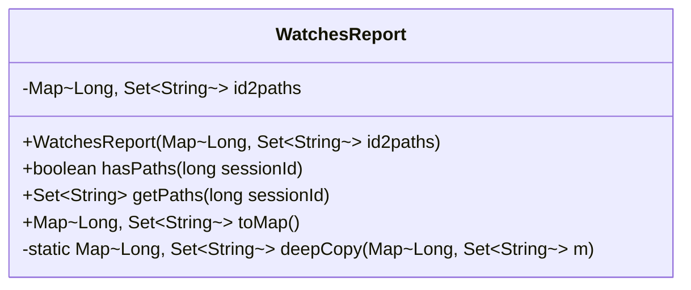
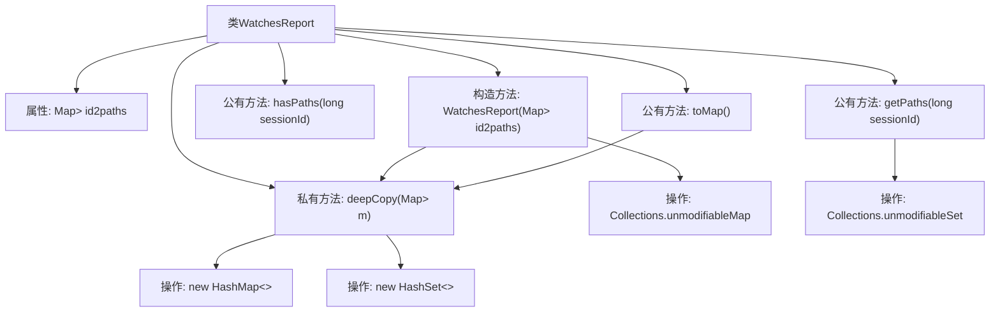

# 基础信息

|      |      |
|------|------|
| 名称 | WatchesReport |
| 编码语言 | .java |
| 代码路径 | zookeeper/zookeeper-server/src/main/java/org/apache/zookeeper/server/watch/WatchesReport.java |
| 包名 | org.apache.zookeeper.server.watch |
| 依赖项 | ['java.util.Collections', 'java.util.HashMap', 'java.util.HashSet', 'java.util.Map', 'java.util.Set'] |
| 概述说明 | WatchesReport类用于管理会话ID与监听路径的映射，提供不可修改的路径查询和深拷贝功能，支持检查会话是否有监听路径及转换为可变映射。 |

# 说明

WatchesReport类用于管理会话ID与对应监听路径的映射关系。构造函数接收一个Map参数，存储会话ID到路径集合的映射，并通过deepCopy方法创建不可修改的副本。提供三个主要方法：hasPaths检查指定会话是否存在监听路径；getPaths返回会话对应的不可修改路径集合，不存在则返回null；toMap返回当前数据的可变副本。所有方法确保原始数据不受外部修改影响。

# 类列表 Class Summary

| 名称   | 类型  | 说明 |
|-------|------|-------------|
| WatchesReport | class | WatchesReport类管理会话ID与监控路径的映射，提供查询路径、检查会话及转换为可变映射的方法，确保数据不可变性和深拷贝安全。 |

## 类 WatchesReport

|      |      |
|------|------|
| 访问范围 | public |
| 类型 | class |
| 名称 | WatchesReport |
| 说明 | WatchesReport类管理会话ID与监控路径的映射，提供查询路径、检查会话及转换为可变映射的方法，确保数据不可变性和深拷贝安全。 |

### UML类图

这段代码展示了一个`WatchesReport`类，用于管理会话ID与路径集合的映射关系。类中包含一个私有不可变映射`id2paths`，存储会话ID及其对应的路径集合。提供了构造方法进行深拷贝初始化，以及三个公有方法：`hasPaths`检查会话是否有路径，`getPaths`获取不可修改的路径集合，`toMap`返回可变的映射副本。私有静态方法`deepCopy`用于实现深拷贝逻辑，确保数据隔离性。整个设计注重数据封装和安全性，防止外部修改内部状态。

### 内部方法调用关系图

这段代码流程图展示了WatchesReport类的核心结构和数据流转。类通过构造方法接收原始映射表，使用deepCopy方法创建深度拷贝并封装为不可变映射。主要功能包括检查会话路径存在性(hasPaths)、获取不可修改的路径集合(getPaths)以及生成可修改的映射副本(toMap)。所有返回集合都经过不可变封装，确保数据安全性，同时通过深度拷贝避免外部修改影响内部状态。

### 字段列表 Field List

| 名称  | 类型  | 说明 |
|-------|-------|------|
| id2paths | Map<Long, Set<String>> | 私有映射，键为长整型，值为字符串集合，存储ID与路径集的对应关系。 |

### 方法列表 Method List

| 名称  | 类型  | 说明 |
|-------|-------|------|
| hasPaths | boolean | 检查sessionId是否存在路径映射。 |
| getPaths | Set<String> | 获取指定会话ID的路径集合，返回不可修改的集合或null。 |
| toMap | Map<Long, Set<String>> | 该方法返回一个深拷贝的映射，键为Long类型，值为String集合。 |
| deepCopy | Map<Long, Set<String>> | 该方法实现Map的深拷贝，键为Long，值为Set<String>。遍历原Map，逐个复制键值到新Map，并创建新的HashSet存储值。返回新Map。 |

